```mermaid
classDiagram
    namespace root {
        class MainActivity {
            <<existente>>
            +onCreate()
        }
    }

    namespace ui_theme["ui · theme"] {
        class GameCountdownTheme {
            <<existente>>
            +darkTheme Boolean
            +dynamicColor Boolean
            +content Composable
        }
        class Color {
            <<existente>>
            Purple80
            PurpleGrey80
            Pink80
            Purple40
            PurpleGrey40
            Pink40
        }
        class Typography {
            <<existente>>
        }
    }

    namespace data_model["data · model"] {
        class Game {
            <<a criar>>
            +id String
            +title String
            +releaseDate LocalDate
            +platforms List~Platform~
            +genres List~Genre~
            +priceUsd Double
            +priceBrl Double
            +coverUrl String
            +synopsis String
            +trailerId String
            +developer String
            +isWatched Boolean
        }
        class Platform {
            <<a criar — enum>>
            PS5
            XBOX_SERIES
            PC
            SWITCH
            MOBILE
        }
        class Genre {
            <<a criar — enum>>
            ACTION
            RPG
            STRATEGY
            SPORTS
            ADVENTURE
        }
    }

    namespace data_repository["data · repository"] {
        class GameRepository {
            <<a criar — interface>>
            +getGames() List~Game~
            +getGameById(id String) Game
            +searchGames(query String) List~Game~
            +getWatchedGames() List~Game~
            +setWatched(id String, watched Boolean)
        }
        class MockGameRepository {
            <<a criar — mock>>
            -games List~Game~
            +getGames() List~Game~
            +getGameById(id String) Game
            +searchGames(query String) List~Game~
            +getWatchedGames() List~Game~
            +setWatched(id String, watched Boolean)
        }
    }

    namespace data_service["data · service"] {
        class GameService {
            <<a criar — interface>>
            +getCatalog(filters GameFilters) List~Game~
            +getGameDetails(id String) Game
            +searchGames(query String) List~Game~
            +getWatchedGames() List~Game~
            +toggleWatched(id String)
        }
        class GameServiceImpl {
            <<a criar>>
            -repository GameRepository
            +getCatalog(filters GameFilters) List~Game~
            +getGameDetails(id String) Game
            +searchGames(query String) List~Game~
            +getWatchedGames() List~Game~
            +toggleWatched(id String)
        }
        class GameFilters {
            <<a criar — data class>>
            +platforms List~Platform~
            +genres List~Genre~
            +releaseWindow ReleaseWindow
            +sortOrder SortOrder
        }
        class ReleaseWindow {
            <<a criar — enum>>
            WEEK
            MONTH
            QUARTER
            SEMESTER
            YEAR
        }
        class SortOrder {
            <<a criar — enum>>
            MOST_ANTICIPATED
            CLOSEST_RELEASE
            ALPHABETICAL
        }
    }

    namespace ui_catalogo["ui · catalogo"] {
        class CatalogoScreen {
            <<a criar — Composable>>
        }
        class CatalogoViewModel {
            <<a criar — ViewModel>>
            +uiState CatalogoUiState
            +onFilterChanged(filters GameFilters)
            +onSearchQueryChanged(query String)
        }
    }

    namespace ui_lista["ui · lista_pessoal"] {
        class ListaPessoalScreen {
            <<a criar — Composable>>
        }
        class ListaPessoalViewModel {
            <<a criar — ViewModel>>
            +uiState ListaPessoalUiState
            +onToggleWatched(id String)
        }
    }

    namespace ui_detalhes["ui · detalhes"] {
        class DetalhesScreen {
            <<a criar — Composable>>
        }
        class DetalhesViewModel {
            <<a criar — ViewModel>>
            +uiState DetalhesUiState
            +onToggleWatched()
        }
    }

    namespace ui_comum["ui · comum"] {
        class GameCard {
            <<a criar — Composable>>
        }
        class CountdownBadge {
            <<a criar — Composable>>
        }
        class PlatformBadge {
            <<a criar — Composable>>
        }
        class FilterBar {
            <<a criar — Composable>>
        }
        class AddToListSwitch {
            <<a criar — Composable>>
        }
    }

    %% Relacionamentos

    MockGameRepository ..|> GameRepository : implementa
    GameServiceImpl ..|> GameService : implementa
    GameServiceImpl --> GameRepository : usa

    CatalogoViewModel --> GameService : usa
    ListaPessoalViewModel --> GameService : usa
    DetalhesViewModel --> GameService : usa

    MainActivity --> GameCountdownTheme : usa

    GameServiceImpl --> GameFilters : recebe
    GameFilters --> Platform : filtra por
    GameFilters --> Genre : filtra por
    GameFilters --> ReleaseWindow : filtra por
    GameFilters --> SortOrder : ordena por

    Game --> Platform : tem
    Game --> Genre : tem
```

# Diagrama de Classes — GameCountdown

Visualização da estrutura de pacotes atual. Atualizado a cada iteração.

> **Legenda de estereótipos**
> - `<<existente>>` — arquivo já criado
> - `<<pacote>>` — pasta criada, ainda sem arquivos Kotlin (só placeholder)
> - `<<a criar>>` — item planejado para as próximas iterações

---

---

*Arquivo gerado no Passo 1 da Fase 2. Próxima atualização: após criação do modelo de dados (`Game.kt` e tipos relacionados).*
