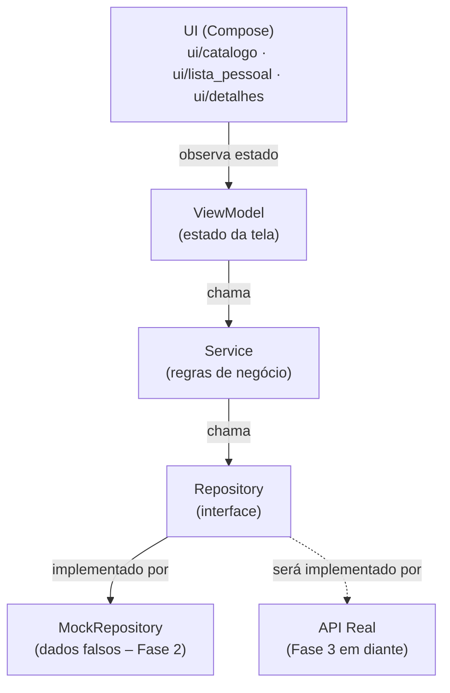

# Diagrama de Componentes — GameCountdown

Documento vivo. Atualizado a cada mudança arquitetural relevante.

---

## Passo 1 — Estrutura de pastas (Fase 2)

**O que foi feito:** Definição da estrutura de pacotes do app Android, seguindo os princípios de SOLID e separação de camadas acordados na Fase 1. Nenhuma lógica foi implementada ainda — apenas a organização de onde cada peça vai morar.

**Por quê desta forma:**
- A camada `data/` é separada da camada `ui/` para que mudanças de tela nunca afetem a lógica de dados, e vice-versa.
- Dentro de `data/`, cada responsabilidade tem sua própria pasta: `model/` (os dados em si), `repository/` (quem busca os dados) e `service/` (quem aplica regras de negócio sobre eles).
- `repository/mock/` existe especificamente para a Fase 2: são implementações falsas que simulam o comportamento de uma API real, sem depender de internet ou backend.
- A UI é organizada por tela (`catalogo/`, `lista_pessoal/`, `detalhes/`) em vez de por tipo de arquivo, porque fica mais fácil de localizar tudo que pertence a uma tela no mesmo lugar.
- `ui/comum/` guarda componentes visuais reutilizáveis entre telas (ex.: o card de um jogo, o badge de countdown).
- Os testes em `src/test/` espelham a estrutura do código principal — cada camada tem sua pasta de testes correspondente.

### Estrutura criada

```
app/src/main/java/com/almenara/gamecountdown/
│
├── data/
│   ├── model/              ← classes de dados (ex.: Game, Platform)
│   ├── repository/         ← interfaces que definem como buscar dados
│   │   └── mock/           ← implementações falsas para o protótipo (Fase 2)
│   └── service/            ← regras de negócio (ex.: filtrar, ordenar, calcular countdown)
│
├── ui/
│   ├── catalogo/           ← tela de catálogo + ViewModel
│   ├── lista_pessoal/      ← tela "Jogos que estou de olho" + ViewModel
│   ├── detalhes/           ← tela de detalhes do jogo + ViewModel
│   ├── comum/              ← componentes visuais compartilhados entre telas
│   └── theme/              ← cores, tipografia e tema Material 3 (já existia)
│
└── MainActivity.kt         ← ponto de entrada do app (já existia)

app/src/test/java/com/almenara/gamecountdown/
│
└── data/
    ├── repository/         ← testes dos repositórios
    └── service/            ← testes dos serviços
```

### Diagrama de camadas (fluxo de dados)



**Leitura do diagrama:** A UI só fala com o ViewModel. O ViewModel só fala com o Service. O Service só fala com o Repository (a interface). Quem implementa o Repository na Fase 2 é o Mock — na Fase 3, será substituído pela implementação real que chama o backend, sem precisar mudar nada no Service nem na UI.

---

## Passo 2 — Modelo de dados (Fase 2)

**O que foi feito:** Criação dos três arquivos que definem como um jogo é representado na memória do app: `Game.kt`, `Platform.kt` e `Genre.kt`, dentro de `data/model/`.

**Por quê desta forma:**

- `Game` é uma `data class` — tipo especial do Kotlin para objetos que só carregam dados, sem comportamento. O compilador gera automaticamente comparação entre objetos, cópia e conversão para texto.
- Campos marcados com `?` (ex.: `priceUsd: Double?`) são **opcionais** — podem ser `null`. Isso reflete a realidade: nem todo jogo tem preço anunciado, nem todo jogo tem trailer ainda.
- `releaseDate` e `preSaleDate` são `String` no formato `"2025-03-15"` — simplificação consciente para o protótipo. Datas como objetos (`LocalDate`) exigiriam configuração extra no build. Revisaremos quando o countdown real precisar de aritmética de datas.
- `Platform` e `Genre` são `enum class` com um campo `displayName` em português — assim a UI pode exibir o nome amigável ("PlayStation 5") sem precisar fazer conversão manual em cada tela.
- `anticipationScore` e `isWatched` vivem no modelo por simplicidade no protótipo. Em fases futuras, `isWatched` tende a migrar para uma camada de preferências do usuário separada (Room/DataStore), quando o sync entre dispositivos for implementado.
- Não há testes nesta camada — `data class` sem lógica não tem comportamento a testar. Os testes começam no `Service`, onde existem regras de negócio reais.

### Arquivos criados

```
data/model/
├── Game.kt        ← objeto principal: campos de um jogo
├── Platform.kt    ← enum: PS5, Xbox Series, PC, Switch, Mobile
└── Genre.kt       ← enum: Ação, RPG, Aventura, Estratégia, Esportes, Simulação, Terror, Luta
```

---

---

## Passo 3 — Repository: interface e mock (Fase 2)

**O que foi feito:** Criação da interface `GameRepository` e da sua implementação falsa `MockGameRepository`, com 6 jogos fictícios cobrindo os diferentes estados que o app precisa exibir.

**Por quê desta forma:**

- `GameRepository` é uma **interface** — define o contrato (o que pode ser feito), sem dizer como. O Service só vai conhecer a interface, nunca a implementação concreta. Isso é o que permite trocar o Mock pelo backend real na Fase 3 sem tocar no Service.
- `MockGameRepository` implementa essa interface com dados fixos em memória. Os jogos cobrem intencionalmente cenários variados: lançamento iminente (dias), lançamento distante (meses/ano), jogo sem preço anunciado, jogo sem trailer, jogo só para uma plataforma, jogo multi-plataforma.
- `watchedIds` é um `mutableSetOf` separado da lista de jogos — a lista pessoal do usuário é uma informação de estado do usuário, não uma propriedade do jogo em si. O método `.copy(isWatched = ...)` mescla os dois no momento da leitura, simulando o que um banco de dados faria.
- `getGameById` retorna `Game?` (com interrogação) porque o jogo pode não existir — chamar com um ID inválido retorna `null` em vez de quebrar o app.
- Os testes verificam os contratos comportamentais do mock: filtragem case-insensitive, toggle de watched, retorno de null para ID inexistente. Não há testes para o modelo (`Game.kt`) porque `data class` sem lógica não tem comportamento a testar.

### Arquivos criados

```
data/repository/
├── GameRepository.kt              ← interface (contrato)
└── mock/
    └── MockGameRepository.kt      ← implementação com 6 jogos fictícios

src/test/data/repository/
└── MockGameRepositoryTest.kt      ← 9 testes dos contratos comportamentais
```

---

*Próximo passo: criar `GameService` (interface) e `GameServiceImpl` com a lógica de filtros, ordenação e countdown (`data/service/`).*
