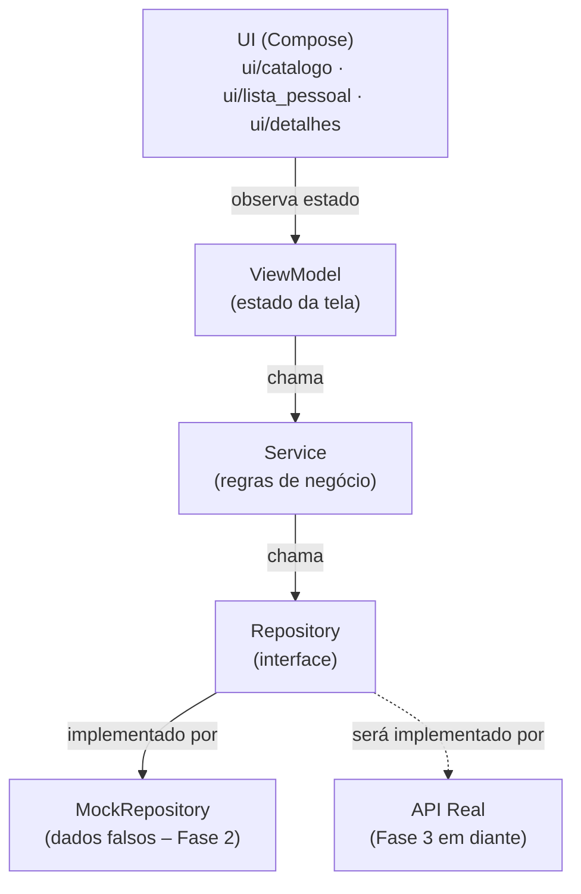

# Diagrama de Componentes — GameCountdown

Documento vivo. Atualizado a cada mudança arquitetural relevante.

---

## Passo 1 — Estrutura de pastas (Fase 2)

**O que foi feito:** Definição da estrutura de pacotes do app Android, seguindo os princípios de SOLID e separação de camadas acordados na Fase 1. Nenhuma lógica foi implementada ainda — apenas a organização de onde cada peça vai morar.

**Por quê desta forma:**
- A camada `data/` é separada da camada `ui/` para que mudanças de tela nunca afetem a lógica de dados, e vice-versa.
- Dentro de `data/`, cada responsabilidade tem sua própria pasta: `model/` (os dados em si), `repository/` (quem busca os dados) e `service/` (quem aplica regras de negócio sobre eles).
- `repository/mock/` existe especificamente para a Fase 2: são implementações falsas que simulam o comportamento de uma API real, sem depender de internet ou backend.
- A UI é organizada por tela (`catalogo/`, `lista_pessoal/`, `detalhes/`) em vez de por tipo de arquivo, porque fica mais fácil de localizar tudo que pertence a uma tela no mesmo lugar.
- `ui/comum/` guarda componentes visuais reutilizáveis entre telas (ex.: o card de um jogo, o badge de countdown).
- Os testes em `src/test/` espelham a estrutura do código principal — cada camada tem sua pasta de testes correspondente.

### Estrutura criada

```
app/src/main/java/com/almenara/gamecountdown/
│
├── data/
│   ├── model/              ← classes de dados (ex.: Game, Platform)
│   ├── repository/         ← interfaces que definem como buscar dados
│   │   └── mock/           ← implementações falsas para o protótipo (Fase 2)
│   └── service/            ← regras de negócio (ex.: filtrar, ordenar, calcular countdown)
│
├── ui/
│   ├── catalogo/           ← tela de catálogo + ViewModel
│   ├── lista_pessoal/      ← tela "Jogos que estou de olho" + ViewModel
│   ├── detalhes/           ← tela de detalhes do jogo + ViewModel
│   ├── comum/              ← componentes visuais compartilhados entre telas
│   └── theme/              ← cores, tipografia e tema Material 3 (já existia)
│
└── MainActivity.kt         ← ponto de entrada do app (já existia)

app/src/test/java/com/almenara/gamecountdown/
│
└── data/
    ├── repository/         ← testes dos repositórios
    └── service/            ← testes dos serviços
```

### Diagrama de camadas (fluxo de dados)



**Leitura do diagrama:** A UI só fala com o ViewModel. O ViewModel só fala com o Service. O Service só fala com o Repository (a interface). Quem implementa o Repository na Fase 2 é o Mock — na Fase 3, será substituído pela implementação real que chama o backend, sem precisar mudar nada no Service nem na UI.

---

## Passo 2 — Modelo de dados (Fase 2)

**O que foi feito:** Criação dos três arquivos que definem como um jogo é representado na memória do app: `Game.kt`, `Platform.kt` e `Genre.kt`, dentro de `data/model/`.

**Por quê desta forma:**

- `Game` é uma `data class` — tipo especial do Kotlin para objetos que só carregam dados, sem comportamento. O compilador gera automaticamente comparação entre objetos, cópia e conversão para texto.
- Campos marcados com `?` (ex.: `priceUsd: Double?`) são **opcionais** — podem ser `null`. Isso reflete a realidade: nem todo jogo tem preço anunciado, nem todo jogo tem trailer ainda.
- `releaseDate` e `preSaleDate` são `String` no formato `"2025-03-15"` — simplificação consciente para o protótipo. Datas como objetos (`LocalDate`) exigiriam configuração extra no build. Revisaremos quando o countdown real precisar de aritmética de datas.
- `Platform` e `Genre` são `enum class` com um campo `displayName` em português — assim a UI pode exibir o nome amigável ("PlayStation 5") sem precisar fazer conversão manual em cada tela.
- `anticipationScore` e `isWatched` vivem no modelo por simplicidade no protótipo. Em fases futuras, `isWatched` tende a migrar para uma camada de preferências do usuário separada (Room/DataStore), quando o sync entre dispositivos for implementado.
- Não há testes nesta camada — `data class` sem lógica não tem comportamento a testar. Os testes começam no `Service`, onde existem regras de negócio reais.

### Arquivos criados

```
data/model/
├── Game.kt        ← objeto principal: campos de um jogo
├── Platform.kt    ← enum: PS5, Xbox Series, PC, Switch, Mobile
└── Genre.kt       ← enum: Ação, RPG, Aventura, Estratégia, Esportes, Simulação, Terror, Luta
```

---

---

## Passo 3 — Repository: interface e mock (Fase 2)

**O que foi feito:** Criação da interface `GameRepository` e da sua implementação falsa `MockGameRepository`, com 6 jogos fictícios cobrindo os diferentes estados que o app precisa exibir.

**Por quê desta forma:**

- `GameRepository` é uma **interface** — define o contrato (o que pode ser feito), sem dizer como. O Service só vai conhecer a interface, nunca a implementação concreta. Isso é o que permite trocar o Mock pelo backend real na Fase 3 sem tocar no Service.
- `MockGameRepository` implementa essa interface com dados fixos em memória. Os jogos cobrem intencionalmente cenários variados: lançamento iminente (dias), lançamento distante (meses/ano), jogo sem preço anunciado, jogo sem trailer, jogo só para uma plataforma, jogo multi-plataforma.
- `watchedIds` é um `mutableSetOf` separado da lista de jogos — a lista pessoal do usuário é uma informação de estado do usuário, não uma propriedade do jogo em si. O método `.copy(isWatched = ...)` mescla os dois no momento da leitura, simulando o que um banco de dados faria.
- `getGameById` retorna `Game?` (com interrogação) porque o jogo pode não existir — chamar com um ID inválido retorna `null` em vez de quebrar o app.
- Os testes verificam os contratos comportamentais do mock: filtragem case-insensitive, toggle de watched, retorno de null para ID inexistente. Não há testes para o modelo (`Game.kt`) porque `data class` sem lógica não tem comportamento a testar.

### Arquivos criados

```
data/repository/
├── GameRepository.kt              ← interface (contrato)
└── mock/
    └── MockGameRepository.kt      ← implementação com 6 jogos fictícios

src/test/data/repository/
└── MockGameRepositoryTest.kt      ← 9 testes dos contratos comportamentais
```

---

## Passo 4 — Service: interface e implementação (Fase 2)

**O que foi feito:** Criação da interface `GameService` (contrato) e da implementação `GameServiceImpl`, com a lógica de filtros de catálogo, ordenação e cálculo de countdown. 11 testes cobrindo cada ordenação, cada filtro (isolados e combinados), os limites de cada janela de período, o cálculo de dias e o repasse dos métodos simples ao Repository.

**Por quê desta forma:**

- `GameService` fica entre a UI/ViewModel e o `GameRepository` — a UI nunca fala com o Repository diretamente. Isso mantém a lógica de negócio (o que é "iminente", como ordenar, quantos dias faltam) fora da UI e fora da camada de dados.
- `FiltroCatalogo` agrupa os filtros opcionais (plataforma, gênero, período) num único parâmetro com valores padrão `null`, em vez de vários parâmetros soltos — retorna o catálogo inteiro quando nenhum filtro é passado.
- `PeriodoLancamento` (semana/mês/trimestre/semestre/ano) e `CriterioOrdenacao` (mais aguardados/mais próximos/alfabética) implementam exatamente os filtros e ordenações da spec da Fase 1.
- **Cálculo de datas com `java.time` + desugaring:** o countdown exige aritmética de datas (diferença em dias). Como o `minSdk` do projeto é 24 e `java.time` só existe nativamente a partir da API 26, foi habilitado o *core library desugaring* (`app/build.gradle.kts` + dependência `desugar_jdk_libs` em `libs.versions.toml`) — opção escolhida por Igor entre isso e um cálculo manual de datas, por ser mais robusta (lida com bissextos e virada de mês/ano automaticamente) e ser o padrão atual do Android para esse cenário.
- **`Clock` injetado no construtor:** `GameServiceImpl` recebe um `java.time.Clock` (padrão: o relógio real do sistema) em vez de chamar `LocalDate.now()` diretamente. Isso permite que os testes "congelem" a data de hoje com `Clock.fixed(...)`. Isso torna os testes de filtro de período e de countdown determinísticos, independentemente de quando rodarem, em vez de dependerem da data real do dia do teste.
- Os testes usam um `FakeGameRepository` próprio (não o `MockGameRepository` da Fase 2), com datas relativas a "hoje" escolhidas para testar os limites exatos de cada janela (ex.: um jogo a exatamente 7 dias para testar o limite inclusivo de `SEMANA`). Isso isola o teste do Service da fixture do Repository, que tem datas fixas em calendário e vai ficar desatualizada com o tempo.

### Arquivos criados

```
data/service/
├── GameService.kt          ← interface + FiltroCatalogo + PeriodoLancamento + CriterioOrdenacao
└── GameServiceImpl.kt      ← implementação com filtros, ordenação e countdown

src/test/data/service/
└── GameServiceImplTest.kt  ← 11 testes + FakeGameRepository isolado
```

---

## Passo 5 — ViewModel e Factory do Catálogo (Fase 2)

**O que foi feito:** Criação do `CatalogoUiState` (estado da tela), do `CatalogoViewModel` (traduz ações do usuário em chamadas ao `GameService` e expõe o estado) e do `CatalogoViewModelFactory` (ensina o Android a instanciar esse ViewModel). 6 testes do ViewModel (carga automática ao criar, aplicar filtro, aplicar ordenação, marcar/desmarcar watched, id inexistente) + 2 testes da Factory (cria o tipo certo, rejeita tipo desconhecido).

**Por quê desta forma:**

- `CatalogoUiState` é uma `data class` que reúne **tudo** que a tela precisa pra se desenhar num dado momento (jogos, filtro, ordenação, carregando, erro). A UI (Compose, ainda não criada) vai só observar esse objeto — nunca guarda estado próprio nem chama o Service diretamente.
- `CatalogoViewModel` conhece **só** o contrato `GameService`, nunca o `GameRepository` nem o Mock. Ele guarda um `MutableStateFlow` privado (gravável só por ele) e expõe um `StateFlow` público somente leitura — padrão do Android para estado observável que sobrevive a mudanças de configuração (ex.: rotação de tela).
- Cada ação do usuário (`aplicarFiltro`, `aplicarOrdenacao`, `alternarWatched`) segue o mesmo formato: atualiza o estado relevante e chama `carregarJogos()` de novo, que busca a lista já filtrada/ordenada no Service. Isso evita duplicar a lógica de "buscar e atualizar estado" em cada método.
- `alternarWatched` primeiro busca o jogo pelo id: se não existir, sai sem fazer nada (não quebra, não chama o Service, não gera erro) — é o comportamento testado em `alternarWatched com id inexistente nao chama o service`.
- **`CatalogoViewModelFactory` foi necessária porque o Android só sabe criar ViewModels de construtor vazio por padrão**, e `CatalogoViewModel` exige um `GameService` no construtor. A Factory é o único lugar do app (fora dos testes) que conhece as implementações concretas `GameServiceImpl` e `MockGameRepository` — o resto do app continua enxergando só a interface `GameService`. Esse é o padrão chamado "composition root": em vez de espalhar `GameServiceImpl(MockGameRepository())` por várias telas, existe um único ponto de montagem por feature.
- Sem framework de injeção de dependência (Hilt/Koin) no projeto ainda, a Factory manual é a forma padrão do Android puro de resolver isso.
- Os testes do ViewModel usam um `FakeGameService` próprio (não o `GameServiceImpl` real), porque a lógica de filtro/ordenação/countdown já está coberta em `GameServiceImplTest` — aqui o que importa é testar a **orquestração** do ViewModel (ele chama o Service com os parâmetros certos? atualiza o estado certo?), não repetir a lógica de negócio.
- Os testes da Factory usam um fake diferente (`FakeGameServiceVazio`, não `FakeGameService`) apesar de estarem no mesmo pacote de teste — no JVM, duas classes `private` com o mesmo nome em arquivos diferentes do mesmo pacote geram arquivos `.class` conflitantes e a build quebra. É uma armadilha específica do Kotlin (visibilidade `private` é checada em tempo de compilação, mas não muda o nome do arquivo `.class` gerado).

### Arquivos criados

```
ui/catalogo/
├── CatalogoUiState.kt          ← estado da tela (jogos, filtro, ordenação, carregando, erro)
├── CatalogoViewModel.kt        ← orquestra chamadas ao GameService e expõe o estado
└── CatalogoViewModelFactory.kt ← composition root: monta GameServiceImpl(MockGameRepository()) e instancia o ViewModel

src/test/ui/catalogo/
├── CatalogoViewModelTest.kt        ← 6 testes + FakeGameService isolado
└── CatalogoViewModelFactoryTest.kt ← 2 testes + FakeGameServiceVazio isolado
```

---

## Passo 6 — Primeiros componentes de UI (ui/comum/) (Fase 2)

**O que foi feito:** Início da camada de View (Compose), começando pelos componentes-folha mais simples e reutilizáveis, guardados em `ui/comum/` por serem cross-cutting (vão reaparecer no Catálogo, na Lista Pessoal e nos Detalhes): `PlatformBadge` (chip com o nome de uma plataforma) e `PriceTag` (chip com o preço do jogo). A lógica de formatação de preço do `PriceTag` ganhou 6 testes unitários.

**Por quê desta forma:**

- **Segmentação por componente, do mais simples ao mais complexo.** Em vez de montar a tela inteira de uma vez, a camada de UI está sendo construída de baixo para cima: primeiro os componentes-folha (que não dependem de nenhum outro componente), depois os que os combinam (`GameCard`), depois a tela. Isso mantém cada passo pequeno o bastante para revisão sem leitura fluente de Kotlin.
- **Componentes puros e sem estado.** Tanto `PlatformBadge` quanto `PriceTag` só recebem dados por parâmetro e os desenham — não buscam dados, não guardam estado, não conhecem ViewModel. É isso que os torna reutilizáveis entre telas e testáveis isoladamente.
- **`modifier: Modifier = Modifier` em todo componente.** Convenção padrão do Compose: quem usa o componente pode ajustar espaçamento/tamanho de fora, sem o componente precisar saber onde será colocado.
- **Cores e formas vêm do `MaterialTheme`, nunca fixadas no código.** Assim os componentes acompanham automaticamente o tema Material 3 Expressive e o modo claro/escuro. `PlatformBadge` usa `secondaryContainer` e `PriceTag` usa `tertiaryContainer` para se distinguirem visualmente quando aparecem lado a lado no mesmo card.

**Sobre o `PriceTag` (decisões de produto tomadas por Igor):**

- **Prioridade de moeda: BRL em destaque, USD como fallback.** Mostra um valor por vez: se houver preço em reais, exibe em R$ (moeda do usuário brasileiro); senão, cai para US$; se não houver nenhum, exibe "Preço não anunciado". A spec pedia "USD, e BRL quando disponível", mas para o público brasileiro decidiu-se destacar o BRL.
- **A regra de qual preço mostrar é lógica de negócio, não desenho** — por isso foi extraída para a função `formatarPreco()`, marcada `internal` (visível ao teste dentro do módulo) em vez de `private`. Isso permite testá-la com **teste unitário comum, sem emulador**, cumprindo a regra "lógica sempre com teste". O desenho da tela em si (renderização Compose) exigiria teste instrumentado com `ComposeTestRule` — esses ficaram para um passo dedicado, quando houver emulador configurado.
- **Formatação por `Locale`:** o preço em BRL usa `Locale.forLanguageTag("pt-BR")` (vírgula no decimal, ponto no milhar: `R$ 1.349,90`) e o USD usa `Locale.US` (ponto no decimal, vírgula no milhar: `US$ 1,349.99`). Os testes cobrem justamente essa diferença de separadores, além dos três casos da regra de prioridade. Nota técnica: o construtor `Locale("pt","BR")` está deprecado no Java atual — usou-se `Locale.forLanguageTag(...)`, disponível desde a API 21.

### Arquivos criados

```
ui/comum/
├── PlatformBadge.kt   ← chip com o nome de uma plataforma (desenho puro)
└── PriceTag.kt        ← chip com o preço; lógica de formatação em formatarPreco() (internal)

src/test/ui/comum/
└── PriceTagTest.kt    ← 6 testes da lógica de formatação (prioridade de moeda + separadores)
```

---

*Próximo passo: o `CountdownBadge` — o núcleo visual do app (countdown + modo LANÇAMENTO IMINENTE), o mais complexo dos três componentes-folha. Depois deles, o `GameCard` que os combina, a `FilterBar` e por fim a `CatalogoScreen`.*

---

## Passo 7 — CountdownBadge: o núcleo visual do app (ui/comum/) (Fase 2)

**O que foi feito:** Criação do `CountdownBadge`, o terceiro e mais complexo componente-folha — exibe quantos dias faltam para o lançamento e destaca visualmente o modo LANÇAMENTO IMINENTE. A lógica que traduz "número de dias" em "texto + estado visual" foi extraída para a função pura `calcularCountdown()` e ganhou 7 testes unitários focados nos limites de cada faixa. Com isso, os três componentes-folha de `ui/comum/` estão completos.

**Por quê desta forma:**

- **A lógica de estado é o coração do app, então foi isolada e testada exaustivamente.** `CountdownBadge` recebe apenas um `Long` (os dias até o lançamento, vindos de `GameService.getDaysUntilRelease`) e delega toda a decisão para `calcularCountdown()`, uma função pura que devolve um `CountdownInfo` (texto + estado). Como no `PriceTag`, essa função é `internal` para ser testável por teste unitário comum, **sem emulador** — o desenho em si (Compose) exigiria teste instrumentado, adiado para um passo dedicado.
- **Separar "o que dizer" de "como destacar".** `CountdownInfo` carrega o `texto` (ex.: "faltam 5 dias") e o `estado` (`CountdownEstado`) separadamente. Assim a regra de negócio não sabe nada de cores — quem escolhe cor/negrito é o Composable, lendo o estado. Isso mantém a lógica testável e a aparência trocável sem tocar na regra.

**Decisões de produto tomadas por Igor:**

- **Dois estados visuais, não três.** Foram consideradas duas opções: (a) 2 estados — Normal e Iminente; (b) 3 estados — Normal, Iminente e um "Crítico" ainda mais destacado para véspera/dia. Escolheu-se **2 estados**, alinhado com a "categoria única" de lançamento iminente já definida na spec (os três gatilhos — 7 dias, véspera, dia — compartilham o mesmo destaque visual). Mais simples e coerente com o resto do sistema.
- **Limite do iminente: 7 dias, inclusivo.** Jogos a 7 dias ou menos são iminentes; a partir de 8 dias, normais. Os textos especiais cobrem o dia ("LANÇA HOJE") e a véspera ("LANÇA AMANHÃ"); de 2 a 7 dias mostra "faltam N dias" com o destaque de iminente; acima de 7, o mesmo texto sem destaque.
- **Jogo já lançado (dias negativos): "Disponível", visual neutro.** Em vez de exibir algo como "faltam -3 dias", a data no passado vira o estado `DISPONIVEL` com texto "Disponível". O catálogo da Fase 2 só tem jogos futuros, mas o caso de borda ficou tratado e coberto por teste desde já.

**Sobre os testes (7 casos):** concentram-se nos **limites** de cada faixa, onde erros de `≤` vs. `<` se escondem — em especial 7 dias (ainda iminente) vs. 8 dias (já normal), além de 0 (hoje), 1 (amanhã), 2 (início do "faltam N dias"), um valor distante (normal) e um negativo (disponível). Verificam tanto o texto quanto o estado retornado.

### Arquivos criados

```
ui/comum/
└── CountdownBadge.kt   ← countdown + modo iminente; lógica em calcularCountdown() (internal),
                          apoiada pelo enum CountdownEstado e pela data class CountdownInfo

src/test/ui/comum/
└── CountdownBadgeTest.kt  ← 7 testes da lógica de countdown (limites de faixa + estados)
```

**Estado da camada `ui/comum/` ao fim deste passo:** os três componentes-folha estão prontos e testados — `PlatformBadge` (desenho puro), `PriceTag` e `CountdownBadge` (com lógica de negócio isolada e testada). São as peças que o `GameCard` vai combinar.

---

*Próximo passo: o `GameCard` — primeiro componente composto, que combina capa, título, `PlatformBadge`, `PriceTag` e `CountdownBadge` para representar um jogo na lista. Depois dele, a `FilterBar` e a `CatalogoScreen`, e por fim ligar o `MainActivity` à tela real.*
