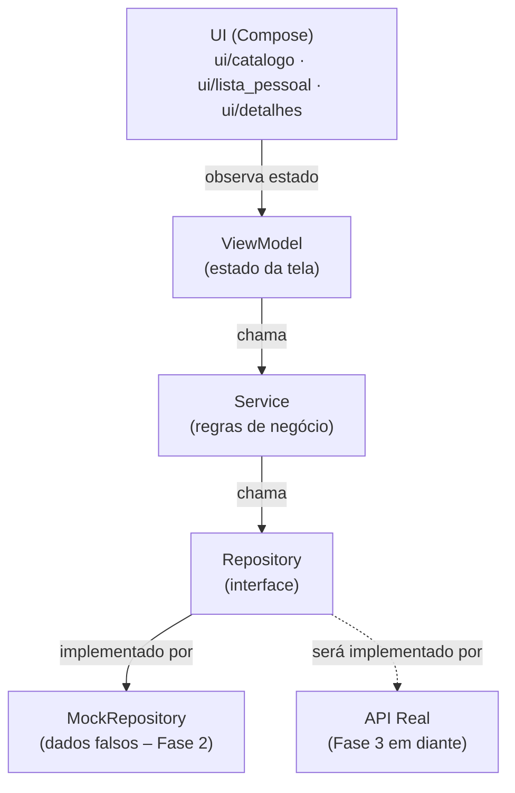

# Diagrama de Componentes — GameCountdown

Documento vivo. Atualizado a cada mudança arquitetural relevante.

---

## Passo 1 — Estrutura de pastas (Fase 2)

**O que foi feito:** Definição da estrutura de pacotes do app Android, seguindo os princípios de SOLID e separação de camadas acordados na Fase 1. Nenhuma lógica foi implementada ainda — apenas a organização de onde cada peça vai morar.

**Por quê desta forma:**
- A camada `data/` é separada da camada `ui/` para que mudanças de tela nunca afetem a lógica de dados, e vice-versa.
- Dentro de `data/`, cada responsabilidade tem sua própria pasta: `model/` (os dados em si), `repository/` (quem busca os dados) e `service/` (quem aplica regras de negócio sobre eles).
- `repository/mock/` existe especificamente para a Fase 2: são implementações falsas que simulam o comportamento de uma API real, sem depender de internet ou backend.
- A UI é organizada por tela (`catalogo/`, `lista_pessoal/`, `detalhes/`) em vez de por tipo de arquivo, porque fica mais fácil de localizar tudo que pertence a uma tela no mesmo lugar.
- `ui/comum/` guarda componentes visuais reutilizáveis entre telas (ex.: o card de um jogo, o badge de countdown).
- Os testes em `src/test/` espelham a estrutura do código principal — cada camada tem sua pasta de testes correspondente.

### Estrutura criada

```
app/src/main/java/com/almenara/gamecountdown/
│
├── data/
│   ├── model/              ← classes de dados (ex.: Game, Platform)
│   ├── repository/         ← interfaces que definem como buscar dados
│   │   └── mock/           ← implementações falsas para o protótipo (Fase 2)
│   └── service/            ← regras de negócio (ex.: filtrar, ordenar, calcular countdown)
│
├── ui/
│   ├── catalogo/           ← tela de catálogo + ViewModel
│   ├── lista_pessoal/      ← tela "Jogos que estou de olho" + ViewModel
│   ├── detalhes/           ← tela de detalhes do jogo + ViewModel
│   ├── comum/              ← componentes visuais compartilhados entre telas
│   └── theme/              ← cores, tipografia e tema Material 3 (já existia)
│
└── MainActivity.kt         ← ponto de entrada do app (já existia)

app/src/test/java/com/almenara/gamecountdown/
│
└── data/
    ├── repository/         ← testes dos repositórios
    └── service/            ← testes dos serviços
```

### Diagrama de camadas (fluxo de dados)



**Leitura do diagrama:** A UI só fala com o ViewModel. O ViewModel só fala com o Service. O Service só fala com o Repository (a interface). Quem implementa o Repository na Fase 2 é o Mock — na Fase 3, será substituído pela implementação real que chama o backend, sem precisar mudar nada no Service nem na UI.

---

## Passo 2 — Modelo de dados (Fase 2)

**O que foi feito:** Criação dos três arquivos que definem como um jogo é representado na memória do app: `Game.kt`, `Platform.kt` e `Genre.kt`, dentro de `data/model/`.

**Por quê desta forma:**

- `Game` é uma `data class` — tipo especial do Kotlin para objetos que só carregam dados, sem comportamento. O compilador gera automaticamente comparação entre objetos, cópia e conversão para texto.
- Campos marcados com `?` (ex.: `priceUsd: Double?`) são **opcionais** — podem ser `null`. Isso reflete a realidade: nem todo jogo tem preço anunciado, nem todo jogo tem trailer ainda.
- `releaseDate` e `preSaleDate` são `String` no formato `"2025-03-15"` — simplificação consciente para o protótipo. Datas como objetos (`LocalDate`) exigiriam configuração extra no build. Revisaremos quando o countdown real precisar de aritmética de datas.
- `Platform` e `Genre` são `enum class` com um campo `displayName` em português — assim a UI pode exibir o nome amigável ("PlayStation 5") sem precisar fazer conversão manual em cada tela.
- `anticipationScore` e `isWatched` vivem no modelo por simplicidade no protótipo. Em fases futuras, `isWatched` tende a migrar para uma camada de preferências do usuário separada (Room/DataStore), quando o sync entre dispositivos for implementado.
- Não há testes nesta camada — `data class` sem lógica não tem comportamento a testar. Os testes começam no `Service`, onde existem regras de negócio reais.

### Arquivos criados

```
data/model/
├── Game.kt        ← objeto principal: campos de um jogo
├── Platform.kt    ← enum: PS5, Xbox Series, PC, Switch, Mobile
└── Genre.kt       ← enum: Ação, RPG, Aventura, Estratégia, Esportes, Simulação, Terror, Luta
```

---

---

## Passo 3 — Repository: interface e mock (Fase 2)

**O que foi feito:** Criação da interface `GameRepository` e da sua implementação falsa `MockGameRepository`, com 6 jogos fictícios cobrindo os diferentes estados que o app precisa exibir.

**Por quê desta forma:**

- `GameRepository` é uma **interface** — define o contrato (o que pode ser feito), sem dizer como. O Service só vai conhecer a interface, nunca a implementação concreta. Isso é o que permite trocar o Mock pelo backend real na Fase 3 sem tocar no Service.
- `MockGameRepository` implementa essa interface com dados fixos em memória. Os jogos cobrem intencionalmente cenários variados: lançamento iminente (dias), lançamento distante (meses/ano), jogo sem preço anunciado, jogo sem trailer, jogo só para uma plataforma, jogo multi-plataforma.
- `watchedIds` é um `mutableSetOf` separado da lista de jogos — a lista pessoal do usuário é uma informação de estado do usuário, não uma propriedade do jogo em si. O método `.copy(isWatched = ...)` mescla os dois no momento da leitura, simulando o que um banco de dados faria.
- `getGameById` retorna `Game?` (com interrogação) porque o jogo pode não existir — chamar com um ID inválido retorna `null` em vez de quebrar o app.
- Os testes verificam os contratos comportamentais do mock: filtragem case-insensitive, toggle de watched, retorno de null para ID inexistente. Não há testes para o modelo (`Game.kt`) porque `data class` sem lógica não tem comportamento a testar.

### Arquivos criados

```
data/repository/
├── GameRepository.kt              ← interface (contrato)
└── mock/
    └── MockGameRepository.kt      ← implementação com 6 jogos fictícios

src/test/data/repository/
└── MockGameRepositoryTest.kt      ← 9 testes dos contratos comportamentais
```

---

## Passo 4 — Service: interface e implementação (Fase 2)

**O que foi feito:** Criação da interface `GameService` (contrato) e da implementação `GameServiceImpl`, com a lógica de filtros de catálogo, ordenação e cálculo de countdown. 11 testes cobrindo cada ordenação, cada filtro (isolados e combinados), os limites de cada janela de período, o cálculo de dias e o repasse dos métodos simples ao Repository.

**Por quê desta forma:**

- `GameService` fica entre a UI/ViewModel e o `GameRepository` — a UI nunca fala com o Repository diretamente. Isso mantém a lógica de negócio (o que é "iminente", como ordenar, quantos dias faltam) fora da UI e fora da camada de dados.
- `FiltroCatalogo` agrupa os filtros opcionais (plataforma, gênero, período) num único parâmetro com valores padrão `null`, em vez de vários parâmetros soltos — retorna o catálogo inteiro quando nenhum filtro é passado.
- `PeriodoLancamento` (semana/mês/trimestre/semestre/ano) e `CriterioOrdenacao` (mais aguardados/mais próximos/alfabética) implementam exatamente os filtros e ordenações da spec da Fase 1.
- **Cálculo de datas com `java.time` + desugaring:** o countdown exige aritmética de datas (diferença em dias). Como o `minSdk` do projeto é 24 e `java.time` só existe nativamente a partir da API 26, foi habilitado o *core library desugaring* (`app/build.gradle.kts` + dependência `desugar_jdk_libs` em `libs.versions.toml`) — opção escolhida por Igor entre isso e um cálculo manual de datas, por ser mais robusta (lida com bissextos e virada de mês/ano automaticamente) e ser o padrão atual do Android para esse cenário.
- **`Clock` injetado no construtor:** `GameServiceImpl` recebe um `java.time.Clock` (padrão: o relógio real do sistema) em vez de chamar `LocalDate.now()` diretamente. Isso permite que os testes "congelem" a data de hoje com `Clock.fixed(...)`. Isso torna os testes de filtro de período e de countdown determinísticos, independentemente de quando rodarem, em vez de dependerem da data real do dia do teste.
- Os testes usam um `FakeGameRepository` próprio (não o `MockGameRepository` da Fase 2), com datas relativas a "hoje" escolhidas para testar os limites exatos de cada janela (ex.: um jogo a exatamente 7 dias para testar o limite inclusivo de `SEMANA`). Isso isola o teste do Service da fixture do Repository, que tem datas fixas em calendário e vai ficar desatualizada com o tempo.

### Arquivos criados

```
data/service/
├── GameService.kt          ← interface + FiltroCatalogo + PeriodoLancamento + CriterioOrdenacao
└── GameServiceImpl.kt      ← implementação com filtros, ordenação e countdown

src/test/data/service/
└── GameServiceImplTest.kt  ← 11 testes + FakeGameRepository isolado
```

---

## Passo 5 — ViewModel e Factory do Catálogo (Fase 2)

**O que foi feito:** Criação do `CatalogoUiState` (estado da tela), do `CatalogoViewModel` (traduz ações do usuário em chamadas ao `GameService` e expõe o estado) e do `CatalogoViewModelFactory` (ensina o Android a instanciar esse ViewModel). 6 testes do ViewModel (carga automática ao criar, aplicar filtro, aplicar ordenação, marcar/desmarcar watched, id inexistente) + 2 testes da Factory (cria o tipo certo, rejeita tipo desconhecido).

**Por quê desta forma:**

- `CatalogoUiState` é uma `data class` que reúne **tudo** que a tela precisa pra se desenhar num dado momento (jogos, filtro, ordenação, carregando, erro). A UI (Compose, ainda não criada) vai só observar esse objeto — nunca guarda estado próprio nem chama o Service diretamente.
- `CatalogoViewModel` conhece **só** o contrato `GameService`, nunca o `GameRepository` nem o Mock. Ele guarda um `MutableStateFlow` privado (gravável só por ele) e expõe um `StateFlow` público somente leitura — padrão do Android para estado observável que sobrevive a mudanças de configuração (ex.: rotação de tela).
- Cada ação do usuário (`aplicarFiltro`, `aplicarOrdenacao`, `alternarWatched`) segue o mesmo formato: atualiza o estado relevante e chama `carregarJogos()` de novo, que busca a lista já filtrada/ordenada no Service. Isso evita duplicar a lógica de "buscar e atualizar estado" em cada método.
- `alternarWatched` primeiro busca o jogo pelo id: se não existir, sai sem fazer nada (não quebra, não chama o Service, não gera erro) — é o comportamento testado em `alternarWatched com id inexistente nao chama o service`.
- **`CatalogoViewModelFactory` foi necessária porque o Android só sabe criar ViewModels de construtor vazio por padrão**, e `CatalogoViewModel` exige um `GameService` no construtor. A Factory é o único lugar do app (fora dos testes) que conhece as implementações concretas `GameServiceImpl` e `MockGameRepository` — o resto do app continua enxergando só a interface `GameService`. Esse é o padrão chamado "composition root": em vez de espalhar `GameServiceImpl(MockGameRepository())` por várias telas, existe um único ponto de montagem por feature.
- Sem framework de injeção de dependência (Hilt/Koin) no projeto ainda, a Factory manual é a forma padrão do Android puro de resolver isso.
- Os testes do ViewModel usam um `FakeGameService` próprio (não o `GameServiceImpl` real), porque a lógica de filtro/ordenação/countdown já está coberta em `GameServiceImplTest` — aqui o que importa é testar a **orquestração** do ViewModel (ele chama o Service com os parâmetros certos? atualiza o estado certo?), não repetir a lógica de negócio.
- Os testes da Factory usam um fake diferente (`FakeGameServiceVazio`, não `FakeGameService`) apesar de estarem no mesmo pacote de teste — no JVM, duas classes `private` com o mesmo nome em arquivos diferentes do mesmo pacote geram arquivos `.class` conflitantes e a build quebra. É uma armadilha específica do Kotlin (visibilidade `private` é checada em tempo de compilação, mas não muda o nome do arquivo `.class` gerado).

### Arquivos criados

```
ui/catalogo/
├── CatalogoUiState.kt          ← estado da tela (jogos, filtro, ordenação, carregando, erro)
├── CatalogoViewModel.kt        ← orquestra chamadas ao GameService e expõe o estado
└── CatalogoViewModelFactory.kt ← composition root: monta GameServiceImpl(MockGameRepository()) e instancia o ViewModel

src/test/ui/catalogo/
├── CatalogoViewModelTest.kt        ← 6 testes + FakeGameService isolado
└── CatalogoViewModelFactoryTest.kt ← 2 testes + FakeGameServiceVazio isolado
```

---

## Passo 6 — Primeiros componentes de UI (ui/comum/) (Fase 2)

**O que foi feito:** Início da camada de View (Compose), começando pelos componentes-folha mais simples e reutilizáveis, guardados em `ui/comum/` por serem cross-cutting (vão reaparecer no Catálogo, na Lista Pessoal e nos Detalhes): `PlatformBadge` (chip com o nome de uma plataforma) e `PriceTag` (chip com o preço do jogo). A lógica de formatação de preço do `PriceTag` ganhou 6 testes unitários.

**Por quê desta forma:**

- **Segmentação por componente, do mais simples ao mais complexo.** Em vez de montar a tela inteira de uma vez, a camada de UI está sendo construída de baixo para cima: primeiro os componentes-folha (que não dependem de nenhum outro componente), depois os que os combinam (`GameCard`), depois a tela. Isso mantém cada passo pequeno o bastante para revisão sem leitura fluente de Kotlin.
- **Componentes puros e sem estado.** Tanto `PlatformBadge` quanto `PriceTag` só recebem dados por parâmetro e os desenham — não buscam dados, não guardam estado, não conhecem ViewModel. É isso que os torna reutilizáveis entre telas e testáveis isoladamente.
- **`modifier: Modifier = Modifier` em todo componente.** Convenção padrão do Compose: quem usa o componente pode ajustar espaçamento/tamanho de fora, sem o componente precisar saber onde será colocado.
- **Cores e formas vêm do `MaterialTheme`, nunca fixadas no código.** Assim os componentes acompanham automaticamente o tema Material 3 Expressive e o modo claro/escuro. `PlatformBadge` usa `secondaryContainer` e `PriceTag` usa `tertiaryContainer` para se distinguirem visualmente quando aparecem lado a lado no mesmo card.

**Sobre o `PriceTag` (decisões de produto tomadas por Igor):**

- **Prioridade de moeda: BRL em destaque, USD como fallback.** Mostra um valor por vez: se houver preço em reais, exibe em R$ (moeda do usuário brasileiro); senão, cai para US$; se não houver nenhum, exibe "Preço não anunciado". A spec pedia "USD, e BRL quando disponível", mas para o público brasileiro decidiu-se destacar o BRL.
- **A regra de qual preço mostrar é lógica de negócio, não desenho** — por isso foi extraída para a função `formatarPreco()`, marcada `internal` (visível ao teste dentro do módulo) em vez de `private`. Isso permite testá-la com **teste unitário comum, sem emulador**, cumprindo a regra "lógica sempre com teste". O desenho da tela em si (renderização Compose) exigiria teste instrumentado com `ComposeTestRule` — esses ficaram para um passo dedicado, quando houver emulador configurado.
- **Formatação por `Locale`:** o preço em BRL usa `Locale.forLanguageTag("pt-BR")` (vírgula no decimal, ponto no milhar: `R$ 1.349,90`) e o USD usa `Locale.US` (ponto no decimal, vírgula no milhar: `US$ 1,349.99`). Os testes cobrem justamente essa diferença de separadores, além dos três casos da regra de prioridade. Nota técnica: o construtor `Locale("pt","BR")` está deprecado no Java atual — usou-se `Locale.forLanguageTag(...)`, disponível desde a API 21.

### Arquivos criados

```
ui/comum/
├── PlatformBadge.kt   ← chip com o nome de uma plataforma (desenho puro)
└── PriceTag.kt        ← chip com o preço; lógica de formatação em formatarPreco() (internal)

src/test/ui/comum/
└── PriceTagTest.kt    ← 6 testes da lógica de formatação (prioridade de moeda + separadores)
```

---

*Próximo passo: o `CountdownBadge` — o núcleo visual do app (countdown + modo LANÇAMENTO IMINENTE), o mais complexo dos três componentes-folha. Depois deles, o `GameCard` que os combina, a `FilterBar` e por fim a `CatalogoScreen`.*

---

## Passo 7 — CountdownBadge: o núcleo visual do app (ui/comum/) (Fase 2)

**O que foi feito:** Criação do `CountdownBadge`, o terceiro e mais complexo componente-folha — exibe quantos dias faltam para o lançamento e destaca visualmente o modo LANÇAMENTO IMINENTE. A lógica que traduz "número de dias" em "texto + estado visual" foi extraída para a função pura `calcularCountdown()` e ganhou 7 testes unitários focados nos limites de cada faixa. Com isso, os três componentes-folha de `ui/comum/` estão completos.

**Por quê desta forma:**

- **A lógica de estado é o coração do app, então foi isolada e testada exaustivamente.** `CountdownBadge` recebe apenas um `Long` (os dias até o lançamento, vindos de `GameService.getDaysUntilRelease`) e delega toda a decisão para `calcularCountdown()`, uma função pura que devolve um `CountdownInfo` (texto + estado). Como no `PriceTag`, essa função é `internal` para ser testável por teste unitário comum, **sem emulador** — o desenho em si (Compose) exigiria teste instrumentado, adiado para um passo dedicado.
- **Separar "o que dizer" de "como destacar".** `CountdownInfo` carrega o `texto` (ex.: "faltam 5 dias") e o `estado` (`CountdownEstado`) separadamente. Assim a regra de negócio não sabe nada de cores — quem escolhe cor/negrito é o Composable, lendo o estado. Isso mantém a lógica testável e a aparência trocável sem tocar na regra.

**Decisões de produto tomadas por Igor:**

- **Dois estados visuais, não três.** Foram consideradas duas opções: (a) 2 estados — Normal e Iminente; (b) 3 estados — Normal, Iminente e um "Crítico" ainda mais destacado para véspera/dia. Escolheu-se **2 estados**, alinhado com a "categoria única" de lançamento iminente já definida na spec (os três gatilhos — 7 dias, véspera, dia — compartilham o mesmo destaque visual). Mais simples e coerente com o resto do sistema.
- **Limite do iminente: 7 dias, inclusivo.** Jogos a 7 dias ou menos são iminentes; a partir de 8 dias, normais. Os textos especiais cobrem o dia ("LANÇA HOJE") e a véspera ("LANÇA AMANHÃ"); de 2 a 7 dias mostra "faltam N dias" com o destaque de iminente; acima de 7, o mesmo texto sem destaque.
- **Jogo já lançado (dias negativos): "Disponível", visual neutro.** Em vez de exibir algo como "faltam -3 dias", a data no passado vira o estado `DISPONIVEL` com texto "Disponível". O catálogo da Fase 2 só tem jogos futuros, mas o caso de borda ficou tratado e coberto por teste desde já.

**Sobre os testes (7 casos):** concentram-se nos **limites** de cada faixa, onde erros de `≤` vs. `<` se escondem — em especial 7 dias (ainda iminente) vs. 8 dias (já normal), além de 0 (hoje), 1 (amanhã), 2 (início do "faltam N dias"), um valor distante (normal) e um negativo (disponível). Verificam tanto o texto quanto o estado retornado.

### Arquivos criados

```
ui/comum/
└── CountdownBadge.kt   ← countdown + modo iminente; lógica em calcularCountdown() (internal),
                          apoiada pelo enum CountdownEstado e pela data class CountdownInfo

src/test/ui/comum/
└── CountdownBadgeTest.kt  ← 7 testes da lógica de countdown (limites de faixa + estados)
```

**Estado da camada `ui/comum/` ao fim deste passo:** os três componentes-folha estão prontos e testados — `PlatformBadge` (desenho puro), `PriceTag` e `CountdownBadge` (com lógica de negócio isolada e testada). São as peças que o `GameCard` vai combinar.

---

*Próximo passo: o `GameCard` — primeiro componente composto, que combina capa, título, `PlatformBadge`, `PriceTag` e `CountdownBadge` para representar um jogo na lista. Depois dele, a `FilterBar` e a `CatalogoScreen`, e por fim ligar o `MainActivity` à tela real.*

---

## Passo 8 — GameCard: primeiro componente composto (ui/comum/) (Fase 2)

**O que foi feito:** Criação do `GameCard`, o primeiro componente **composto** — um item de lista que representa um jogo combinando os três componentes-folha (`PlatformBadge`, `PriceTag`, `CountdownBadge`) com uma capa e o título. A única lógica do card (extrair a inicial do título para a capa placeholder) foi isolada em `inicialDoTitulo()` e coberta por 5 testes.

**Por quê desta forma:**

- **Composição, não reimplementação.** O `GameCard` não redesenha preço, plataforma ou countdown — ele **reutiliza** os componentes-folha já prontos e testados. É exatamente o retorno esperado da estratégia de construir de baixo para cima: montar o card virou basicamente organizar peças existentes num layout.
- **O card é um componente de exibição puro.** Recebe os dados prontos (`game`), avisa quando é tocado (`onClick`) e nada mais — não chama Service, não guarda estado, não sabe que dia é hoje. Isso o mantém reutilizável (Catálogo, Lista Pessoal, resultados de busca) e testável isoladamente.
- **O countdown chega calculado de fora (`dias: Long`).** Este foi o principal ponto de design do passo. O `CountdownBadge` precisa do número de dias, mas calcular isso depende do `Clock`/`GameService` (saber "hoje"). Para não furar a pureza do card, quem monta a tela é que chama `getDaysUntilRelease()` e repassa o resultado. Alternativa descartada: o card calcular a data sozinho — tornaria o componente não-determinístico (dependente da data real ao rodar) e duplicaria lógica que já existe e é testada no Service.

**Decisões de produto tomadas por Igor:**

- **Capa placeholder, sem imagens reais ainda.** Opções consideradas: (a) adicionar a biblioteca Coil + permissão INTERNET para carregar as capas reais das URLs do mock; (b) um placeholder local. Escolheu-se **(b)**: uma caixa colorida (cor do tema) com a inicial do título centralizada. Como a UI da Fase 2 é descartável e o foco é validar o fluxo, evita-se adicionar dependência e dependência de rede agora. As imagens reais entram quando a UI for "pra valer".
- **Layout em linha horizontal**, não pôster vertical: capa à esquerda, informações à direita — formato clássico de item de lista, coerente com a spec ("UI majoritariamente baseada em listas") e mostra mais jogos por tela.
- **Card só de exibição + `onClick`**, sem controle de "adicionar à lista pessoal" embutido. O toggle de watched virará um componente próprio (`AddToListSwitch`) num passo seguinte, mantendo a segmentação limpa (exibição separada de ação).

**Detalhes de implementação que valem registro:**

- **`FlowRow` para as plataformas.** Um jogo pode ter várias plataformas (ex.: "Project Omega" tem 3). Em vez de estourar a largura da tela, os `PlatformBadge` quebram para a linha de baixo automaticamente.
- **Título com no máximo 2 linhas + reticências** (`maxLines = 2`, `TextOverflow.Ellipsis`) para títulos longos não desalinharem a lista.
- **`inicialDoTitulo()` trata os casos de borda** (título vazio ou só espaços → "?"), evitando crash. Ficou `internal` para ser testável por teste unitário comum, seguindo o mesmo padrão do `PriceTag` e do `CountdownBadge`.

### Arquivos criados

```
ui/comum/
└── GameCard.kt   ← item de lista composto; combina capa + título + PlatformBadge/PriceTag/CountdownBadge;
                    lógica de apoio em inicialDoTitulo() (internal)

src/test/ui/comum/
└── GameCardTest.kt  ← 5 testes da extração da inicial do título (casos normais + bordas)
```

**Estado da camada de UI ao fim deste passo:** todos os componentes de `ui/comum/` necessários para a tela de Catálogo estão prontos e testados. Falta a `FilterBar` (filtros + ordenação), a `CatalogoScreen` (a tela em si, consumindo o `CatalogoViewModel`) e ligar o `MainActivity` à tela real — quando o "Hello Android!" do template finalmente dá lugar ao conteúdo.

---

*Próximo passo: a `FilterBar` — controles de filtro (plataforma, gênero, período) e ordenação, ligados ao `CatalogoViewModel`. Depois dela, a `CatalogoScreen` e o `MainActivity`.*

---

## Passo 9 — FilterBar: filtros e ordenação (ui/catalogo/) (Fase 2)

**O que foi feito:** Criação da `FilterBar`, a barra com os quatro controles da tela de Catálogo — filtro de plataforma, de gênero, de período de lançamento e escolha de ordenação — cada um como um menu suspenso (dropdown). Os rótulos amigáveis de período e ordenação foram isolados em `rotuloPeriodo()`/`rotuloOrdenacao()` e cobertos por 4 testes. Diferente dos componentes anteriores, a `FilterBar` mora em `ui/catalogo/` (não em `ui/comum/`) por ser específica desta tela.

**Por quê desta forma:**

- **Barra sem estado de negócio.** A `FilterBar` recebe o `FiltroCatalogo` e o `CriterioOrdenacao` atuais e apenas **emite** o novo valor via callbacks (`onFiltroChange`, `onOrdenacaoChange`) — quem guarda e aplica é o `CatalogoViewModel`. O único estado que a barra guarda é local de UI (menu aberto/fechado), que não é regra de negócio. Esse é o padrão "state hoisting" do Compose: o estado sobe para o ViewModel, o componente só desenha e avisa.
- **Um componente genérico reutilizado quatro vezes.** Em vez de escrever quatro pares botão+menu quase idênticos, há um `FilterDropdown<T>` privado, parametrizado pelo tipo do valor de cada opção. Cada um dos quatro controles é só uma chamada com sua lista de opções — menos código repetido, mais fácil de revisar.
- **A opção "limpar filtro" é o valor `null`.** Cada filtro começa com uma opção ("Todas"/"Todos"/"Qualquer") cujo valor é `null` — que é exatamente o que o `FiltroCatalogo` já entende como "sem filtro". Assim, limpar um filtro reusa o mesmo caminho de código de aplicá-lo. A ordenação não tem opção nula, pois sempre há um critério ativo.
- **Rolagem horizontal.** Os quatro botões podem não caber em telas estreitas, então a barra rola na horizontal em vez de espremer ou cortar os controles.

**Decisões de produto tomadas por Igor:**

- **Menus suspensos (dropdowns), não chips nem bottom sheet.** Opções consideradas: (a) dropdowns — um botão por dimensão; (b) chips horizontais roláveis, sempre à vista; (c) um botão "Filtros" abrindo um painel deslizante. Escolheu-se **(a)**: compacto, escala bem para muitas opções (são 8 gêneros) e usa só APIs estáveis do Material 3.
- **Rótulos amigáveis na UI, não nos enums do Service.** Decisão explícita de manter `PeriodoLancamento` e `CriterioOrdenacao` "puros" (sem texto de apresentação), diferente de `Platform`/`Genre` que carregam `displayName`. O trade-off aceito: melhor separação de camadas (o Service não conhece texto de UI), ao custo de o rótulo não ser reutilizável fora da barra e de haver uma pequena inconsistência com os enums de modelo. Por isso os mapas `rotuloPeriodo()`/`rotuloOrdenacao()` vivem na `FilterBar`.

**Sobre os testes (4 casos):** como os rótulos passaram a ser lógica na UI, foram testados. Os testes não checam texto fixo (que mudaria a cada ajuste de redação), e sim duas propriedades que pegam erros reais de copiar-e-colar: todo valor do enum tem rótulo **não-vazio**, e os rótulos são **todos distintos** entre si (dois filtros nunca mostram o mesmo texto). O `when` exaustivo já garante, em tempo de compilação, que nenhum valor fica sem tratamento.

### Arquivos criados

```
ui/catalogo/
└── FilterBar.kt   ← barra de filtros + ordenação (dropdowns); FilterDropdown<T> genérico interno;
                     rótulos em rotuloPeriodo()/rotuloOrdenacao() (internal)

src/test/ui/catalogo/
└── FilterBarTest.kt  ← 4 testes dos rótulos (não-vazios + distintos, para período e ordenação)
```

**Estado da camada de UI ao fim deste passo:** todos os componentes visuais da tela de Catálogo estão prontos e testados (`ui/comum/`: `PlatformBadge`, `PriceTag`, `CountdownBadge`, `GameCard`; `ui/catalogo/`: `FilterBar`). Falta montá-los na `CatalogoScreen`, consumindo o `CatalogoViewModel`, e ligar o `MainActivity` à tela real.

---

*Próximo passo: a `CatalogoScreen` — a tela que junta a `FilterBar` e a lista de `GameCard`, observando o estado do `CatalogoViewModel`. Depois dela, ligar o `MainActivity` (fim do "Hello Android!").*

---

## Passo 10 — CatalogoScreen: a primeira tela montada (ui/catalogo/) (Fase 2)

**O que foi feito:** Montagem da `CatalogoScreen`, a primeira tela de verdade — junta a `FilterBar` no topo e uma lista rolável de `GameCard`, observando o `CatalogoViewModel`. Para isso, a camada de estado foi ajustada: criou-se o modelo `JogoCatalogo` (jogo + dias) e o `CatalogoUiState`/`CatalogoViewModel` passaram a calcular o countdown ao montar o estado. Os testes do ViewModel foram atualizados e ganharam um caso novo. A tela ainda **não** está ligada ao `MainActivity` (próximo passo).

O passo foi feito em duas partes, respeitando a segmentação por camada: **(1)** a mudança de estado/ViewModel (lógica, com testes) e **(2)** a tela (UI).

**Parte 1 — Estado + ViewModel (por quê):**

- **O countdown passou a viver no estado (`JogoCatalogo`).** O `GameCard` precisa dos "dias até o lançamento", mas só o `GameService` sabe calculá-los (depende do relógio). Duas opções foram consideradas: (a) o `CatalogoUiState` carregar os dias já calculados; (b) o ViewModel expor um método `diasAte(game)` que a tela chamaria por card. Escolheu-se **(a)**: o ViewModel calcula os dias de cada jogo dentro de `carregarJogos()` e guarda um `JogoCatalogo(game, dias)` no estado. Assim a tela **só observa estado** e nada chama o Service durante o desenho — o `CatalogoUiState` descreve, sozinho, tudo que a tela precisa (princípio central do MVVM). O custo aceito foi mexer no estado, no ViewModel e nos seus testes.
- **Teste novo de pareamento.** O `FakeGameService` dos testes passou a devolver, em `getDaysUntilRelease`, um valor derivado do id do jogo (id "1" → 1 dia), permitindo um teste que verifica que **cada** jogo recebeu o countdown correspondente ao seu próprio id — não basta o campo existir, ele tem que estar pareado ao jogo certo. Os testes antigos foram ajustados para o novo formato (`it.game.id` em vez de `it.id`).

**Parte 2 — A tela (por quê):**

- **Tela com estado + conteúdo sem estado.** `CatalogoScreen(viewModel)` é a casca "com estado": observa o `uiState` via `collectAsState()` e repassa dados e callbacks. `CatalogoConteudo(...)` é "sem estado": recebe tudo por parâmetro e só desenha. Essa divisão deixa o conteúdo previewável no Android Studio (o `@Preview` usa dados fictícios, sem precisar de ViewModel) e testável isoladamente no futuro.
- **`Scaffold` + `TopAppBar`** dão a estrutura padrão de tela do Material 3 (barra de título "Catálogo" + área de conteúdo). O padding reservado pela barra é repassado ao conteúdo para nada ficar escondido atrás dela.
- **`LazyColumn` para a lista**, não uma `Column` comum: ela só compõe os cards visíveis e reaproveita os demais conforme o usuário rola — eficiente para catálogos grandes. A `key` por id ajuda o Compose a reaproveitar os itens corretamente quando a lista é filtrada/reordenada.
- **Estado vazio tratado** (decisão de Igor): quando nenhum jogo passa pelos filtros, a tela mostra "Nenhum jogo encontrado" centralizado, em vez de uma área em branco. Os estados `carregando` e `mensagemErro` não são desenhados por ora — o mock é síncrono e nunca os dispara; ficam reservados para a API real da Fase 3.
- **Clique no card é um `onJogoClick(id)` ainda sem destino.** O parâmetro existe (com padrão vazio) para a futura navegação à tela de detalhes; nesta fase não faz nada, pois o foco é validar o fluxo de catálogo + filtros.

### Arquivos criados/alterados

```
ui/catalogo/
├── JogoCatalogo (em CatalogoUiState.kt)  ← NOVO modelo: jogo + dias já calculados
├── CatalogoUiState.kt                    ← ALTERADO: jogos agora é List<JogoCatalogo>
├── CatalogoViewModel.kt                  ← ALTERADO: carregarJogos() calcula os dias ao montar o estado
└── CatalogoScreen.kt                     ← NOVO: Scaffold + FilterBar + LazyColumn de GameCard (+ estado vazio)

src/test/ui/catalogo/
└── CatalogoViewModelTest.kt              ← ALTERADO: asserções no novo formato + teste de pareamento dos dias
```

**Estado da camada de UI ao fim deste passo:** a tela de Catálogo está montada e compilando, com todos os seus componentes integrados e o ViewModel testado. Falta só o último fio: ligar o `MainActivity` à `CatalogoScreen` (criando o ViewModel via `CatalogoViewModelFactory`), o que substitui o "Hello Android!" do template pelo catálogo real rodando no aparelho.

---

*Próximo passo: ligar o `MainActivity` à `CatalogoScreen`, usando a `CatalogoViewModelFactory` — o momento em que o app finalmente mostra conteúdo de verdade.*

---

## Passo 11 — MainActivity ligada ao Catálogo: o app mostra conteúdo (Fase 2)

**O que foi feito:** Ligação final da tela — o `MainActivity` deixou de exibir o "Hello Android!" do template e passou a exibir a `CatalogoScreen`, criando o `CatalogoViewModel` pela `CatalogoViewModelFactory`. O app foi compilado, instalado no aparelho (Samsung, via Wi-Fi) e executado: o catálogo real do mock aparece, com filtros e ordenação funcionando. **A tela de Catálogo está completa de ponta a ponta.**

**Por quê desta forma:**

- **A Factory monta a cadeia real num único ponto.** O `MainActivity` não conhece `GameServiceImpl` nem `MockGameRepository` — ele só chama `viewModel(factory = CatalogoViewModelFactory())`. É a Factory (o "composition root", criado no Passo 5) que monta `GameServiceImpl(MockGameRepository())` por baixo. Quando a Fase 3 trocar o mock pela API real, só a Factory muda; o `MainActivity`, a tela e o ViewModel ficam intactos.
- **`viewModel()` em vez de instanciar direto.** Usar a função `viewModel(...)` do `lifecycle-viewmodel-compose` (em vez de `CatalogoViewModel(...)` na mão) faz o ViewModel **sobreviver à rotação de tela** e a outras mudanças de configuração — o estado do catálogo (filtros, lista) não se perde quando o aparelho gira. É o comportamento esperado de um ViewModel de verdade.
- **Sem `Scaffold` duplicado.** A `CatalogoScreen` já traz o próprio `Scaffold` e a barra de topo (Passo 10), então o `MainActivity` apenas aplica o tema (`GameCountdownTheme`) e coloca a tela dentro — nada de aninhar um segundo `Scaffold`.
- **Validação de ponta a ponta.** Rodar no aparelho confirmou que toda a cadeia funciona junta: `MockGameRepository` → `GameServiceImpl` (com o desugaring de `java.time` para o countdown) → `CatalogoViewModel` → `CatalogoScreen` e seus componentes. Este era o objetivo central da Fase 2: validar o fluxo e o conceito com dados mockados.

### Arquivos alterados

```
MainActivity.kt   ← ALTERADO: remove o Greeting/"Hello Android!" do template;
                    exibe CatalogoScreen com o ViewModel criado pela CatalogoViewModelFactory
```

**Marco atingido:** a **feature de Catálogo** (a primeira do app) está completa em todas as camadas — modelo → repositório → service → ViewModel → UI → tela rodando no aparelho. Todas as camadas de lógica têm testes unitários; a UI tem componentes previewáveis (testes instrumentados de Compose ficaram reservados para um passo dedicado com emulador).

---

*Próximo passo: a definir com Igor. Opções naturais: (a) a feature de **Lista Pessoal** ("Jogos que estou de olho"), que reaproveita `GameCard` e precisa de um `ListaPessoalViewModel`; (b) a tela de **Detalhes**, onde o `getDaysUntilRelease` e a sinopse/trailer entram, com um `DetalhesViewModel`; (c) expor a **busca** (já existe no Service) no Catálogo; (d) a navegação entre telas, que costura tudo. As três lacunas de ViewModel mapeadas antes do Passo 6 seguem pendentes.*

---

## Passo 12 — Busca no Catálogo (ui/catalogo/) (Fase 2)

**O que foi feito:** Exposição da busca (que já existia e era testada no Service) na tela de Catálogo. Uma lupa na barra de topo abre um campo de busca que filtra os jogos por título. Feito em duas partes: **(1)** estado + ViewModel (com 3 testes novos) e **(2)** a UI da barra de busca. Fecha a primeira das três lacunas de ViewModel mapeadas antes do Passo 6.

**Decisões de produto tomadas por Igor:**

- **Busca é um MODO separado, que não conversa com filtros/ordenação.** Opções consideradas: (a) integrar o texto ao pipeline de `getGames` (busca + filtros + ordenação combinados); (b) modo separado, usando `searchGames` e ignorando filtros/ordenação. Escolheu-se **(b)**. Enquanto a busca está aberta, a `FilterBar` some e os resultados vêm só de `searchGames` (casamento por título). Vantagem: não mexe no contrato do Service (o `getGames` e o `FiltroCatalogo` ficam intactos). Registrado para o futuro: a busca deve ganhar tela dedicada, acessível por uma barra de navegação inferior (Catálogo / Lista Pessoal / Calendário / Busca), e pode ganhar filtros próprios então.
- **Lupa na barra de topo, do lado oposto ao título.** Ao tocar, a barra de topo se transforma: título → campo de texto, com "voltar" à esquerda e "limpar" (X) à direita. Alternativa descartada: campo de busca fixo sempre visível abaixo do título.

**Por quê desta forma (implementação):**

- **O modo busca vive no estado (`buscando` + `busca`).** O `CatalogoUiState` ganhou dois campos: `buscando` (o campo de busca está aberto?) e `busca` (o texto). O `carregarJogos()` passou a ramificar: se `buscando`, usa `searchGames(busca)`; senão, `getGames(filtro, ordenacao)`. Assim o mesmo método serve os dois modos, e a tela continua só observando estado.
- **Três ações no ViewModel:** `abrirBusca()` (liga o modo e lista todos como ponto de partida — `searchGames("")` devolve tudo), `atualizarBusca(texto)` (refaz a busca a cada tecla) e `fecharBusca()` (desliga o modo e volta ao catálogo com os filtros/ordenação que estavam ativos).
- **Barra de topo com duas formas, sem estado próprio.** O `CatalogoTopBar` é um Composable privado que decide entre "título + lupa" e "voltar + campo + limpar" conforme o `buscando`. O campo recebe foco automático ao abrir (via `FocusRequester` + `LaunchedEffect`), já subindo o teclado.
- **A `FilterBar` só aparece fora da busca** — o `CatalogoConteudo` recebe `buscando` e omite a barra de filtros no modo busca, refletindo a decisão de que busca e filtros não se misturam (por ora).

**Sobre os testes (3 novos, total de 10 no ViewModel):** cobrem o ciclo completo do modo busca — `abrirBusca` liga o modo e lista todos; `atualizarBusca` filtra por título (o fake casa "alpha" com "Alpha Quest"); `fecharBusca` desliga o modo, limpa o texto e volta ao catálogo completo. A UI da barra (desenho) fica para os testes instrumentados, como os demais componentes Compose.

**Dependência adicionada:** `androidx.compose.material:material-icons-core` (gerenciada pelo BOM, sem versão fixa). Necessária para os ícones de lupa, voltar e limpar — não vinha transitivamente do `material3`. Optou-se pelo pacote **-core** (conjunto básico de ícones), não pelo `-extended`, que é muito maior e desnecessário aqui.

### Arquivos criados/alterados

```
ui/catalogo/
├── CatalogoUiState.kt    ← ALTERADO: campos 'buscando' e 'busca'
├── CatalogoViewModel.kt  ← ALTERADO: carregarJogos() ramifica por modo; abrirBusca/atualizarBusca/fecharBusca
└── CatalogoScreen.kt     ← ALTERADO: CatalogoTopBar (lupa ↔ campo de busca); FilterBar escondida no modo busca

src/test/ui/catalogo/
└── CatalogoViewModelTest.kt  ← ALTERADO: +3 testes do modo busca (total 10)

gradle/libs.versions.toml + app/build.gradle.kts  ← ALTERADO: dependência material-icons-core
```

**Estado da feature de Catálogo:** completa, com busca. Seguem pendentes as outras duas lacunas de ViewModel: `ListaPessoalViewModel` e `DetalhesViewModel`, além da navegação entre telas.

---

*Próximo passo: a definir com Igor — provavelmente a **Lista Pessoal**, a tela de **Detalhes**, ou a **navegação** que costura as telas (hoje o clique no card já emite o id, mas ainda sem destino).*

---

## Passo 13 — Lista Pessoal, parte 1: infra compartilhada + ViewModel (Fase 2)

**O que foi feito:** Início da feature "Jogos que estou de olho" pela camada de lógica. Duas coisas: **(1)** um `AppContainer` que passa a compartilhar uma única instância de `GameService` entre as telas; **(2)** o `ListaPessoalViewModel` (+ estado `ListaPessoalUiState`/`JogoLista` e `ListaPessoalViewModelFactory`), com 3 testes. A UI (o `AddToListSwitch`, o slot no `GameCard` e a `ListaPessoalScreen`) fica para o Passo 14.

**Decisões de produto/arquitetura tomadas por Igor:**

- **Repositório mock compartilhado (uma única instância).** Até aqui, cada Factory criava seu próprio `MockGameRepository`. Como agora duas telas mexem no MESMO dado (a lista "de olho"), isso daria listas divergentes. Decidiu-se centralizar num `AppContainer` (um `object`/singleton) que expõe um `GameService` único; ambas as Factories passam a usá-lo como padrão. Assim, marcar um jogo no Catálogo reflete na Lista Pessoal e vice-versa. É um "composition root" manual — o único lugar que conhece as implementações concretas (`GameServiceImpl` + `MockGameRepository`); quando a Fase 3 trouxer a API real, só o `AppContainer` muda.
- **A Lista Pessoal terá controle de remover no card** (o `AddToListSwitch`, que estava adiado desde o Passo 8). Isso será implementado no Passo 14; o `ListaPessoalViewModel` já expõe a ação `removerDaLista(id)` que dá suporte a ele.

**Por quê desta forma (implementação):**

- **ViewModel espelha o do Catálogo, mas mais simples.** Observa o `getWatchedGames()` e calcula os dias de cada jogo ao montar o estado (mesmo padrão do Catálogo: a tela só observa estado, nada chama o Service no desenho). A ação `removerDaLista(id)` chama `setWatched(id, false)` e recarrega. Remover um id que não está na lista é inofensivo (coberto por teste).
- **`JogoLista` é um tipo próprio da feature**, espelhando o `JogoCatalogo` (jogo + dias). Optou-se por não reusar o `JogoCatalogo` do pacote do Catálogo para não acoplar as duas features; ficou registrado que os dois podem ser unificados num tipo comum no futuro, se valer a pena.
- **A Factory usa o `AppContainer` como padrão**, o que é justamente o que garante o dado compartilhado com o Catálogo.

**Sobre os testes (3):** `init` carrega só os jogos observados, com os dias pareados a cada jogo (o fake devolve dias = id); `removerDaLista` tira o jogo certo da lista; remover um id fora da lista não altera nada. O fake guarda o conjunto de watched em memória, simulando o repositório.

### Arquivos criados/alterados

```
di/
└── AppContainer.kt                     ← NOVO: composition root único (GameService compartilhado)

ui/catalogo/
└── CatalogoViewModelFactory.kt         ← ALTERADO: usa AppContainer.gameService (antes criava o seu próprio)

ui/lista_pessoal/
├── ListaPessoalUiState.kt              ← NOVO: JogoLista (jogo + dias) + ListaPessoalUiState
├── ListaPessoalViewModel.kt            ← NOVO: carrega watched + removerDaLista(id)
└── ListaPessoalViewModelFactory.kt     ← NOVO: cria o ViewModel com o GameService compartilhado

src/test/ui/lista_pessoal/
└── ListaPessoalViewModelTest.kt        ← NOVO: 3 testes (carga, remoção, remoção de id ausente)
```

**Estado:** a lógica da Lista Pessoal está pronta e testada, compartilhando o dado com o Catálogo. Falta a UI: o componente `AddToListSwitch`, um slot no `GameCard` para acomodá-lo, e a `ListaPessoalScreen`. E, para a tela ser alcançável no app, ainda falta a navegação (hoje o `MainActivity` mostra só o Catálogo).

---

*Próximo passo: Lista Pessoal, parte 2 — o componente `AddToListSwitch`, um slot opcional no `GameCard` e a `ListaPessoalScreen`. A navegação que torna a tela alcançável é um passo à parte.*

---

## Passo 14 — Lista Pessoal, parte 2: UI (Fase 2)

**O que foi feito:** A UI da Lista Pessoal — o componente `AddToListSwitch` (o controle de "de olho" que estava adiado desde o Passo 8), um slot opcional `trailing` no `GameCard` para acomodá-lo, e a `ListaPessoalScreen`, que lista os jogos observados e permite removê-los com um snackbar de "Desfazer". A feature de Lista Pessoal está completa em lógica e UI; falta apenas a navegação para torná-la alcançável no app.

**Decisão de produto tomada por Igor:**

- **Remoção com "Desfazer" (snackbar), não imediata e silenciosa.** Opções consideradas: (a) remover na hora sem desfazer; (b) remover na hora, mas com um snackbar "Removido · Desfazer" por alguns segundos. Escolheu-se **(b)**, mais seguro contra toques acidentais (o switch fica sempre ligado nesta tela, então um toque já remove). Para dar suporte, o `ListaPessoalViewModel` ganhou `desfazerRemocao(id)` (re-marca o jogo), com teste.

**Por quê desta forma (implementação):**

- **`AddToListSwitch` é genérico e reutilizável.** Recebe `marcado` + `onMarcarChange` e nada mais — não sabe se está adicionando ou removendo. Na Lista Pessoal ele começa sempre ligado e, ao desligar, dispara a remoção; no Catálogo, no futuro, o mesmo componente servirá para adicionar. É um `Switch` do Material 3 puro (sem ícone, para não depender do pacote `material-icons-extended`).
- **`GameCard` ganhou um slot `trailing` opcional** (`(@Composable () -> Unit)? = null`). O Catálogo não passa nada e continua idêntico; a Lista Pessoal passa o `AddToListSwitch`. A coluna de infos do card passou de `fillMaxWidth` para `weight(1f)`, abrindo espaço à direita para o slot — uma mudança que, além de habilitar o slot, é mais correta para uma `Row` com elemento à direita. Manter o card genérico (um slot, em vez de um switch fixo) evita que o componente compartilhado saiba de "watched".
- **O snackbar é assíncrono.** Exibir um snackbar e esperar a resposta ("Desfazer" ou dispensa) é uma operação suspensa, então roda num `rememberCoroutineScope()` disparado no callback de remoção. Se o resultado for `ActionPerformed`, chama `desfazerRemocao`. O `SnackbarHost` fica no `Scaffold`.
- **Tela com estado + conteúdo sem estado**, como no Catálogo: `ListaPessoalScreen(viewModel)` observa e orquestra o snackbar; `ListaPessoalConteudo(...)` só desenha (lista ou estado vazio "Você ainda não está de olho em nenhum jogo") e é previewável.

**Reachability:** a `ListaPessoalScreen` **ainda não é alcançável** no app — o `MainActivity` exibe só o Catálogo. A tela está pronta e previewável; ligá-la de verdade depende da navegação (próximo passo). Optou-se por não criar nenhuma ligação provisória no `MainActivity` para não gerar código descartável.

### Arquivos criados/alterados

```
ui/comum/
├── AddToListSwitch.kt   ← NOVO: switch de "de olho", genérico (marcado + onMarcarChange)
└── GameCard.kt          ← ALTERADO: slot opcional 'trailing'; Column passou a weight(1f)

ui/lista_pessoal/
├── ListaPessoalViewModel.kt   ← ALTERADO: + desfazerRemocao(id) para a ação "Desfazer"
└── ListaPessoalScreen.kt      ← NOVO: Scaffold + LazyColumn de GameCard com switch + snackbar de desfazer

src/test/ui/lista_pessoal/
└── ListaPessoalViewModelTest.kt  ← ALTERADO: +1 teste (desfazerRemocao); total 4
```

**Estado das features:** Catálogo e Lista Pessoal estão completas (lógica + UI + testes). O `AddToListSwitch`, o slot do `GameCard` e o `AppContainer` (dado compartilhado) já preparam o terreno para a navegação. Continua pendente a tela de **Detalhes** (com `DetalhesViewModel`) e, sobretudo, a **navegação** que costura Catálogo, Lista Pessoal e Detalhes.

---

*Próximo passo: a definir com Igor — a **navegação** (que finalmente conecta as telas e torna a Lista Pessoal alcançável, provavelmente com a barra inferior Catálogo/Lista Pessoal/Calendário/Busca que Igor mencionou) ou a tela de **Detalhes**.*

---

## Passo 15 — Detalhes, parte 1: estado + ViewModel (Fase 2)

**O que foi feito:** Início da tela de Detalhes pela camada de lógica — o `DetalhesViewModel` (+ estado `DetalhesUiState` e `DetalhesViewModelFactory`), com 5 testes. Este ViewModel carrega UM jogo específico pelo id e expõe a ação de alternar "de olho". A UI (a tela com capa, sinopse, trailer e o `AddToListSwitch`) fica para o Passo 16.

**Escopo decidido com Igor (o que a tela vai/não vai ter):**

- **Dentro do escopo agora:** capa (placeholder), título, sinopse, desenvolvedor, data de lançamento, data de pré-venda (se houver), plataformas, preço, countdown, controle de "de olho" e um acesso ao trailer.
- **Fora do escopo agora:** "Onde comprar?" (links de loja/afiliados) e "Notícias relacionadas" — dependem de dados que só existem no backend (Fase 3+), não no mock.
- **Trailer:** placeholder que abre o YouTube **externamente** (via Intent com o `trailerId`), em vez de player embutido. Sem dependência nova; o player embutido fica para a Fase 3+. Será implementado no Passo 16.
- **"De olho" na tela de Detalhes:** sim — a tela terá o `AddToListSwitch`, e o `DetalhesViewModel` já expõe `alternarWatched()` para dar suporte a ele. Como usa o `GameService` compartilhado (via `AppContainer`), marcar aqui reflete no Catálogo e na Lista Pessoal.

**Por quê desta forma (implementação):**

- **O ViewModel recebe o `gameId` no construtor.** Diferente dos outros, a tela de Detalhes mostra um jogo específico, então o id é injetado pela Factory (virá da navegação — a tela de origem passa o id do card tocado). No `init`, busca o jogo por `getGameById(id)` e calcula os dias.
- **`game` é anulável no estado.** Se o id não existir, `game` fica `null` e a tela mostrará "não encontrado" — um caso de borda tratado e testado, em vez de assumir que o jogo sempre existe.
- **`alternarWatched()` protege contra jogo ausente.** Se não há jogo carregado, sai sem chamar o Service (coberto por teste) — evita `NullPointerException` e chamadas inúteis.

**Sobre os testes (5):** carrega o jogo certo pelo id com os dias; id inexistente deixa `game` nulo; alternar marca como observado; alternar duas vezes desfaz; alternar sem jogo carregado não chama o Service. O fake conta as chamadas de `setWatched` para verificar o último caso.

### Arquivos criados

```
ui/detalhes/
├── DetalhesUiState.kt            ← NOVO: game (anulável) + dias
├── DetalhesViewModel.kt          ← NOVO: carrega por id + alternarWatched()
└── DetalhesViewModelFactory.kt   ← NOVO: recebe o gameId + o GameService compartilhado

src/test/ui/detalhes/
└── DetalhesViewModelTest.kt      ← NOVO: 5 testes (carga, id inexistente, toggle, toggle duplo, toggle sem jogo)
```

**Estado:** a lógica das três telas (Catálogo, Lista Pessoal, Detalhes) está pronta e testada. Falta a UI de Detalhes (Passo 16) e a navegação que conecta tudo.

---

*Próximo passo: Detalhes, parte 2 — a `DetalhesScreen` (capa, infos, sinopse, `AddToListSwitch` e o botão de trailer que abre o YouTube). Depois, a navegação que costura as telas.*

---

## Passo 16 — Detalhes, parte 2: a tela (Fase 2)

**O que foi feito:** A UI da tela de Detalhes — a `DetalhesScreen`, com capa (placeholder grande), título, countdown, controle de "de olho", plataformas, preço, informações (desenvolvedor, datas) e sinopse, mais um botão que abre o trailer no YouTube. Um formatador de data (`formatarData`) converte as datas ISO para o formato brasileiro, com 4 testes. A feature de Detalhes está completa (lógica + UI); falta só a navegação para alcançá-la.

**Por quê desta forma (implementação):**

- **Conteúdo rolável.** A tela usa uma `Column` com `verticalScroll`, porque o conteúdo (sinopse, várias seções) pode passar da altura da tela. Diferente das listas do Catálogo/Lista Pessoal, aqui é uma única página de conteúdo, não uma lista de itens — por isso `Column` rolável, não `LazyColumn`.
- **O acesso ao `Context` fica só na casca com estado.** Abrir o YouTube exige um `Context` do Android (para disparar um `Intent`). Isso ficou na `DetalhesScreen` (que tem o `LocalContext`); o `DetalhesConteudo` recebe só um callback `onAssistirTrailer` e permanece livre de dependências do Android — continua previewável e testável isoladamente.
- **Trailer via `Intent` externo** (decisão de Igor): monta a URL `youtube.com/watch?v=<trailerId>` e abre no app do YouTube/navegador. O botão só aparece quando o jogo tem `trailerId` (jogos sem trailer não mostram o botão). Sem player embutido nem dependência nova.
- **"De olho" reusa o `AddToListSwitch`** ligado ao `alternarWatched()` do ViewModel; como o `GameService` é compartilhado (via `AppContainer`), marcar aqui reflete no Catálogo e na Lista Pessoal.
- **Caso de borda tratado:** quando o `game` é `null` (id inexistente), a tela mostra "Jogo não encontrado" em vez de quebrar.
- **`formatarData` é lógica pura e testada.** Converte "2026-07-10" em "10/07/2026" por manipulação de string (sem `java.time`, evitando complexidade), e devolve a entrada original se ela não estiver no formato esperado — protegendo contra dados malformados. Segue o mesmo padrão de `formatarPreco`/`calcularCountdown`: função `internal` testável sem emulador.
- **Reúso pesado de componentes:** `CountdownBadge`, `PlatformBadge`, `PriceTag`, `AddToListSwitch` e até o `inicialDoTitulo` da capa vêm todos de `ui/comum/` — a tela é, em boa parte, composição de peças já testadas.

### Arquivos criados

```
ui/detalhes/
└── DetalhesScreen.kt        ← NOVO: tela completa (capa, infos, sinopse, switch, botão de trailer);
                               formatarData() (internal) para datas amigáveis

src/test/ui/detalhes/
└── DetalhesFormatTest.kt    ← NOVO: 4 testes de formatarData (normal, zeros à esquerda, malformada, vazia)
```

**Estado das três telas:** Catálogo, Lista Pessoal e Detalhes estão completas — lógica, UI e testes. Todas as peças de UI e os três ViewModels existem. O que falta para amarrar o app é a **navegação**: hoje o `MainActivity` mostra só o Catálogo; Lista Pessoal e Detalhes ainda não são alcançáveis, e o clique num `GameCard` emite o id mas não leva a lugar nenhum.

---

*Próximo passo (provável): a **navegação** — conectar Catálogo → Detalhes (pelo clique no card) e adicionar a barra de navegação inferior (Catálogo / Lista Pessoal / Calendário / Busca) que Igor mencionou. É o que torna Lista Pessoal e Detalhes finalmente alcançáveis no app.*
