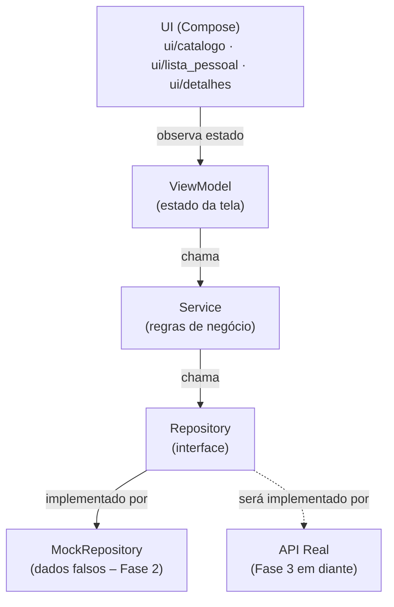

# Diagrama de Componentes — GameCountdown

Documento vivo. Atualizado a cada mudança arquitetural relevante.

---

## Passo 1 — Estrutura de pastas (Fase 2)

**O que foi feito:** Definição da estrutura de pacotes do app Android, seguindo os princípios de SOLID e separação de camadas acordados na Fase 1. Nenhuma lógica foi implementada ainda — apenas a organização de onde cada peça vai morar.

**Por quê desta forma:**
- A camada `data/` é separada da camada `ui/` para que mudanças de tela nunca afetem a lógica de dados, e vice-versa.
- Dentro de `data/`, cada responsabilidade tem sua própria pasta: `model/` (os dados em si), `repository/` (quem busca os dados) e `service/` (quem aplica regras de negócio sobre eles).
- `repository/mock/` existe especificamente para a Fase 2: são implementações falsas que simulam o comportamento de uma API real, sem depender de internet ou backend.
- A UI é organizada por tela (`catalogo/`, `lista_pessoal/`, `detalhes/`) em vez de por tipo de arquivo, porque fica mais fácil de localizar tudo que pertence a uma tela no mesmo lugar.
- `ui/comum/` guarda componentes visuais reutilizáveis entre telas (ex.: o card de um jogo, o badge de countdown).
- Os testes em `src/test/` espelham a estrutura do código principal — cada camada tem sua pasta de testes correspondente.

### Estrutura criada

```
app/src/main/java/com/almenara/gamecountdown/
│
├── data/
│   ├── model/              ← classes de dados (ex.: Game, Platform)
│   ├── repository/         ← interfaces que definem como buscar dados
│   │   └── mock/           ← implementações falsas para o protótipo (Fase 2)
│   └── service/            ← regras de negócio (ex.: filtrar, ordenar, calcular countdown)
│
├── ui/
│   ├── catalogo/           ← tela de catálogo + ViewModel
│   ├── lista_pessoal/      ← tela "Jogos que estou de olho" + ViewModel
│   ├── detalhes/           ← tela de detalhes do jogo + ViewModel
│   ├── comum/              ← componentes visuais compartilhados entre telas
│   └── theme/              ← cores, tipografia e tema Material 3 (já existia)
│
└── MainActivity.kt         ← ponto de entrada do app (já existia)

app/src/test/java/com/almenara/gamecountdown/
│
└── data/
    ├── repository/         ← testes dos repositórios
    └── service/            ← testes dos serviços
```

### Diagrama de camadas (fluxo de dados)



**Leitura do diagrama:** A UI só fala com o ViewModel. O ViewModel só fala com o Service. O Service só fala com o Repository (a interface). Quem implementa o Repository na Fase 2 é o Mock — na Fase 3, será substituído pela implementação real que chama o backend, sem precisar mudar nada no Service nem na UI.

---

*Próximo passo: definir o modelo de dados (`data/model/Game.kt` e tipos relacionados).*
