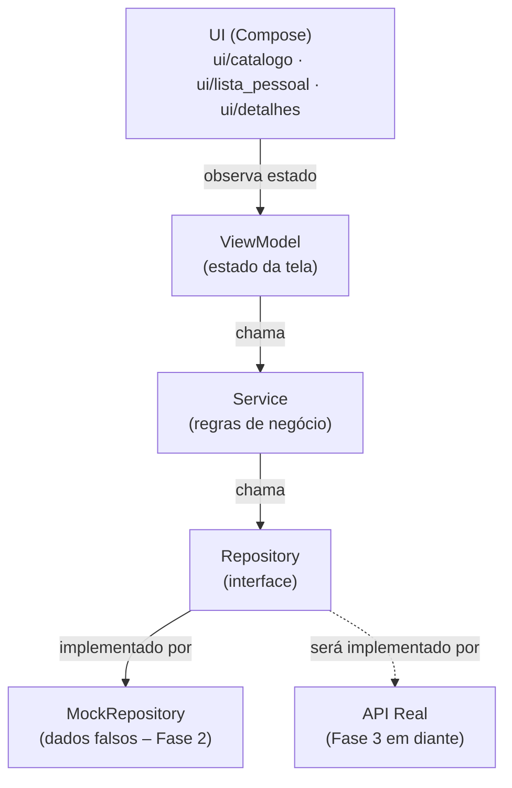

# Diagrama de Componentes — GameCountdown

Documento vivo. Atualizado a cada mudança arquitetural relevante.

---

## Passo 1 — Estrutura de pastas (Fase 2)

**O que foi feito:** Definição da estrutura de pacotes do app Android, seguindo os princípios de SOLID e separação de camadas acordados na Fase 1. Nenhuma lógica foi implementada ainda — apenas a organização de onde cada peça vai morar.

**Por quê desta forma:**
- A camada `data/` é separada da camada `ui/` para que mudanças de tela nunca afetem a lógica de dados, e vice-versa.
- Dentro de `data/`, cada responsabilidade tem sua própria pasta: `model/` (os dados em si), `repository/` (quem busca os dados) e `service/` (quem aplica regras de negócio sobre eles).
- `repository/mock/` existe especificamente para a Fase 2: são implementações falsas que simulam o comportamento de uma API real, sem depender de internet ou backend.
- A UI é organizada por tela (`catalogo/`, `lista_pessoal/`, `detalhes/`) em vez de por tipo de arquivo, porque fica mais fácil de localizar tudo que pertence a uma tela no mesmo lugar.
- `ui/comum/` guarda componentes visuais reutilizáveis entre telas (ex.: o card de um jogo, o badge de countdown).
- Os testes em `src/test/` espelham a estrutura do código principal — cada camada tem sua pasta de testes correspondente.

### Estrutura criada

```
app/src/main/java/com/almenara/gamecountdown/
│
├── data/
│   ├── model/              ← classes de dados (ex.: Game, Platform)
│   ├── repository/         ← interfaces que definem como buscar dados
│   │   └── mock/           ← implementações falsas para o protótipo (Fase 2)
│   └── service/            ← regras de negócio (ex.: filtrar, ordenar, calcular countdown)
│
├── ui/
│   ├── catalogo/           ← tela de catálogo + ViewModel
│   ├── lista_pessoal/      ← tela "Jogos que estou de olho" + ViewModel
│   ├── detalhes/           ← tela de detalhes do jogo + ViewModel
│   ├── comum/              ← componentes visuais compartilhados entre telas
│   └── theme/              ← cores, tipografia e tema Material 3 (já existia)
│
└── MainActivity.kt         ← ponto de entrada do app (já existia)

app/src/test/java/com/almenara/gamecountdown/
│
└── data/
    ├── repository/         ← testes dos repositórios
    └── service/            ← testes dos serviços
```

### Diagrama de camadas (fluxo de dados)



**Leitura do diagrama:** A UI só fala com o ViewModel. O ViewModel só fala com o Service. O Service só fala com o Repository (a interface). Quem implementa o Repository na Fase 2 é o Mock — na Fase 3, será substituído pela implementação real que chama o backend, sem precisar mudar nada no Service nem na UI.

---

## Passo 2 — Modelo de dados (Fase 2)

**O que foi feito:** Criação dos três arquivos que definem como um jogo é representado na memória do app: `Game.kt`, `Platform.kt` e `Genre.kt`, dentro de `data/model/`.

**Por quê desta forma:**

- `Game` é uma `data class` — tipo especial do Kotlin para objetos que só carregam dados, sem comportamento. O compilador gera automaticamente comparação entre objetos, cópia e conversão para texto.
- Campos marcados com `?` (ex.: `priceUsd: Double?`) são **opcionais** — podem ser `null`. Isso reflete a realidade: nem todo jogo tem preço anunciado, nem todo jogo tem trailer ainda.
- `releaseDate` e `preSaleDate` são `String` no formato `"2025-03-15"` — simplificação consciente para o protótipo. Datas como objetos (`LocalDate`) exigiriam configuração extra no build. Revisaremos quando o countdown real precisar de aritmética de datas.
- `Platform` e `Genre` são `enum class` com um campo `displayName` em português — assim a UI pode exibir o nome amigável ("PlayStation 5") sem precisar fazer conversão manual em cada tela.
- `anticipationScore` e `isWatched` vivem no modelo por simplicidade no protótipo. Em fases futuras, `isWatched` tende a migrar para uma camada de preferências do usuário separada (Room/DataStore), quando o sync entre dispositivos for implementado.
- Não há testes nesta camada — `data class` sem lógica não tem comportamento a testar. Os testes começam no `Service`, onde existem regras de negócio reais.

### Arquivos criados

```
data/model/
├── Game.kt        ← objeto principal: campos de um jogo
├── Platform.kt    ← enum: PS5, Xbox Series, PC, Switch, Mobile
└── Genre.kt       ← enum: Ação, RPG, Aventura, Estratégia, Esportes, Simulação, Terror, Luta
```

---

---

## Passo 3 — Repository: interface e mock (Fase 2)

**O que foi feito:** Criação da interface `GameRepository` e da sua implementação falsa `MockGameRepository`, com 6 jogos fictícios cobrindo os diferentes estados que o app precisa exibir.

**Por quê desta forma:**

- `GameRepository` é uma **interface** — define o contrato (o que pode ser feito), sem dizer como. O Service só vai conhecer a interface, nunca a implementação concreta. Isso é o que permite trocar o Mock pelo backend real na Fase 3 sem tocar no Service.
- `MockGameRepository` implementa essa interface com dados fixos em memória. Os jogos cobrem intencionalmente cenários variados: lançamento iminente (dias), lançamento distante (meses/ano), jogo sem preço anunciado, jogo sem trailer, jogo só para uma plataforma, jogo multi-plataforma.
- `watchedIds` é um `mutableSetOf` separado da lista de jogos — a lista pessoal do usuário é uma informação de estado do usuário, não uma propriedade do jogo em si. O método `.copy(isWatched = ...)` mescla os dois no momento da leitura, simulando o que um banco de dados faria.
- `getGameById` retorna `Game?` (com interrogação) porque o jogo pode não existir — chamar com um ID inválido retorna `null` em vez de quebrar o app.
- Os testes verificam os contratos comportamentais do mock: filtragem case-insensitive, toggle de watched, retorno de null para ID inexistente. Não há testes para o modelo (`Game.kt`) porque `data class` sem lógica não tem comportamento a testar.

### Arquivos criados

```
data/repository/
├── GameRepository.kt              ← interface (contrato)
└── mock/
    └── MockGameRepository.kt      ← implementação com 6 jogos fictícios

src/test/data/repository/
└── MockGameRepositoryTest.kt      ← 9 testes dos contratos comportamentais
```

---

## Passo 4 — Service: interface e implementação (Fase 2)

**O que foi feito:** Criação da interface `GameService` (contrato) e da implementação `GameServiceImpl`, com a lógica de filtros de catálogo, ordenação e cálculo de countdown. 11 testes cobrindo cada ordenação, cada filtro (isolados e combinados), os limites de cada janela de período, o cálculo de dias e o repasse dos métodos simples ao Repository.

**Por quê desta forma:**

- `GameService` fica entre a UI/ViewModel e o `GameRepository` — a UI nunca fala com o Repository diretamente. Isso mantém a lógica de negócio (o que é "iminente", como ordenar, quantos dias faltam) fora da UI e fora da camada de dados.
- `FiltroCatalogo` agrupa os filtros opcionais (plataforma, gênero, período) num único parâmetro com valores padrão `null`, em vez de vários parâmetros soltos — retorna o catálogo inteiro quando nenhum filtro é passado.
- `PeriodoLancamento` (semana/mês/trimestre/semestre/ano) e `CriterioOrdenacao` (mais aguardados/mais próximos/alfabética) implementam exatamente os filtros e ordenações da spec da Fase 1.
- **Cálculo de datas com `java.time` + desugaring:** o countdown exige aritmética de datas (diferença em dias). Como o `minSdk` do projeto é 24 e `java.time` só existe nativamente a partir da API 26, foi habilitado o *core library desugaring* (`app/build.gradle.kts` + dependência `desugar_jdk_libs` em `libs.versions.toml`) — opção escolhida por Igor entre isso e um cálculo manual de datas, por ser mais robusta (lida com bissextos e virada de mês/ano automaticamente) e ser o padrão atual do Android para esse cenário.
- **`Clock` injetado no construtor:** `GameServiceImpl` recebe um `java.time.Clock` (padrão: o relógio real do sistema) em vez de chamar `LocalDate.now()` diretamente. Isso permite que os testes "congelem" a data de hoje com `Clock.fixed(...)`. Isso torna os testes de filtro de período e de countdown determinísticos, independentemente de quando rodarem, em vez de dependerem da data real do dia do teste.
- Os testes usam um `FakeGameRepository` próprio (não o `MockGameRepository` da Fase 2), com datas relativas a "hoje" escolhidas para testar os limites exatos de cada janela (ex.: um jogo a exatamente 7 dias para testar o limite inclusivo de `SEMANA`). Isso isola o teste do Service da fixture do Repository, que tem datas fixas em calendário e vai ficar desatualizada com o tempo.

### Arquivos criados

```
data/service/
├── GameService.kt          ← interface + FiltroCatalogo + PeriodoLancamento + CriterioOrdenacao
└── GameServiceImpl.kt      ← implementação com filtros, ordenação e countdown

src/test/data/service/
└── GameServiceImplTest.kt  ← 11 testes + FakeGameRepository isolado
```

---

## Passo 5 — ViewModel e Factory do Catálogo (Fase 2)

**O que foi feito:** Criação do `CatalogoUiState` (estado da tela), do `CatalogoViewModel` (traduz ações do usuário em chamadas ao `GameService` e expõe o estado) e do `CatalogoViewModelFactory` (ensina o Android a instanciar esse ViewModel). 6 testes do ViewModel (carga automática ao criar, aplicar filtro, aplicar ordenação, marcar/desmarcar watched, id inexistente) + 2 testes da Factory (cria o tipo certo, rejeita tipo desconhecido).

**Por quê desta forma:**

- `CatalogoUiState` é uma `data class` que reúne **tudo** que a tela precisa pra se desenhar num dado momento (jogos, filtro, ordenação, carregando, erro). A UI (Compose, ainda não criada) vai só observar esse objeto — nunca guarda estado próprio nem chama o Service diretamente.
- `CatalogoViewModel` conhece **só** o contrato `GameService`, nunca o `GameRepository` nem o Mock. Ele guarda um `MutableStateFlow` privado (gravável só por ele) e expõe um `StateFlow` público somente leitura — padrão do Android para estado observável que sobrevive a mudanças de configuração (ex.: rotação de tela).
- Cada ação do usuário (`aplicarFiltro`, `aplicarOrdenacao`, `alternarWatched`) segue o mesmo formato: atualiza o estado relevante e chama `carregarJogos()` de novo, que busca a lista já filtrada/ordenada no Service. Isso evita duplicar a lógica de "buscar e atualizar estado" em cada método.
- `alternarWatched` primeiro busca o jogo pelo id: se não existir, sai sem fazer nada (não quebra, não chama o Service, não gera erro) — é o comportamento testado em `alternarWatched com id inexistente nao chama o service`.
- **`CatalogoViewModelFactory` foi necessária porque o Android só sabe criar ViewModels de construtor vazio por padrão**, e `CatalogoViewModel` exige um `GameService` no construtor. A Factory é o único lugar do app (fora dos testes) que conhece as implementações concretas `GameServiceImpl` e `MockGameRepository` — o resto do app continua enxergando só a interface `GameService`. Esse é o padrão chamado "composition root": em vez de espalhar `GameServiceImpl(MockGameRepository())` por várias telas, existe um único ponto de montagem por feature.
- Sem framework de injeção de dependência (Hilt/Koin) no projeto ainda, a Factory manual é a forma padrão do Android puro de resolver isso.
- Os testes do ViewModel usam um `FakeGameService` próprio (não o `GameServiceImpl` real), porque a lógica de filtro/ordenação/countdown já está coberta em `GameServiceImplTest` — aqui o que importa é testar a **orquestração** do ViewModel (ele chama o Service com os parâmetros certos? atualiza o estado certo?), não repetir a lógica de negócio.
- Os testes da Factory usam um fake diferente (`FakeGameServiceVazio`, não `FakeGameService`) apesar de estarem no mesmo pacote de teste — no JVM, duas classes `private` com o mesmo nome em arquivos diferentes do mesmo pacote geram arquivos `.class` conflitantes e a build quebra. É uma armadilha específica do Kotlin (visibilidade `private` é checada em tempo de compilação, mas não muda o nome do arquivo `.class` gerado).

### Arquivos criados

```
ui/catalogo/
├── CatalogoUiState.kt          ← estado da tela (jogos, filtro, ordenação, carregando, erro)
├── CatalogoViewModel.kt        ← orquestra chamadas ao GameService e expõe o estado
└── CatalogoViewModelFactory.kt ← composition root: monta GameServiceImpl(MockGameRepository()) e instancia o ViewModel

src/test/ui/catalogo/
├── CatalogoViewModelTest.kt        ← 6 testes + FakeGameService isolado
└── CatalogoViewModelFactoryTest.kt ← 2 testes + FakeGameServiceVazio isolado
```

---

## Passo 6 — Primeiros componentes de UI (ui/comum/) (Fase 2)

**O que foi feito:** Início da camada de View (Compose), começando pelos componentes-folha mais simples e reutilizáveis, guardados em `ui/comum/` por serem cross-cutting (vão reaparecer no Catálogo, na Lista Pessoal e nos Detalhes): `PlatformBadge` (chip com o nome de uma plataforma) e `PriceTag` (chip com o preço do jogo). A lógica de formatação de preço do `PriceTag` ganhou 6 testes unitários.

**Por quê desta forma:**

- **Segmentação por componente, do mais simples ao mais complexo.** Em vez de montar a tela inteira de uma vez, a camada de UI está sendo construída de baixo para cima: primeiro os componentes-folha (que não dependem de nenhum outro componente), depois os que os combinam (`GameCard`), depois a tela. Isso mantém cada passo pequeno o bastante para revisão sem leitura fluente de Kotlin.
- **Componentes puros e sem estado.** Tanto `PlatformBadge` quanto `PriceTag` só recebem dados por parâmetro e os desenham — não buscam dados, não guardam estado, não conhecem ViewModel. É isso que os torna reutilizáveis entre telas e testáveis isoladamente.
- **`modifier: Modifier = Modifier` em todo componente.** Convenção padrão do Compose: quem usa o componente pode ajustar espaçamento/tamanho de fora, sem o componente precisar saber onde será colocado.
- **Cores e formas vêm do `MaterialTheme`, nunca fixadas no código.** Assim os componentes acompanham automaticamente o tema Material 3 Expressive e o modo claro/escuro. `PlatformBadge` usa `secondaryContainer` e `PriceTag` usa `tertiaryContainer` para se distinguirem visualmente quando aparecem lado a lado no mesmo card.

**Sobre o `PriceTag` (decisões de produto tomadas por Igor):**

- **Prioridade de moeda: BRL em destaque, USD como fallback.** Mostra um valor por vez: se houver preço em reais, exibe em R$ (moeda do usuário brasileiro); senão, cai para US$; se não houver nenhum, exibe "Preço não anunciado". A spec pedia "USD, e BRL quando disponível", mas para o público brasileiro decidiu-se destacar o BRL.
- **A regra de qual preço mostrar é lógica de negócio, não desenho** — por isso foi extraída para a função `formatarPreco()`, marcada `internal` (visível ao teste dentro do módulo) em vez de `private`. Isso permite testá-la com **teste unitário comum, sem emulador**, cumprindo a regra "lógica sempre com teste". O desenho da tela em si (renderização Compose) exigiria teste instrumentado com `ComposeTestRule` — esses ficaram para um passo dedicado, quando houver emulador configurado.
- **Formatação por `Locale`:** o preço em BRL usa `Locale.forLanguageTag("pt-BR")` (vírgula no decimal, ponto no milhar: `R$ 1.349,90`) e o USD usa `Locale.US` (ponto no decimal, vírgula no milhar: `US$ 1,349.99`). Os testes cobrem justamente essa diferença de separadores, além dos três casos da regra de prioridade. Nota técnica: o construtor `Locale("pt","BR")` está deprecado no Java atual — usou-se `Locale.forLanguageTag(...)`, disponível desde a API 21.

### Arquivos criados

```
ui/comum/
├── PlatformBadge.kt   ← chip com o nome de uma plataforma (desenho puro)
└── PriceTag.kt        ← chip com o preço; lógica de formatação em formatarPreco() (internal)

src/test/ui/comum/
└── PriceTagTest.kt    ← 6 testes da lógica de formatação (prioridade de moeda + separadores)
```

---

*Próximo passo: o `CountdownBadge` — o núcleo visual do app (countdown + modo LANÇAMENTO IMINENTE), o mais complexo dos três componentes-folha. Depois deles, o `GameCard` que os combina, a `FilterBar` e por fim a `CatalogoScreen`.*

---

## Passo 7 — CountdownBadge: o núcleo visual do app (ui/comum/) (Fase 2)

**O que foi feito:** Criação do `CountdownBadge`, o terceiro e mais complexo componente-folha — exibe quantos dias faltam para o lançamento e destaca visualmente o modo LANÇAMENTO IMINENTE. A lógica que traduz "número de dias" em "texto + estado visual" foi extraída para a função pura `calcularCountdown()` e ganhou 7 testes unitários focados nos limites de cada faixa. Com isso, os três componentes-folha de `ui/comum/` estão completos.

**Por quê desta forma:**

- **A lógica de estado é o coração do app, então foi isolada e testada exaustivamente.** `CountdownBadge` recebe apenas um `Long` (os dias até o lançamento, vindos de `GameService.getDaysUntilRelease`) e delega toda a decisão para `calcularCountdown()`, uma função pura que devolve um `CountdownInfo` (texto + estado). Como no `PriceTag`, essa função é `internal` para ser testável por teste unitário comum, **sem emulador** — o desenho em si (Compose) exigiria teste instrumentado, adiado para um passo dedicado.
- **Separar "o que dizer" de "como destacar".** `CountdownInfo` carrega o `texto` (ex.: "faltam 5 dias") e o `estado` (`CountdownEstado`) separadamente. Assim a regra de negócio não sabe nada de cores — quem escolhe cor/negrito é o Composable, lendo o estado. Isso mantém a lógica testável e a aparência trocável sem tocar na regra.

**Decisões de produto tomadas por Igor:**

- **Dois estados visuais, não três.** Foram consideradas duas opções: (a) 2 estados — Normal e Iminente; (b) 3 estados — Normal, Iminente e um "Crítico" ainda mais destacado para véspera/dia. Escolheu-se **2 estados**, alinhado com a "categoria única" de lançamento iminente já definida na spec (os três gatilhos — 7 dias, véspera, dia — compartilham o mesmo destaque visual). Mais simples e coerente com o resto do sistema.
- **Limite do iminente: 7 dias, inclusivo.** Jogos a 7 dias ou menos são iminentes; a partir de 8 dias, normais. Os textos especiais cobrem o dia ("LANÇA HOJE") e a véspera ("LANÇA AMANHÃ"); de 2 a 7 dias mostra "faltam N dias" com o destaque de iminente; acima de 7, o mesmo texto sem destaque.
- **Jogo já lançado (dias negativos): "Disponível", visual neutro.** Em vez de exibir algo como "faltam -3 dias", a data no passado vira o estado `DISPONIVEL` com texto "Disponível". O catálogo da Fase 2 só tem jogos futuros, mas o caso de borda ficou tratado e coberto por teste desde já.

**Sobre os testes (7 casos):** concentram-se nos **limites** de cada faixa, onde erros de `≤` vs. `<` se escondem — em especial 7 dias (ainda iminente) vs. 8 dias (já normal), além de 0 (hoje), 1 (amanhã), 2 (início do "faltam N dias"), um valor distante (normal) e um negativo (disponível). Verificam tanto o texto quanto o estado retornado.

### Arquivos criados

```
ui/comum/
└── CountdownBadge.kt   ← countdown + modo iminente; lógica em calcularCountdown() (internal),
                          apoiada pelo enum CountdownEstado e pela data class CountdownInfo

src/test/ui/comum/
└── CountdownBadgeTest.kt  ← 7 testes da lógica de countdown (limites de faixa + estados)
```

**Estado da camada `ui/comum/` ao fim deste passo:** os três componentes-folha estão prontos e testados — `PlatformBadge` (desenho puro), `PriceTag` e `CountdownBadge` (com lógica de negócio isolada e testada). São as peças que o `GameCard` vai combinar.

---

*Próximo passo: o `GameCard` — primeiro componente composto, que combina capa, título, `PlatformBadge`, `PriceTag` e `CountdownBadge` para representar um jogo na lista. Depois dele, a `FilterBar` e a `CatalogoScreen`, e por fim ligar o `MainActivity` à tela real.*

---

## Passo 8 — GameCard: primeiro componente composto (ui/comum/) (Fase 2)

**O que foi feito:** Criação do `GameCard`, o primeiro componente **composto** — um item de lista que representa um jogo combinando os três componentes-folha (`PlatformBadge`, `PriceTag`, `CountdownBadge`) com uma capa e o título. A única lógica do card (extrair a inicial do título para a capa placeholder) foi isolada em `inicialDoTitulo()` e coberta por 5 testes.

**Por quê desta forma:**

- **Composição, não reimplementação.** O `GameCard` não redesenha preço, plataforma ou countdown — ele **reutiliza** os componentes-folha já prontos e testados. É exatamente o retorno esperado da estratégia de construir de baixo para cima: montar o card virou basicamente organizar peças existentes num layout.
- **O card é um componente de exibição puro.** Recebe os dados prontos (`game`), avisa quando é tocado (`onClick`) e nada mais — não chama Service, não guarda estado, não sabe que dia é hoje. Isso o mantém reutilizável (Catálogo, Lista Pessoal, resultados de busca) e testável isoladamente.
- **O countdown chega calculado de fora (`dias: Long`).** Este foi o principal ponto de design do passo. O `CountdownBadge` precisa do número de dias, mas calcular isso depende do `Clock`/`GameService` (saber "hoje"). Para não furar a pureza do card, quem monta a tela é que chama `getDaysUntilRelease()` e repassa o resultado. Alternativa descartada: o card calcular a data sozinho — tornaria o componente não-determinístico (dependente da data real ao rodar) e duplicaria lógica que já existe e é testada no Service.

**Decisões de produto tomadas por Igor:**

- **Capa placeholder, sem imagens reais ainda.** Opções consideradas: (a) adicionar a biblioteca Coil + permissão INTERNET para carregar as capas reais das URLs do mock; (b) um placeholder local. Escolheu-se **(b)**: uma caixa colorida (cor do tema) com a inicial do título centralizada. Como a UI da Fase 2 é descartável e o foco é validar o fluxo, evita-se adicionar dependência e dependência de rede agora. As imagens reais entram quando a UI for "pra valer".
- **Layout em linha horizontal**, não pôster vertical: capa à esquerda, informações à direita — formato clássico de item de lista, coerente com a spec ("UI majoritariamente baseada em listas") e mostra mais jogos por tela.
- **Card só de exibição + `onClick`**, sem controle de "adicionar à lista pessoal" embutido. O toggle de watched virará um componente próprio (`AddToListSwitch`) num passo seguinte, mantendo a segmentação limpa (exibição separada de ação).

**Detalhes de implementação que valem registro:**

- **`FlowRow` para as plataformas.** Um jogo pode ter várias plataformas (ex.: "Project Omega" tem 3). Em vez de estourar a largura da tela, os `PlatformBadge` quebram para a linha de baixo automaticamente.
- **Título com no máximo 2 linhas + reticências** (`maxLines = 2`, `TextOverflow.Ellipsis`) para títulos longos não desalinharem a lista.
- **`inicialDoTitulo()` trata os casos de borda** (título vazio ou só espaços → "?"), evitando crash. Ficou `internal` para ser testável por teste unitário comum, seguindo o mesmo padrão do `PriceTag` e do `CountdownBadge`.

### Arquivos criados

```
ui/comum/
└── GameCard.kt   ← item de lista composto; combina capa + título + PlatformBadge/PriceTag/CountdownBadge;
                    lógica de apoio em inicialDoTitulo() (internal)

src/test/ui/comum/
└── GameCardTest.kt  ← 5 testes da extração da inicial do título (casos normais + bordas)
```

**Estado da camada de UI ao fim deste passo:** todos os componentes de `ui/comum/` necessários para a tela de Catálogo estão prontos e testados. Falta a `FilterBar` (filtros + ordenação), a `CatalogoScreen` (a tela em si, consumindo o `CatalogoViewModel`) e ligar o `MainActivity` à tela real — quando o "Hello Android!" do template finalmente dá lugar ao conteúdo.

---

*Próximo passo: a `FilterBar` — controles de filtro (plataforma, gênero, período) e ordenação, ligados ao `CatalogoViewModel`. Depois dela, a `CatalogoScreen` e o `MainActivity`.*

---

## Passo 9 — FilterBar: filtros e ordenação (ui/catalogo/) (Fase 2)

**O que foi feito:** Criação da `FilterBar`, a barra com os quatro controles da tela de Catálogo — filtro de plataforma, de gênero, de período de lançamento e escolha de ordenação — cada um como um menu suspenso (dropdown). Os rótulos amigáveis de período e ordenação foram isolados em `rotuloPeriodo()`/`rotuloOrdenacao()` e cobertos por 4 testes. Diferente dos componentes anteriores, a `FilterBar` mora em `ui/catalogo/` (não em `ui/comum/`) por ser específica desta tela.

**Por quê desta forma:**

- **Barra sem estado de negócio.** A `FilterBar` recebe o `FiltroCatalogo` e o `CriterioOrdenacao` atuais e apenas **emite** o novo valor via callbacks (`onFiltroChange`, `onOrdenacaoChange`) — quem guarda e aplica é o `CatalogoViewModel`. O único estado que a barra guarda é local de UI (menu aberto/fechado), que não é regra de negócio. Esse é o padrão "state hoisting" do Compose: o estado sobe para o ViewModel, o componente só desenha e avisa.
- **Um componente genérico reutilizado quatro vezes.** Em vez de escrever quatro pares botão+menu quase idênticos, há um `FilterDropdown<T>` privado, parametrizado pelo tipo do valor de cada opção. Cada um dos quatro controles é só uma chamada com sua lista de opções — menos código repetido, mais fácil de revisar.
- **A opção "limpar filtro" é o valor `null`.** Cada filtro começa com uma opção ("Todas"/"Todos"/"Qualquer") cujo valor é `null` — que é exatamente o que o `FiltroCatalogo` já entende como "sem filtro". Assim, limpar um filtro reusa o mesmo caminho de código de aplicá-lo. A ordenação não tem opção nula, pois sempre há um critério ativo.
- **Rolagem horizontal.** Os quatro botões podem não caber em telas estreitas, então a barra rola na horizontal em vez de espremer ou cortar os controles.

**Decisões de produto tomadas por Igor:**

- **Menus suspensos (dropdowns), não chips nem bottom sheet.** Opções consideradas: (a) dropdowns — um botão por dimensão; (b) chips horizontais roláveis, sempre à vista; (c) um botão "Filtros" abrindo um painel deslizante. Escolheu-se **(a)**: compacto, escala bem para muitas opções (são 8 gêneros) e usa só APIs estáveis do Material 3.
- **Rótulos amigáveis na UI, não nos enums do Service.** Decisão explícita de manter `PeriodoLancamento` e `CriterioOrdenacao` "puros" (sem texto de apresentação), diferente de `Platform`/`Genre` que carregam `displayName`. O trade-off aceito: melhor separação de camadas (o Service não conhece texto de UI), ao custo de o rótulo não ser reutilizável fora da barra e de haver uma pequena inconsistência com os enums de modelo. Por isso os mapas `rotuloPeriodo()`/`rotuloOrdenacao()` vivem na `FilterBar`.

**Sobre os testes (4 casos):** como os rótulos passaram a ser lógica na UI, foram testados. Os testes não checam texto fixo (que mudaria a cada ajuste de redação), e sim duas propriedades que pegam erros reais de copiar-e-colar: todo valor do enum tem rótulo **não-vazio**, e os rótulos são **todos distintos** entre si (dois filtros nunca mostram o mesmo texto). O `when` exaustivo já garante, em tempo de compilação, que nenhum valor fica sem tratamento.

### Arquivos criados

```
ui/catalogo/
└── FilterBar.kt   ← barra de filtros + ordenação (dropdowns); FilterDropdown<T> genérico interno;
                     rótulos em rotuloPeriodo()/rotuloOrdenacao() (internal)

src/test/ui/catalogo/
└── FilterBarTest.kt  ← 4 testes dos rótulos (não-vazios + distintos, para período e ordenação)
```

**Estado da camada de UI ao fim deste passo:** todos os componentes visuais da tela de Catálogo estão prontos e testados (`ui/comum/`: `PlatformBadge`, `PriceTag`, `CountdownBadge`, `GameCard`; `ui/catalogo/`: `FilterBar`). Falta montá-los na `CatalogoScreen`, consumindo o `CatalogoViewModel`, e ligar o `MainActivity` à tela real.

---

*Próximo passo: a `CatalogoScreen` — a tela que junta a `FilterBar` e a lista de `GameCard`, observando o estado do `CatalogoViewModel`. Depois dela, ligar o `MainActivity` (fim do "Hello Android!").*

---

## Passo 10 — CatalogoScreen: a primeira tela montada (ui/catalogo/) (Fase 2)

**O que foi feito:** Montagem da `CatalogoScreen`, a primeira tela de verdade — junta a `FilterBar` no topo e uma lista rolável de `GameCard`, observando o `CatalogoViewModel`. Para isso, a camada de estado foi ajustada: criou-se o modelo `JogoCatalogo` (jogo + dias) e o `CatalogoUiState`/`CatalogoViewModel` passaram a calcular o countdown ao montar o estado. Os testes do ViewModel foram atualizados e ganharam um caso novo. A tela ainda **não** está ligada ao `MainActivity` (próximo passo).

O passo foi feito em duas partes, respeitando a segmentação por camada: **(1)** a mudança de estado/ViewModel (lógica, com testes) e **(2)** a tela (UI).

**Parte 1 — Estado + ViewModel (por quê):**

- **O countdown passou a viver no estado (`JogoCatalogo`).** O `GameCard` precisa dos "dias até o lançamento", mas só o `GameService` sabe calculá-los (depende do relógio). Duas opções foram consideradas: (a) o `CatalogoUiState` carregar os dias já calculados; (b) o ViewModel expor um método `diasAte(game)` que a tela chamaria por card. Escolheu-se **(a)**: o ViewModel calcula os dias de cada jogo dentro de `carregarJogos()` e guarda um `JogoCatalogo(game, dias)` no estado. Assim a tela **só observa estado** e nada chama o Service durante o desenho — o `CatalogoUiState` descreve, sozinho, tudo que a tela precisa (princípio central do MVVM). O custo aceito foi mexer no estado, no ViewModel e nos seus testes.
- **Teste novo de pareamento.** O `FakeGameService` dos testes passou a devolver, em `getDaysUntilRelease`, um valor derivado do id do jogo (id "1" → 1 dia), permitindo um teste que verifica que **cada** jogo recebeu o countdown correspondente ao seu próprio id — não basta o campo existir, ele tem que estar pareado ao jogo certo. Os testes antigos foram ajustados para o novo formato (`it.game.id` em vez de `it.id`).

**Parte 2 — A tela (por quê):**

- **Tela com estado + conteúdo sem estado.** `CatalogoScreen(viewModel)` é a casca "com estado": observa o `uiState` via `collectAsState()` e repassa dados e callbacks. `CatalogoConteudo(...)` é "sem estado": recebe tudo por parâmetro e só desenha. Essa divisão deixa o conteúdo previewável no Android Studio (o `@Preview` usa dados fictícios, sem precisar de ViewModel) e testável isoladamente no futuro.
- **`Scaffold` + `TopAppBar`** dão a estrutura padrão de tela do Material 3 (barra de título "Catálogo" + área de conteúdo). O padding reservado pela barra é repassado ao conteúdo para nada ficar escondido atrás dela.
- **`LazyColumn` para a lista**, não uma `Column` comum: ela só compõe os cards visíveis e reaproveita os demais conforme o usuário rola — eficiente para catálogos grandes. A `key` por id ajuda o Compose a reaproveitar os itens corretamente quando a lista é filtrada/reordenada.
- **Estado vazio tratado** (decisão de Igor): quando nenhum jogo passa pelos filtros, a tela mostra "Nenhum jogo encontrado" centralizado, em vez de uma área em branco. Os estados `carregando` e `mensagemErro` não são desenhados por ora — o mock é síncrono e nunca os dispara; ficam reservados para a API real da Fase 3.
- **Clique no card é um `onJogoClick(id)` ainda sem destino.** O parâmetro existe (com padrão vazio) para a futura navegação à tela de detalhes; nesta fase não faz nada, pois o foco é validar o fluxo de catálogo + filtros.

### Arquivos criados/alterados

```
ui/catalogo/
├── JogoCatalogo (em CatalogoUiState.kt)  ← NOVO modelo: jogo + dias já calculados
├── CatalogoUiState.kt                    ← ALTERADO: jogos agora é List<JogoCatalogo>
├── CatalogoViewModel.kt                  ← ALTERADO: carregarJogos() calcula os dias ao montar o estado
└── CatalogoScreen.kt                     ← NOVO: Scaffold + FilterBar + LazyColumn de GameCard (+ estado vazio)

src/test/ui/catalogo/
└── CatalogoViewModelTest.kt              ← ALTERADO: asserções no novo formato + teste de pareamento dos dias
```

**Estado da camada de UI ao fim deste passo:** a tela de Catálogo está montada e compilando, com todos os seus componentes integrados e o ViewModel testado. Falta só o último fio: ligar o `MainActivity` à `CatalogoScreen` (criando o ViewModel via `CatalogoViewModelFactory`), o que substitui o "Hello Android!" do template pelo catálogo real rodando no aparelho.

---

*Próximo passo: ligar o `MainActivity` à `CatalogoScreen`, usando a `CatalogoViewModelFactory` — o momento em que o app finalmente mostra conteúdo de verdade.*

---

## Passo 11 — MainActivity ligada ao Catálogo: o app mostra conteúdo (Fase 2)

**O que foi feito:** Ligação final da tela — o `MainActivity` deixou de exibir o "Hello Android!" do template e passou a exibir a `CatalogoScreen`, criando o `CatalogoViewModel` pela `CatalogoViewModelFactory`. O app foi compilado, instalado no aparelho (Samsung, via Wi-Fi) e executado: o catálogo real do mock aparece, com filtros e ordenação funcionando. **A tela de Catálogo está completa de ponta a ponta.**

**Por quê desta forma:**

- **A Factory monta a cadeia real num único ponto.** O `MainActivity` não conhece `GameServiceImpl` nem `MockGameRepository` — ele só chama `viewModel(factory = CatalogoViewModelFactory())`. É a Factory (o "composition root", criado no Passo 5) que monta `GameServiceImpl(MockGameRepository())` por baixo. Quando a Fase 3 trocar o mock pela API real, só a Factory muda; o `MainActivity`, a tela e o ViewModel ficam intactos.
- **`viewModel()` em vez de instanciar direto.** Usar a função `viewModel(...)` do `lifecycle-viewmodel-compose` (em vez de `CatalogoViewModel(...)` na mão) faz o ViewModel **sobreviver à rotação de tela** e a outras mudanças de configuração — o estado do catálogo (filtros, lista) não se perde quando o aparelho gira. É o comportamento esperado de um ViewModel de verdade.
- **Sem `Scaffold` duplicado.** A `CatalogoScreen` já traz o próprio `Scaffold` e a barra de topo (Passo 10), então o `MainActivity` apenas aplica o tema (`GameCountdownTheme`) e coloca a tela dentro — nada de aninhar um segundo `Scaffold`.
- **Validação de ponta a ponta.** Rodar no aparelho confirmou que toda a cadeia funciona junta: `MockGameRepository` → `GameServiceImpl` (com o desugaring de `java.time` para o countdown) → `CatalogoViewModel` → `CatalogoScreen` e seus componentes. Este era o objetivo central da Fase 2: validar o fluxo e o conceito com dados mockados.

### Arquivos alterados

```
MainActivity.kt   ← ALTERADO: remove o Greeting/"Hello Android!" do template;
                    exibe CatalogoScreen com o ViewModel criado pela CatalogoViewModelFactory
```

**Marco atingido:** a **feature de Catálogo** (a primeira do app) está completa em todas as camadas — modelo → repositório → service → ViewModel → UI → tela rodando no aparelho. Todas as camadas de lógica têm testes unitários; a UI tem componentes previewáveis (testes instrumentados de Compose ficaram reservados para um passo dedicado com emulador).

---

*Próximo passo: a definir com Igor. Opções naturais: (a) a feature de **Lista Pessoal** ("Jogos que estou de olho"), que reaproveita `GameCard` e precisa de um `ListaPessoalViewModel`; (b) a tela de **Detalhes**, onde o `getDaysUntilRelease` e a sinopse/trailer entram, com um `DetalhesViewModel`; (c) expor a **busca** (já existe no Service) no Catálogo; (d) a navegação entre telas, que costura tudo. As três lacunas de ViewModel mapeadas antes do Passo 6 seguem pendentes.*

---

## Passo 12 — Busca no Catálogo (ui/catalogo/) (Fase 2)

**O que foi feito:** Exposição da busca (que já existia e era testada no Service) na tela de Catálogo. Uma lupa na barra de topo abre um campo de busca que filtra os jogos por título. Feito em duas partes: **(1)** estado + ViewModel (com 3 testes novos) e **(2)** a UI da barra de busca. Fecha a primeira das três lacunas de ViewModel mapeadas antes do Passo 6.

**Decisões de produto tomadas por Igor:**

- **Busca é um MODO separado, que não conversa com filtros/ordenação.** Opções consideradas: (a) integrar o texto ao pipeline de `getGames` (busca + filtros + ordenação combinados); (b) modo separado, usando `searchGames` e ignorando filtros/ordenação. Escolheu-se **(b)**. Enquanto a busca está aberta, a `FilterBar` some e os resultados vêm só de `searchGames` (casamento por título). Vantagem: não mexe no contrato do Service (o `getGames` e o `FiltroCatalogo` ficam intactos). Registrado para o futuro: a busca deve ganhar tela dedicada, acessível por uma barra de navegação inferior (Catálogo / Lista Pessoal / Calendário / Busca), e pode ganhar filtros próprios então.
- **Lupa na barra de topo, do lado oposto ao título.** Ao tocar, a barra de topo se transforma: título → campo de texto, com "voltar" à esquerda e "limpar" (X) à direita. Alternativa descartada: campo de busca fixo sempre visível abaixo do título.

**Por quê desta forma (implementação):**

- **O modo busca vive no estado (`buscando` + `busca`).** O `CatalogoUiState` ganhou dois campos: `buscando` (o campo de busca está aberto?) e `busca` (o texto). O `carregarJogos()` passou a ramificar: se `buscando`, usa `searchGames(busca)`; senão, `getGames(filtro, ordenacao)`. Assim o mesmo método serve os dois modos, e a tela continua só observando estado.
- **Três ações no ViewModel:** `abrirBusca()` (liga o modo e lista todos como ponto de partida — `searchGames("")` devolve tudo), `atualizarBusca(texto)` (refaz a busca a cada tecla) e `fecharBusca()` (desliga o modo e volta ao catálogo com os filtros/ordenação que estavam ativos).
- **Barra de topo com duas formas, sem estado próprio.** O `CatalogoTopBar` é um Composable privado que decide entre "título + lupa" e "voltar + campo + limpar" conforme o `buscando`. O campo recebe foco automático ao abrir (via `FocusRequester` + `LaunchedEffect`), já subindo o teclado.
- **A `FilterBar` só aparece fora da busca** — o `CatalogoConteudo` recebe `buscando` e omite a barra de filtros no modo busca, refletindo a decisão de que busca e filtros não se misturam (por ora).

**Sobre os testes (3 novos, total de 10 no ViewModel):** cobrem o ciclo completo do modo busca — `abrirBusca` liga o modo e lista todos; `atualizarBusca` filtra por título (o fake casa "alpha" com "Alpha Quest"); `fecharBusca` desliga o modo, limpa o texto e volta ao catálogo completo. A UI da barra (desenho) fica para os testes instrumentados, como os demais componentes Compose.

**Dependência adicionada:** `androidx.compose.material:material-icons-core` (gerenciada pelo BOM, sem versão fixa). Necessária para os ícones de lupa, voltar e limpar — não vinha transitivamente do `material3`. Optou-se pelo pacote **-core** (conjunto básico de ícones), não pelo `-extended`, que é muito maior e desnecessário aqui.

### Arquivos criados/alterados

```
ui/catalogo/
├── CatalogoUiState.kt    ← ALTERADO: campos 'buscando' e 'busca'
├── CatalogoViewModel.kt  ← ALTERADO: carregarJogos() ramifica por modo; abrirBusca/atualizarBusca/fecharBusca
└── CatalogoScreen.kt     ← ALTERADO: CatalogoTopBar (lupa ↔ campo de busca); FilterBar escondida no modo busca

src/test/ui/catalogo/
└── CatalogoViewModelTest.kt  ← ALTERADO: +3 testes do modo busca (total 10)

gradle/libs.versions.toml + app/build.gradle.kts  ← ALTERADO: dependência material-icons-core
```

**Estado da feature de Catálogo:** completa, com busca. Seguem pendentes as outras duas lacunas de ViewModel: `ListaPessoalViewModel` e `DetalhesViewModel`, além da navegação entre telas.

---

*Próximo passo: a definir com Igor — provavelmente a **Lista Pessoal**, a tela de **Detalhes**, ou a **navegação** que costura as telas (hoje o clique no card já emite o id, mas ainda sem destino).*

---

## Passo 13 — Lista Pessoal, parte 1: infra compartilhada + ViewModel (Fase 2)

**O que foi feito:** Início da feature "Jogos que estou de olho" pela camada de lógica. Duas coisas: **(1)** um `AppContainer` que passa a compartilhar uma única instância de `GameService` entre as telas; **(2)** o `ListaPessoalViewModel` (+ estado `ListaPessoalUiState`/`JogoLista` e `ListaPessoalViewModelFactory`), com 3 testes. A UI (o `AddToListSwitch`, o slot no `GameCard` e a `ListaPessoalScreen`) fica para o Passo 14.

**Decisões de produto/arquitetura tomadas por Igor:**

- **Repositório mock compartilhado (uma única instância).** Até aqui, cada Factory criava seu próprio `MockGameRepository`. Como agora duas telas mexem no MESMO dado (a lista "de olho"), isso daria listas divergentes. Decidiu-se centralizar num `AppContainer` (um `object`/singleton) que expõe um `GameService` único; ambas as Factories passam a usá-lo como padrão. Assim, marcar um jogo no Catálogo reflete na Lista Pessoal e vice-versa. É um "composition root" manual — o único lugar que conhece as implementações concretas (`GameServiceImpl` + `MockGameRepository`); quando a Fase 3 trouxer a API real, só o `AppContainer` muda.
- **A Lista Pessoal terá controle de remover no card** (o `AddToListSwitch`, que estava adiado desde o Passo 8). Isso será implementado no Passo 14; o `ListaPessoalViewModel` já expõe a ação `removerDaLista(id)` que dá suporte a ele.

**Por quê desta forma (implementação):**

- **ViewModel espelha o do Catálogo, mas mais simples.** Observa o `getWatchedGames()` e calcula os dias de cada jogo ao montar o estado (mesmo padrão do Catálogo: a tela só observa estado, nada chama o Service no desenho). A ação `removerDaLista(id)` chama `setWatched(id, false)` e recarrega. Remover um id que não está na lista é inofensivo (coberto por teste).
- **`JogoLista` é um tipo próprio da feature**, espelhando o `JogoCatalogo` (jogo + dias). Optou-se por não reusar o `JogoCatalogo` do pacote do Catálogo para não acoplar as duas features; ficou registrado que os dois podem ser unificados num tipo comum no futuro, se valer a pena.
- **A Factory usa o `AppContainer` como padrão**, o que é justamente o que garante o dado compartilhado com o Catálogo.

**Sobre os testes (3):** `init` carrega só os jogos observados, com os dias pareados a cada jogo (o fake devolve dias = id); `removerDaLista` tira o jogo certo da lista; remover um id fora da lista não altera nada. O fake guarda o conjunto de watched em memória, simulando o repositório.

### Arquivos criados/alterados

```
di/
└── AppContainer.kt                     ← NOVO: composition root único (GameService compartilhado)

ui/catalogo/
└── CatalogoViewModelFactory.kt         ← ALTERADO: usa AppContainer.gameService (antes criava o seu próprio)

ui/lista_pessoal/
├── ListaPessoalUiState.kt              ← NOVO: JogoLista (jogo + dias) + ListaPessoalUiState
├── ListaPessoalViewModel.kt            ← NOVO: carrega watched + removerDaLista(id)
└── ListaPessoalViewModelFactory.kt     ← NOVO: cria o ViewModel com o GameService compartilhado

src/test/ui/lista_pessoal/
└── ListaPessoalViewModelTest.kt        ← NOVO: 3 testes (carga, remoção, remoção de id ausente)
```

**Estado:** a lógica da Lista Pessoal está pronta e testada, compartilhando o dado com o Catálogo. Falta a UI: o componente `AddToListSwitch`, um slot no `GameCard` para acomodá-lo, e a `ListaPessoalScreen`. E, para a tela ser alcançável no app, ainda falta a navegação (hoje o `MainActivity` mostra só o Catálogo).

---

*Próximo passo: Lista Pessoal, parte 2 — o componente `AddToListSwitch`, um slot opcional no `GameCard` e a `ListaPessoalScreen`. A navegação que torna a tela alcançável é um passo à parte.*

---

## Passo 14 — Lista Pessoal, parte 2: UI (Fase 2)

**O que foi feito:** A UI da Lista Pessoal — o componente `AddToListSwitch` (o controle de "de olho" que estava adiado desde o Passo 8), um slot opcional `trailing` no `GameCard` para acomodá-lo, e a `ListaPessoalScreen`, que lista os jogos observados e permite removê-los com um snackbar de "Desfazer". A feature de Lista Pessoal está completa em lógica e UI; falta apenas a navegação para torná-la alcançável no app.

**Decisão de produto tomada por Igor:**

- **Remoção com "Desfazer" (snackbar), não imediata e silenciosa.** Opções consideradas: (a) remover na hora sem desfazer; (b) remover na hora, mas com um snackbar "Removido · Desfazer" por alguns segundos. Escolheu-se **(b)**, mais seguro contra toques acidentais (o switch fica sempre ligado nesta tela, então um toque já remove). Para dar suporte, o `ListaPessoalViewModel` ganhou `desfazerRemocao(id)` (re-marca o jogo), com teste.

**Por quê desta forma (implementação):**

- **`AddToListSwitch` é genérico e reutilizável.** Recebe `marcado` + `onMarcarChange` e nada mais — não sabe se está adicionando ou removendo. Na Lista Pessoal ele começa sempre ligado e, ao desligar, dispara a remoção; no Catálogo, no futuro, o mesmo componente servirá para adicionar. É um `Switch` do Material 3 puro (sem ícone, para não depender do pacote `material-icons-extended`).
- **`GameCard` ganhou um slot `trailing` opcional** (`(@Composable () -> Unit)? = null`). O Catálogo não passa nada e continua idêntico; a Lista Pessoal passa o `AddToListSwitch`. A coluna de infos do card passou de `fillMaxWidth` para `weight(1f)`, abrindo espaço à direita para o slot — uma mudança que, além de habilitar o slot, é mais correta para uma `Row` com elemento à direita. Manter o card genérico (um slot, em vez de um switch fixo) evita que o componente compartilhado saiba de "watched".
- **O snackbar é assíncrono.** Exibir um snackbar e esperar a resposta ("Desfazer" ou dispensa) é uma operação suspensa, então roda num `rememberCoroutineScope()` disparado no callback de remoção. Se o resultado for `ActionPerformed`, chama `desfazerRemocao`. O `SnackbarHost` fica no `Scaffold`.
- **Tela com estado + conteúdo sem estado**, como no Catálogo: `ListaPessoalScreen(viewModel)` observa e orquestra o snackbar; `ListaPessoalConteudo(...)` só desenha (lista ou estado vazio "Você ainda não está de olho em nenhum jogo") e é previewável.

**Reachability:** a `ListaPessoalScreen` **ainda não é alcançável** no app — o `MainActivity` exibe só o Catálogo. A tela está pronta e previewável; ligá-la de verdade depende da navegação (próximo passo). Optou-se por não criar nenhuma ligação provisória no `MainActivity` para não gerar código descartável.

### Arquivos criados/alterados

```
ui/comum/
├── AddToListSwitch.kt   ← NOVO: switch de "de olho", genérico (marcado + onMarcarChange)
└── GameCard.kt          ← ALTERADO: slot opcional 'trailing'; Column passou a weight(1f)

ui/lista_pessoal/
├── ListaPessoalViewModel.kt   ← ALTERADO: + desfazerRemocao(id) para a ação "Desfazer"
└── ListaPessoalScreen.kt      ← NOVO: Scaffold + LazyColumn de GameCard com switch + snackbar de desfazer

src/test/ui/lista_pessoal/
└── ListaPessoalViewModelTest.kt  ← ALTERADO: +1 teste (desfazerRemocao); total 4
```

**Estado das features:** Catálogo e Lista Pessoal estão completas (lógica + UI + testes). O `AddToListSwitch`, o slot do `GameCard` e o `AppContainer` (dado compartilhado) já preparam o terreno para a navegação. Continua pendente a tela de **Detalhes** (com `DetalhesViewModel`) e, sobretudo, a **navegação** que costura Catálogo, Lista Pessoal e Detalhes.

---

*Próximo passo: a definir com Igor — a **navegação** (que finalmente conecta as telas e torna a Lista Pessoal alcançável, provavelmente com a barra inferior Catálogo/Lista Pessoal/Calendário/Busca que Igor mencionou) ou a tela de **Detalhes**.*

---

## Passo 15 — Detalhes, parte 1: estado + ViewModel (Fase 2)

**O que foi feito:** Início da tela de Detalhes pela camada de lógica — o `DetalhesViewModel` (+ estado `DetalhesUiState` e `DetalhesViewModelFactory`), com 5 testes. Este ViewModel carrega UM jogo específico pelo id e expõe a ação de alternar "de olho". A UI (a tela com capa, sinopse, trailer e o `AddToListSwitch`) fica para o Passo 16.

**Escopo decidido com Igor (o que a tela vai/não vai ter):**

- **Dentro do escopo agora:** capa (placeholder), título, sinopse, desenvolvedor, data de lançamento, data de pré-venda (se houver), plataformas, preço, countdown, controle de "de olho" e um acesso ao trailer.
- **Fora do escopo agora:** "Onde comprar?" (links de loja/afiliados) e "Notícias relacionadas" — dependem de dados que só existem no backend (Fase 3+), não no mock.
- **Trailer:** placeholder que abre o YouTube **externamente** (via Intent com o `trailerId`), em vez de player embutido. Sem dependência nova; o player embutido fica para a Fase 3+. Será implementado no Passo 16.
- **"De olho" na tela de Detalhes:** sim — a tela terá o `AddToListSwitch`, e o `DetalhesViewModel` já expõe `alternarWatched()` para dar suporte a ele. Como usa o `GameService` compartilhado (via `AppContainer`), marcar aqui reflete no Catálogo e na Lista Pessoal.

**Por quê desta forma (implementação):**

- **O ViewModel recebe o `gameId` no construtor.** Diferente dos outros, a tela de Detalhes mostra um jogo específico, então o id é injetado pela Factory (virá da navegação — a tela de origem passa o id do card tocado). No `init`, busca o jogo por `getGameById(id)` e calcula os dias.
- **`game` é anulável no estado.** Se o id não existir, `game` fica `null` e a tela mostrará "não encontrado" — um caso de borda tratado e testado, em vez de assumir que o jogo sempre existe.
- **`alternarWatched()` protege contra jogo ausente.** Se não há jogo carregado, sai sem chamar o Service (coberto por teste) — evita `NullPointerException` e chamadas inúteis.

**Sobre os testes (5):** carrega o jogo certo pelo id com os dias; id inexistente deixa `game` nulo; alternar marca como observado; alternar duas vezes desfaz; alternar sem jogo carregado não chama o Service. O fake conta as chamadas de `setWatched` para verificar o último caso.

### Arquivos criados

```
ui/detalhes/
├── DetalhesUiState.kt            ← NOVO: game (anulável) + dias
├── DetalhesViewModel.kt          ← NOVO: carrega por id + alternarWatched()
└── DetalhesViewModelFactory.kt   ← NOVO: recebe o gameId + o GameService compartilhado

src/test/ui/detalhes/
└── DetalhesViewModelTest.kt      ← NOVO: 5 testes (carga, id inexistente, toggle, toggle duplo, toggle sem jogo)
```

**Estado:** a lógica das três telas (Catálogo, Lista Pessoal, Detalhes) está pronta e testada. Falta a UI de Detalhes (Passo 16) e a navegação que conecta tudo.

---

*Próximo passo: Detalhes, parte 2 — a `DetalhesScreen` (capa, infos, sinopse, `AddToListSwitch` e o botão de trailer que abre o YouTube). Depois, a navegação que costura as telas.*

---

## Passo 16 — Detalhes, parte 2: a tela (Fase 2)

**O que foi feito:** A UI da tela de Detalhes — a `DetalhesScreen`, com capa (placeholder grande), título, countdown, controle de "de olho", plataformas, preço, informações (desenvolvedor, datas) e sinopse, mais um botão que abre o trailer no YouTube. Um formatador de data (`formatarData`) converte as datas ISO para o formato brasileiro, com 4 testes. A feature de Detalhes está completa (lógica + UI); falta só a navegação para alcançá-la.

**Por quê desta forma (implementação):**

- **Conteúdo rolável.** A tela usa uma `Column` com `verticalScroll`, porque o conteúdo (sinopse, várias seções) pode passar da altura da tela. Diferente das listas do Catálogo/Lista Pessoal, aqui é uma única página de conteúdo, não uma lista de itens — por isso `Column` rolável, não `LazyColumn`.
- **O acesso ao `Context` fica só na casca com estado.** Abrir o YouTube exige um `Context` do Android (para disparar um `Intent`). Isso ficou na `DetalhesScreen` (que tem o `LocalContext`); o `DetalhesConteudo` recebe só um callback `onAssistirTrailer` e permanece livre de dependências do Android — continua previewável e testável isoladamente.
- **Trailer via `Intent` externo** (decisão de Igor): monta a URL `youtube.com/watch?v=<trailerId>` e abre no app do YouTube/navegador. O botão só aparece quando o jogo tem `trailerId` (jogos sem trailer não mostram o botão). Sem player embutido nem dependência nova.
- **"De olho" reusa o `AddToListSwitch`** ligado ao `alternarWatched()` do ViewModel; como o `GameService` é compartilhado (via `AppContainer`), marcar aqui reflete no Catálogo e na Lista Pessoal.
- **Caso de borda tratado:** quando o `game` é `null` (id inexistente), a tela mostra "Jogo não encontrado" em vez de quebrar.
- **`formatarData` é lógica pura e testada.** Converte "2026-07-10" em "10/07/2026" por manipulação de string (sem `java.time`, evitando complexidade), e devolve a entrada original se ela não estiver no formato esperado — protegendo contra dados malformados. Segue o mesmo padrão de `formatarPreco`/`calcularCountdown`: função `internal` testável sem emulador.
- **Reúso pesado de componentes:** `CountdownBadge`, `PlatformBadge`, `PriceTag`, `AddToListSwitch` e até o `inicialDoTitulo` da capa vêm todos de `ui/comum/` — a tela é, em boa parte, composição de peças já testadas.

### Arquivos criados

```
ui/detalhes/
└── DetalhesScreen.kt        ← NOVO: tela completa (capa, infos, sinopse, switch, botão de trailer);
                               formatarData() (internal) para datas amigáveis

src/test/ui/detalhes/
└── DetalhesFormatTest.kt    ← NOVO: 4 testes de formatarData (normal, zeros à esquerda, malformada, vazia)
```

**Estado das três telas:** Catálogo, Lista Pessoal e Detalhes estão completas — lógica, UI e testes. Todas as peças de UI e os três ViewModels existem. O que falta para amarrar o app é a **navegação**: hoje o `MainActivity` mostra só o Catálogo; Lista Pessoal e Detalhes ainda não são alcançáveis, e o clique num `GameCard` emite o id mas não leva a lugar nenhum.

---

*Próximo passo (provável): a **navegação** — conectar Catálogo → Detalhes (pelo clique no card) e adicionar a barra de navegação inferior (Catálogo / Lista Pessoal / Calendário / Busca) que Igor mencionou. É o que torna Lista Pessoal e Detalhes finalmente alcançáveis no app.*

---

## Passo 17 — Navegação: o app amarrado (Fase 2)

**O que foi feito:** A navegação com Jetpack Navigation Compose — uma barra inferior (abas Catálogo e Lista Pessoal) e a tela de Detalhes como destino empilhado, alcançável ao tocar um `GameCard`. O `MainActivity` passou a exibir a raiz navegável (`GameCountdownApp`) no lugar do Catálogo direto. Com isso, as três telas ficaram efetivamente conectadas e o app roda de ponta a ponta no aparelho.

**Decisões tomadas por Igor:**

- **Jetpack Navigation Compose**, não navegação manual por estado. É a biblioteca padrão: cuida da pilha de telas (voltar), da passagem de argumentos (o id do jogo para Detalhes) e integra com a barra inferior. Custa uma dependência nova (`navigation-compose`), mas é o caminho idôneo e escalável — a alternativa manual exigiria reimplementar back stack e argumentos na mão.
- **Abas: só Catálogo + Lista Pessoal por ora.** Detalhes é tela empilhada (não aba). Calendário e Busca entram como abas quando forem definidos/feitos — adicionar uma aba depois é barato e evita placeholder descartável. (A Busca hoje vive dentro do Catálogo, na lupa; a tela dedicada de busca é futura.)

**Por quê desta forma (implementação):**

- **Um `NavHost` com três destinos:** `catalogo`, `lista` e `detalhes/{gameId}`. As rotas ficam centralizadas no objeto `Rotas` (sem strings soltas espalhadas). A tela de Detalhes recebe o id do jogo como argumento de rota; o clique num card chama `navController.navigate(Rotas.detalhes(id))`.
- **Barra inferior só nas abas.** A `NavigationBar` aparece apenas quando a rota atual é Catálogo ou Lista; em Detalhes ela some (é uma tela de "profundidade", com seu próprio botão de voltar). Isso é decidido observando a rota atual (`currentBackStackEntryAsState`).
- **Troca de aba no padrão recomendado do Android:** ao tocar uma aba, usa-se `popUpTo(startDestination){ saveState = true }` + `launchSingleTop` + `restoreState`. Resultado: não se empilham abas infinitamente, e cada aba preserva/restaura seu estado (posição de rolagem, filtros) ao ser revisitada.
- **Cada tela cria seu ViewModel via `viewModel(factory = ...)` dentro do seu destino** — assim o ViewModel fica no escopo daquela entrada da pilha. Como todas as Factories usam o `GameService` compartilhado do `AppContainer`, o dado "de olho" é consistente entre as telas (marcar em Detalhes/Catálogo reflete na Lista).
- **Ajuste de insets por causa do Scaffold aninhado.** O app tem um `Scaffold` externo (barra inferior) e cada tela tem o seu (barra de topo). Para os insets de sistema não serem contados duas vezes (barra de topo empurrada demais, folga embaixo), o `Scaffold` externo passou a cuidar dos insets e os internos foram marcados com `contentWindowInsets = WindowInsets(0)`. É o ponto mais delicado do passo — vale conferir o alinhamento das bordas no aparelho.
- **Sem novos testes unitários:** navegação é encanamento de UI (rotas, pilha, barra) — sem lógica pura a testar em `src/test`. Testes instrumentados de navegação ficam para o passo dedicado de testes de UI, junto dos demais Compose.

### Arquivos criados/alterados

```
ui/navigation/
└── GameCountdownApp.kt   ← NOVO: Rotas + NavHost + barra inferior; costura Catálogo/Lista/Detalhes

MainActivity.kt           ← ALTERADO: exibe GameCountdownApp() (antes: CatalogoScreen direto)

ui/catalogo/CatalogoScreen.kt        ← ALTERADO: contentWindowInsets = WindowInsets(0)
ui/lista_pessoal/ListaPessoalScreen.kt ← ALTERADO: contentWindowInsets = WindowInsets(0)
ui/detalhes/DetalhesScreen.kt        ← ALTERADO: contentWindowInsets = WindowInsets(0)

gradle/libs.versions.toml + app/build.gradle.kts  ← ALTERADO: dependência navigation-compose
```

**Marco atingido:** o protótipo da Fase 2 está navegável de ponta a ponta — três telas conectadas, dado compartilhado, tudo rodando no aparelho com dados mockados. Isso cumpre o objetivo central da fase: validar o fluxo e o conceito. Pendências conhecidas: a tela de **Calendário** (conceito ainda a definir com Igor, pois a spec só a descreve em uma linha) e a tela dedicada de **Busca**; ambas entram como novas abas. Testes instrumentados de UI (Compose) seguem reservados para um passo próprio.

---

*Próximo passo: definir com Igor o conceito da tela de **Calendário** (formato: lista por mês, grade mensal ou timeline) — a lacuna de produto identificada — e então implementá-la como a terceira aba.*

---

## Passo 18 — Coil: capas reais (Fase 2)

**O que foi feito:** Substituição do placeholder de capa (caixa colorida com a inicial) por imagens reais carregadas da rede com Coil. Criou-se o componente `GameCover`, que encapsula "carrega a `coverUrl` ou mostra o placeholder"; `GameCard` e `DetalhesScreen` passaram a usá-lo. Este é o Passo 1 do roadmap do Calendário (definido com Igor): capas reais são a base visual da grade de calendário (círculos com a capa do jogo).

**Contexto (roadmap do Calendário):** Igor definiu o conceito do Calendário — uma **visão alternativa** (grade mensal) dentro de Catálogo e Lista Pessoal, registrada agora na spec (`game-countdown-app-spec.md`, seção "Visão de Calendário"). O roadmap acordado tem 3 passos: **(1) Coil — este passo**; (2) mover a Busca para uma aba própria na barra inferior; (3) o Calendário em si.

**Decisões tomadas por Igor:**

- **Adicionar Coil agora**, em vez de manter o placeholder. O círculo de capa é a assinatura visual do Calendário — uma inicial num círculo minúsculo perde o sentido. Confirmou-se que o mock já tem `coverUrl` preenchido (URLs do `picsum.photos`): são imagens reais e carregáveis, embora fotos genéricas (a arte real dos jogos vem na Fase 3, via RAWG/Steam, no mesmo campo `coverUrl` — então Coil agora é compatível com o futuro).

**Por quê desta forma (implementação):**

- **Um `GameCover` reutilizável** concentra a lógica de capa num só lugar: se a `coverUrl` é vazia, mostra o placeholder da inicial; se há URL, o Coil baixa a imagem e usa o mesmo placeholder como estado de *carregando* e de *erro*. `GameCard`, `DetalhesScreen` e (em breve) os círculos do Calendário reusam o mesmo componente — sem duplicar "capa ou placeholder".
- **`SubcomposeAsyncImage` do Coil** foi escolhido por permitir *slots* Composable para os estados de loading/erro (ali entra o placeholder da inicial), em vez de apenas um `Painter` estático.
- **Fallback consistente:** o placeholder continua sendo a caixa colorida com a inicial (extraída do antigo `GameCard`), então sem capa, carregando ou com falha de rede o visual é o mesmo já conhecido — nada de tela quebrada.
- **Coil 2.7.0** (artefato único `coil-compose`, que já inclui a camada de rede) + `crossfade` para a imagem surgir suavemente. Optou-se por não usar shimmer/skeleton por ora (o placeholder estático basta; shimmer fica como polimento futuro).
- **Permissão de INTERNET** adicionada ao manifesto — necessária para o Coil baixar as imagens.
- **Sem novos testes unitários:** carregamento de imagem é comportamento de UI/rede, sem lógica pura a testar em `src/test`. A verificação foi feita **rodando no aparelho** (screenshot confirmou as capas do `picsum` carregando nos cards). O `inicialDoTitulo` (placeholder) já tinha teste.

### Arquivos criados/alterados

```
ui/comum/
├── GameCover.kt   ← NOVO: capa via Coil com fallback para o placeholder da inicial
└── GameCard.kt    ← ALTERADO: usa GameCover no lugar do Box+inicial inline

ui/detalhes/DetalhesScreen.kt  ← ALTERADO: capa grande agora usa GameCover

AndroidManifest.xml            ← ALTERADO: + permissão INTERNET
gradle/libs.versions.toml + app/build.gradle.kts  ← ALTERADO: dependência coil-compose 2.7.0
docs/game-countdown-app-spec.md ← ALTERADO: nova seção "Visão de Calendário" (conceito definido por Igor)
```

**Estado:** capas reais carregando no app. Próximo passo do roadmap: mover a Busca do topo do Catálogo para uma aba dedicada na barra inferior (liberando o topo-direito para o botão de calendário), e então o Calendário.

---

*Próximo passo: Passo 2 do roadmap — **Busca como aba inferior**: criar a tela/ViewModel de Busca (reusando `searchGames`), remover o modo de busca do Catálogo e adicionar a aba na `NavigationBar`.*

---

## Passo 19 — Busca como aba própria (Fase 2)

**O que foi feito:** A busca deixou de ser um modo dentro do Catálogo (a lupa que transformava a barra de topo) e virou uma **aba própria** na barra inferior, ao lado de Catálogo e Lista. Criou-se a feature de Busca (`BuscaViewModel` + estado + Factory + `BuscaScreen`, com 4 testes) e removeu-se toda a lógica de busca do Catálogo, que ficou mais simples. Este é o Passo 2 do roadmap do Calendário — libera o canto superior direito do Catálogo para o futuro botão de calendário.

**Decisão de Igor:** a busca passa a ser acessível por um botão na barra de navegação inferior (não mais pela lupa no topo). Avaliou-se a mudança como "média, mas limpa e sem risco", e optou-se por fazê-la de verdade (não placeholder), já que um placeholder deixaria a busca quebrada e a fiação teria de ser refeita depois.

**Por quê desta forma (implementação):**

- **`BuscaViewModel` começa vazio e só busca ao digitar.** Sem `init`/carga inicial: enquanto o texto está vazio, os resultados ficam vazios e a tela mostra uma dica ("Busque um jogo pelo título"). Ao digitar, chama `searchGames` (casa por título) e calcula os dias de cada resultado. Mantém a decisão anterior: busca é por título, independente de filtros/ordenação.
- **`JogoBusca` (jogo + dias)** é um tipo próprio da feature, espelhando `JogoCatalogo`/`JogoLista` — mesma escolha de não acoplar features por um modelo compartilhado (fica registrado que os três podem ser unificados no futuro).
- **Catálogo ficou mais enxuto.** Removeram-se do `CatalogoUiState` os campos `buscando`/`busca`; do `CatalogoViewModel`, os métodos `abrirBusca`/`atualizarBusca`/`fecharBusca` e a ramificação em `carregarJogos` (que agora é só `getGames`); da `CatalogoScreen`, todo o `CatalogoTopBar` de dois modos virou um simples título "Catálogo". Os 3 testes de busca do Catálogo saíram (a cobertura migrou para `BuscaViewModelTest`).
- **A tela de Busca** tem o campo na barra de topo (com lupa decorativa e botão limpar), foca automaticamente ao abrir a aba (teclado sobe), e mostra três estados: dica (sem texto), "Nenhum jogo encontrado" (sem resultados) e a lista de `GameCard`. Tocar num resultado navega para os Detalhes.
- **Nova aba na navegação:** adicionou-se a rota `busca` ao `NavHost`, o item na `NavigationBar` (ícone de lupa) e a Busca ao conjunto de telas que exibem a barra inferior.

**Sobre os testes (4 novos na Busca):** estado inicial vazio; buscar retorna os jogos que casam por título (com dias pareados); buscar com texto vazio zera os resultados; buscar sem correspondência retorna vazio. Verificado também no aparelho: a aba Busca filtra por título e mostra o card com capa real.

### Arquivos criados/alterados

```
ui/busca/
├── BuscaUiState.kt            ← NOVO: JogoBusca (jogo + dias) + BuscaUiState (query + resultados)
├── BuscaViewModel.kt          ← NOVO: buscar(query) via searchGames
├── BuscaViewModelFactory.kt   ← NOVO: cria o ViewModel com o GameService compartilhado
└── BuscaScreen.kt             ← NOVO: campo no topo + estados (dica / vazio / lista)

ui/catalogo/
├── CatalogoUiState.kt         ← ALTERADO: removidos buscando/busca
├── CatalogoViewModel.kt       ← ALTERADO: removidos os métodos de busca; carregarJogos só usa getGames
└── CatalogoScreen.kt          ← ALTERADO: topo virou só o título (sem lupa/campo de busca)

ui/navigation/GameCountdownApp.kt  ← ALTERADO: rota + aba Busca na barra inferior

src/test/ui/busca/BuscaViewModelTest.kt      ← NOVO: 4 testes
src/test/ui/catalogo/CatalogoViewModelTest.kt ← ALTERADO: removidos os 3 testes de busca
```

**Estado:** três abas na barra inferior (Catálogo, Lista, Busca); o topo do Catálogo está livre para o botão de calendário. Falta o Passo 3 do roadmap: o **Calendário** em si.

---

*Próximo passo: Passo 3 do roadmap — o **Calendário**: o componente de grade mensal reutilizável (com capas nos dias via GameCover, selo "+N", hoje destacado, setas de mês), o toggle de visão (lista ↔ grade) em Catálogo e Lista Pessoal, e o bottom sheet ao tocar um dia.*

---

## Passo 20 — Calendário 3a: lógica de agrupamento (Fase 2)

**O que foi feito:** Primeira fatia do Calendário (Passo 3 do roadmap), pela camada de lógica. Uma função pura, `jogosPorDiaDoMes`, que agrupa os jogos por dia de um mês e ordena cada dia por interesse público. 5 testes. Nenhuma UI ainda — só a base que o componente de grade vai consumir.

**Fatiamento do Calendário (acordado com Igor):** por ser o passo mais complexo, foi dividido em três: **(3a) lógica de agrupamento — este passo**; (3b) o componente de grade + o bottom sheet do dia (onde entram as decisões visuais, a resolver *vendo* na tela); (3c) integração — o botão de alternar lista↔grade em Catálogo e Lista Pessoal.

**Por quê desta forma:**

- **Toda a regra "que jogo aparece em cada dia" é lógica pura, isolada e testada.** `jogosPorDiaDoMes(jogos, mes)` recebe a lista de jogos (a mesma que cada tela já filtra) e um mês (`YearMonth`), e devolve um mapa `dia do mês -> lista de jogos daquele dia`. A lista de cada dia vem ordenada por `anticipationScore` (maior primeiro), então o **primeiro é o destaque** que a grade mostrará no círculo, e o **tamanho da lista** dá o "+N" (quantos lançamentos há no dia). O componente visual (3b) só vai ler esse resultado — sem lógica de datas na UI.
- **Reusa o dado que as telas já têm.** Confirma a decisão anterior: o Calendário não precisa de novo método no Service. Catálogo passa sua lista já filtrada (gênero/plataforma); Lista Pessoal passa só os "de olho". A mesma função serve as duas instâncias.
- **`java.time` (com o desugaring já ativo)** faz o trabalho de datas: `LocalDate.parse` lê a `releaseDate` e `YearMonth.from` decide se o jogo cai no mês exibido. Datas malformadas são ignoradas com segurança (`runCatching`) em vez de quebrar a tela.

**Sobre os testes (5):** agrupa os jogos do mês por dia; ignora jogos de outros meses (inclusive mesmo mês de outro ano); no mesmo dia, ordena por interesse com o destaque primeiro; data malformada é ignorada sem quebrar; mês sem jogos devolve vazio.

### Arquivos criados

```
ui/comum/
└── CalendarioAgrupamento.kt   ← NOVO: jogosPorDiaDoMes() (internal, pura)

src/test/ui/comum/
└── CalendarioAgrupamentoTest.kt  ← NOVO: 5 testes do agrupamento
```

**Estado:** a lógica do Calendário está pronta e testada. Próximo: o componente visual da grade (3b).

---

*Próximo passo: Calendário 3b — o componente de grade mensal (cabeçalho do mês com setas ◀ ▶, semana começando no domingo, círculos de capa via `GameCover` nos dias com lançamento, selo "+N", dia atual destacado) e o bottom sheet que abre ao tocar um dia. As decisões visuais serão conferidas por screenshot no aparelho.*

---

## Passo 21 — Calendário 3b: a grade + integração no Catálogo (Fase 2)

**O que foi feito:** O componente visual `Calendario` (grade mensal + bottom sheet do dia) e sua integração na tela de Catálogo (botão que alterna lista ↔ grade). Verificado no aparelho por screenshot: a grade mostra as capas reais nos dias com lançamento, o dia atual destacado, e o bottom sheet abre com os jogos do dia tocado. A integração na Lista Pessoal e eventuais ajustes visuais ficam para o Passo 3c.

**Nota de fatiamento:** o plano era 3b = só o componente e 3c = integração nas duas telas. Para conseguir **verificar por screenshot** (não dá para ver o `@Preview` do Android Studio a partir daqui), a integração no **Catálogo** foi adiantada para este passo — assim a grade pôde ser vista funcionando de verdade. Sobra para 3c: replicar o toggle na Lista Pessoal e ajustes visuais.

**Por quê desta forma (implementação):**

- **`Calendario` é um componente de UI autocontido.** Recebe a lista de jogos já filtrada pela tela + a data de hoje, e cuida de tudo: guarda o mês exibido e o dia selecionado (estado de UI, via `remember`), agrupa os jogos com a função pura `jogosPorDiaDoMes` (Passo 20) e desenha a grade. As telas só fornecem os dados e um `onJogoClick` — nenhuma lógica de calendário vaza para elas.
- **A grade é montada "na mão" com `Row`/`Column`** (o Compose não traz um calendário pronto): calcula o deslocamento do dia 1 (domingo = 0), preenche as células vazias no começo/fim e divide em semanas de 7. Cada célula é quadrada (`aspectRatio(1f)`).
- **O dia com lançamento** mostra a capa do jogo de maior interesse (o primeiro da lista já ordenada) recortada em círculo (`GameCover` + `CircleShape`), com o número do dia numa pílula escura para legibilidade sobre a imagem, e o selo "+N" quando há mais de um lançamento. Dias sem lançamento mostram só o número, apagado e sem interação. **Hoje** ganha uma moldura (só quando o mês exibido é o corrente).
- **Bottom sheet do dia** (`ModalBottomSheet`): ao tocar um dia com jogos, sobe um painel com o título ("10 de Julho") e a lista de `GameCard`s daquele dia; tocar um card fecha o sheet e navega para os Detalhes. Os dias do countdown de cada card são calculados ali com `ChronoUnit.DAYS.between(hoje, data)`.
- **Toggle no Catálogo:** um botão no canto superior direito alterna `modoGrade` (guardado com `rememberSaveable`, sobrevive à rotação). A `FilterBar` continua visível nas duas visões — o calendário respeita os mesmos filtros de gênero/plataforma (decisão de produto). O `CatalogoConteudo` virou um `when` de três casos: grade, lista vazia, lista com jogos.

**Decisões visuais (validadas por screenshot, podem ser ajustadas em 3c):** número do dia numa pílula escura sobreposta à capa; "hoje" como moldura circular; setas de mês no cabeçalho; nomes de mês em português via um array local (`mesesPt`). Como é apresentação pura (não regra de negócio), não há teste unitário próprio — a lógica que precisava de teste (o agrupamento) já foi coberta no Passo 20. A verificação foi visual, no aparelho.

### Arquivos criados/alterados

```
ui/comum/
└── Calendario.kt   ← NOVO: grade mensal + bottom sheet do dia (usa jogosPorDiaDoMes e GameCover)

ui/catalogo/CatalogoScreen.kt  ← ALTERADO: botão de alternar lista↔grade; CatalogoConteudo com a visão de grade
```

**Estado:** o Calendário funciona no Catálogo (grade + bottom sheet), verificado no aparelho. Falta o Passo 3c: o mesmo toggle na Lista Pessoal (o Calendário dela mostra só os "de olho") e ajustes visuais que Igor queira.

---

*Próximo passo: Calendário 3c — integrar o toggle lista↔grade na Lista Pessoal (reusando o componente `Calendario`, alimentado só com os jogos observados) e aplicar eventuais ajustes visuais decididos com Igor após ver a grade no aparelho.*

---

## Passo 22 — Calendário 3c: grade na Lista Pessoal (Fase 2)

**O que foi feito:** Integração do mesmo toggle lista↔grade na Lista Pessoal, reusando o componente `Calendario` — agora alimentado só com os jogos "de olho". Verificado no aparelho: o calendário da Lista mostra apenas os jogos observados (julho vazio; agosto com a capa do Hearthfall no dia 15). Isso **fecha todo o Passo 3 do roadmap** (3a lógica + 3b Catálogo + 3c Lista Pessoal) — o Calendário está completo.

**Igor aprovou o visual da grade como está** (capa em círculo, número na pílula, moldura de hoje, setas), sem ajustes — então 3c foi só a replicação do padrão do Catálogo na Lista Pessoal.

**Por quê desta forma (implementação):**

- **Reúso total do componente.** A `ListaPessoalScreen` ganhou o mesmo `modoGrade` (`rememberSaveable`) e o mesmo botão no topo-direito do Catálogo; o `ListaPessoalConteudo` virou um `when` de três casos (grade / lista vazia / lista com jogos). A diferença entre as duas instâncias do Calendário é só o dado de entrada: o Catálogo passa a lista filtrada, a Lista Pessoal passa `uiState.jogos.map { it.game }` (só os observados). O componente `Calendario` é o mesmo, sem nenhuma mudança — a "separação por tela" das duas instâncias (decisão de Igor) cai naturalmente de cada tela passar sua própria lista.
- **O bottom sheet do calendário não tem o switch de remover.** Na visão de grade, os cards do painel do dia usam o `GameCard` puro (sem o `AddToListSwitch`). A remoção continua sendo uma ação da visão de lista — a grade é modo de consulta. Isso saiu de graça, porque o `Calendario` sempre usou o `GameCard` sem `trailing`.
- **Sem novos testes:** integração de UI, sem lógica pura nova (a do agrupamento já foi testada no Passo 20). Verificação por screenshot no aparelho.

### Arquivos alterados

```
ui/lista_pessoal/ListaPessoalScreen.kt  ← ALTERADO: botão de alternar lista↔grade;
                                           ListaPessoalConteudo com a visão de grade (só os "de olho")
```

**Marco atingido — Calendário completo.** As quatro telas do protótipo (Catálogo, Lista Pessoal, Busca, Detalhes) estão prontas, e Catálogo e Lista Pessoal têm a visão alternativa de calendário. Tudo com dados mockados, capas reais (Coil), navegação por abas + telas empilhadas, e o dado "de olho" compartilhado entre as telas. O protótipo da Fase 2 cumpre seu objetivo: validar fluxo e conceito.

**Pendências conhecidas (não bloqueiam a Fase 2):** testes instrumentados de UI (Compose) seguem reservados para um passo próprio; a arte real de capas, o player de trailer embutido, "Onde comprar?" e "Notícias" dependem do backend (Fase 3+); a tela dedicada de Busca pode ganhar filtros próprios no futuro.

---

*Próximo passo: a definir com Igor. Com as features centrais do protótipo completas, opções naturais são: revisar/polir o protótipo inteiro de ponta a ponta, começar os testes instrumentados de Compose, ou encerrar a Fase 2 e planejar a Fase 3 (backend v0).*

---

## Passo 23 — Estratégia de testes em dois níveis (Fase 2)

**O que foi feito:** Definição da política de testes do projeto e criação do primeiro teste instrumentado de Compose, como template. Não é uma feature — é uma decisão de processo, registrada aqui por adicionar um arquivo em `src/androidTest/` e por reger como testamos daqui pra frente.

**A política (decidida por Igor):**

- **Adições menores / lógica pura → teste unitário** (JVM, `src/test/`). Rápidos (~3s), no dia a dia. Ex.: `jogosPorDiaDoMes` (agrupamento do calendário), `formatarPreco`, `calcularCountdown`, os ViewModels.
- **Feature inteira concluída → teste instrumentado de Compose** (`src/androidTest/`), como validação final de que a entrega na tela real é a esperada. Lentos (~70s: builda o APK de teste, instala e roda no aparelho), mas são os únicos que provam o que **aparece e responde** na tela.
- **Regra operacional:** ao perceber que uma feature está concluída e que dá pra rodar um teste instrumentado, o Claude **pede permissão a Igor antes de executá-lo** (`connectedDebugAndroidTest`) — não roda por conta própria. O aparelho (SM-S908E, via Wi-Fi) está sempre disponível.

**Sobre o experimento:** rodou-se um teste instrumentado no `GameCard` no aparelho (2 casos: exibe título/plataforma/preço/countdown; toca e dispara `onClick`) — ambos passaram em ~70s. A infra já estava pronta (o template do Android Studio já trazia `compose.ui.test.junit4`, `compose.ui.test.manifest` e o runner configurados). O arquivo foi mantido como **template de referência** para os testes instrumentados de feature que virão.

**Por que a arquitetura ajuda:** a separação "casca com estado + conteúdo sem estado" (`CatalogoConteudo`, `BuscaConteudo`, etc.) e os `contentDescription` nos ícones — feitos ao longo da Fase 2 — deixam os componentes testáveis isoladamente, sem subir ViewModel nem rede.

### Arquivos criados

```
src/androidTest/ui/comum/
└── GameCardInstrumentedTest.kt   ← NOVO: template de teste instrumentado (2 casos no GameCard)
```

---

## Passo 24 — Rodada de feedback pós-protótipo: filtros na Lista Pessoal (Fase 2)

**O que foi feito:** Primeira fatia de uma rodada de ajustes que Igor levantou usando o protótipo (9 apontamentos). Esta fatia cobre o item 3: a Lista Pessoal ganhou acesso aos mesmos filtros (plataforma/gênero/período) e ordenação já existentes no Catálogo, reusando a `FilterBar`. De quebra, corrigiu-se um bug de ancoragem da `FilterBar` (item 1/2 do feedback): o `DropdownMenu` de cada filtro não estava ancorado ao próprio botão, então abria numa lateral da tela em vez de logo abaixo, e o espaçamento entre os botões mudava a cada abertura.

**Correção da FilterBar (itens 1 e 2):**

- **Causa raiz única para os dois bugs.** Botão e `DropdownMenu` eram filhos soltos da `Row` da barra. Sem um contêiner comum servindo de âncora, o `DropdownMenu` não sabia em relação a qual botão se posicionar (daí aparecer numa lateral da tela), e por ser tecnicamente mais um filho da `Row`, sua presença mexia no espaçamento calculado entre os botões ao abrir.
- **Fix:** cada par botão+menu (dentro de `FilterDropdown<T>`) passou a viver dentro de um `Box` próprio, que serve de âncora ao `DropdownMenu` e isola o menu de contar como item da `Row` externa. Resolve os dois sintomas com uma única mudança.

**Por quê desta forma (filtros na Lista Pessoal):**

- **`GameService.getWatchedGames()` ganhou os mesmos parâmetros `filtro`/`ordenacao` de `getGames()`.** Em vez de filtrar no ViewModel (o que duplicaria a regra de negócio já testada em `GameServiceImpl`), a lógica de filtro/ordenação foi extraída para uma função privada compartilhada (`aplicarFiltroEOrdenacao`), usada tanto por `getGames` (sobre o catálogo inteiro) quanto por `getWatchedGames` (só sobre os jogos "de olho"). Mantém a regra num único lugar, testada uma vez.
- **`ListaPessoalUiState` ganhou `filtro`/`ordenacao`, e o `ListaPessoalViewModel` ganhou `aplicarFiltro`/`aplicarOrdenacao`** — espelhando exatamente o `CatalogoUiState`/`CatalogoViewModel`. A tela continua só observando estado.
- **A `FilterBar` migrou de `ui/catalogo/` para `ui/comum/`.** Ela nasceu no Catálogo (Passo 9), mas ao passar a ser usada também pela Lista Pessoal deixou de ser exclusiva de uma feature — vira exatamente o caso que `ui/comum/` existe para resolver (componente cross-cutting), igual a `GameCard`, `AddToListSwitch` e `Calendario`. Primeira versão desta mudança deixou a `FilterBar` em `ui/catalogo/` e fez a Lista Pessoal importá-la de lá; Igor apontou que isso criava uma dependência entre pastas de feature vizinhas, contrariando a própria organização por tela definida no Passo 1 — corrigido movendo o arquivo (`.kt` de produção e de teste) para `ui/comum/`, sem duplicar código.
- **A `ListaPessoalScreen` passou a montar a `FilterBar`** (agora de `ui/comum/`) da mesma forma que a `CatalogoScreen` — `Column` com a barra no topo e a visão (lista/grade/vazio) abaixo.

**Testes:** 2 novos em `GameServiceImplTest` (filtro aplicado só dentro dos observados; ordenação dos observados) + 2 novos em `ListaPessoalViewModelTest` (`aplicarFiltro` atualiza estado e filtra; `aplicarOrdenacao` atualiza estado e reordena). Os fakes de `GameService` usados em `BuscaViewModelTest`, `DetalhesViewModelTest`, `CatalogoViewModelTest` e `CatalogoViewModelFactoryTest` foram ajustados para a nova assinatura de `getWatchedGames` (mudança mecânica, sem novo comportamento).

### Arquivos criados/alterados

```
ui/comum/
├── FilterBar.kt                       ← MOVIDO de ui/catalogo/; Box ancorando botão+menu (fix de alinhamento/espaçamento)

ui/catalogo/
└── CatalogoScreen.kt                  ← ALTERADO: import de FilterBar passa a vir de ui/comum/

data/service/
├── GameService.kt                     ← ALTERADO: getWatchedGames(filtro, ordenacao)
└── GameServiceImpl.kt                 ← ALTERADO: aplicarFiltroEOrdenacao() extraída e reusada

ui/lista_pessoal/
├── ListaPessoalUiState.kt             ← ALTERADO: + filtro, ordenacao
├── ListaPessoalViewModel.kt           ← ALTERADO: + aplicarFiltro, aplicarOrdenacao
└── ListaPessoalScreen.kt              ← ALTERADO: FilterBar (de ui/comum/) montada no topo do conteúdo

src/test/.../ui/comum/FilterBarTest.kt                     ← MOVIDO de src/test/.../ui/catalogo/
src/test/.../data/service/GameServiceImplTest.kt          ← ALTERADO: +2 testes de getWatchedGames
src/test/.../ui/lista_pessoal/ListaPessoalViewModelTest.kt ← ALTERADO: +2 testes de filtro/ordenação
src/test/.../ui/busca/BuscaViewModelTest.kt                ← ALTERADO: assinatura do fake
src/test/.../ui/detalhes/DetalhesViewModelTest.kt          ← ALTERADO: assinatura do fake
src/test/.../ui/catalogo/CatalogoViewModelTest.kt          ← ALTERADO: assinatura do fake
src/test/.../ui/catalogo/CatalogoViewModelFactoryTest.kt   ← ALTERADO: assinatura do fake
```

**Estado:** item 3 do feedback concluído; itens 1 e 2 corrigidos como efeito colateral direto. Seguem os demais itens da rodada: 7 (trocar switch por lixeira na Lista Pessoal), 6 (botão "+" no Catálogo), 4 e 5 (busca), 8 (Detalhes) e 9 (ícone do app) — cada um em commit próprio.

---

## Passo 25 — Lista Pessoal: botão de lixeira no lugar do switch (Fase 2)

**O que foi feito:** Item 7 da rodada de feedback. Nas tiles da Lista Pessoal, o `AddToListSwitch` (sempre ligado, porque todo jogo ali já está "de olho") deu lugar a um `IconButton` com ícone de lixeira (`Icons.Filled.Delete`). O comportamento por trás — remoção instantânea + snackbar "Desfazer" — não mudou; só a forma de disparar a remoção.

**Por quê desta forma:**

- **O switch nunca fez sentido semântico nesta tela.** Ele sempre aparecia ligado (nenhum jogo na Lista Pessoal está "fora"), então a única interação possível era desligá-lo para remover — um controle de dois estados usado para representar uma ação de um estado só. Um botão de lixeira comunica a ação (remover) diretamente, sem essa indireção.
- **Nenhuma lógica nova, nenhum teste novo.** A troca é só de componente visual: `onRemover(item.game.id)` já existia e continua sendo chamado do mesmo jeito, disparando `viewModel.removerDaLista` + o snackbar de desfazer em `ListaPessoalScreen`. Não há função pura nova para testar — mesmo padrão do `AddToListSwitch` original, que também não tinha teste unitário próprio.
- **`AddToListSwitch` não foi removido do projeto** — continua em uso na tela de Detalhes (decisão de Igor no item 8.3 desta mesma rodada: manter o switch lá). Só o uso na Lista Pessoal mudou.
- **Ícone vem do `material-icons-core`** (mesmo pacote já usado para `DateRange` e `List`/`AutoMirrored`), sem precisar do `-extended`.

### Arquivos alterados

```
ui/lista_pessoal/
└── ListaPessoalScreen.kt   ← ALTERADO: trailing do GameCard passa de AddToListSwitch para IconButton + Delete
```

**Estado:** itens 1, 2, 3 e 7 do feedback concluídos. Seguem: 6 (botão "+" no Catálogo), 4 e 5 (busca), 8 (Detalhes) e 9 (ícone do app).

---

## Passo 26 — Catálogo: botão "+"/"✓" para adicionar à Lista Pessoal (Fase 2)

**O que foi feito:** Item 6 da rodada de feedback. As tiles do Catálogo ganharam um `trailing` no `GameCard`: um `IconButton` que mostra "+" quando o jogo ainda não está na Lista Pessoal, e "✓" quando já está — permitindo adicionar (ou desfazer) sem abrir a tela de Detalhes.

**Decisão de produto (Igor, entre duas opções apresentadas):**

- **Botão alterna com feedback visual**, em vez de só adicionar (idempotente, sem remover por ali). Escolhida a alternância: reusa `alternarWatched(id)` — já existente e testado no `CatalogoViewModel` desde o Passo 5 — em vez de exigir um método novo só de adicionar. Dá também a vantagem de permitir desfazer direto do Catálogo, e o ícone comunica o estado atual do jogo.

**Por quê desta forma (implementação):**

- **Nenhuma lógica nova, nenhum teste novo.** `alternarWatched` já existe e já tem cobertura (inverte `isWatched` via `setWatched`, no-op para id inexistente). Esta mudança é só de wiring: `CatalogoConteudo` ganhou o parâmetro `onAlternarWatched`, repassado pela `CatalogoScreen` como `viewModel::alternarWatched`.
- **O ícone lê `item.game.isWatched` diretamente** — o campo já vem preenchido do `GameService`/`Repository` (reflete o conjunto de "observados" do mock), sem precisar de estado adicional na tela.
- **Reusa o slot `trailing` do `GameCard`** (criado no Passo 14 para o switch da Lista Pessoal) — mesma extensão, conteúdo diferente por tela.

### Arquivos alterados

```
ui/catalogo/
└── CatalogoScreen.kt   ← ALTERADO: + onAlternarWatched; trailing do GameCard com IconButton "+"/"✓"
```

**Estado:** itens 1, 2, 3, 6 e 7 do feedback concluídos. Seguem: 4 e 5 (busca), 8 (Detalhes) e 9 (ícone do app).

---

## Passo 27 — Sincronizar "de olho" entre Catálogo, Lista Pessoal e Detalhes (Fase 2)

**O que foi feito:** Correção de um bug encontrado por Igor em teste manual: marcar/desmarcar um jogo como "de olho" numa tela não refletia na hora nas outras (ex.: remover na Lista Pessoal não atualizava o "✓" do Catálogo até esse recarregar sozinho). Não é um item da rodada de feedback original — foi um bug descoberto testando o item 6.

**Causa raiz:** `CatalogoViewModel`, `ListaPessoalViewModel` e `DetalhesViewModel` têm cada um seu próprio `StateFlow` de estado, preenchido só quando o PRÓPRIO ViewModel executa uma ação. O dado de verdade (quem está "de olho") já era compartilhado — uma única instância de `GameService`/`MockGameRepository` via `AppContainer` — mas não era **observado reativamente**: nenhuma tela sabia quando outra mexia nele. Piora com a navegação por abas (`GameCountdownApp.kt`), que usa `saveState`/`restoreState` de propósito (preserva scroll ao trocar de aba) e, como efeito colateral, mantém viva a MESMA instância de cada ViewModel entre trocas de aba — então o estado "congelado" persistia até a tela ser recriada do zero.

**Decisão de produto (Igor, entre duas opções apresentadas):**

- **Estado compartilhado reativo**, em vez de recarregar ao voltar pra aba. Rejeitada a alternativa mais simples (`LaunchedEffect` recarregando ao focar a tela) porque não sincronizaria duas telas visíveis ao mesmo tempo (cenário futuro de tablet/split-screen) e é mais "remendo" que correção — o dado já é compartilhado, faltava só ser observado.

**Por quê desta forma (implementação):**

- **Callback síncrono, não `Flow`/coroutine.** Cogitou-se expor `watchedIds` como `StateFlow<Set<String>>` e cada ViewModel coletar via `viewModelScope.launch { ... }`. Descartado: nenhum ViewModel do projeto usa coroutines hoje, e os testes de ViewModel chamam `.value` direto, sem `TestDispatcher`/`Dispatchers.setMain(...)` configurado — introduzir coleta de Flow exigiria essa infra em toda a suíte só para um fix pontual. Optou-se por um padrão observer clássico e síncrono: `GameRepository`/`GameService` ganharam `observarMudancasWatched(callback): () -> Unit` — registra o callback e devolve uma função que CANCELA a inscrição. `MockGameRepository.setWatched` chama todos os callbacks inscritos, na hora, depois de mudar o conjunto.
- **A inscrição sobe até o `GameService`** (não fica só no Repository) para respeitar a regra "a UI/ViewModel nunca fala com o Repository direto" — `GameServiceImpl.observarMudancasWatched` só repassa.
- **Cada ViewModel se inscreve no `init`** (`gameService.observarMudancasWatched { carregarJogos() }` / `{ carregar() }`) e guarda a função de cancelamento recebida. As próprias ações que chamam `setWatched` (`alternarWatched`, `removerDaLista`, `desfazerRemocao`) **pararam de chamar o recarregamento explicitamente** — o callback já faz isso, para o ViewModel que iniciou a mudança e para qualquer outro vivo no momento.
- **`onCleared()` cancela a inscrição**, evitando vazar um callback apontando pra um ViewModel destruído — por isso os três ViewModels agora sobrescrevem esse método (alargado para `public`, já que a classe base o declara `protected`, para os testes poderem chamá-lo diretamente).

**Testes (11 novos):** `MockGameRepositoryTest` (+3: callback é chamado, cancelamento para de notificar, múltiplos inscritos funcionam) e `GameServiceImplTest` (+1: repasse ao Repository) cobrem a mecânica da inscrição. `CatalogoViewModelTest`, `ListaPessoalViewModelTest` e `DetalhesViewModelTest` (+2 cada) reproduzem o cenário exato do bug — mudar o watched **direto no fake, sem chamar nenhum método do ViewModel** — e verificam que o estado reflete sozinho; e que, após `onCleared()`, mudanças externas param de afetar o estado (a inscrição foi mesmo cancelada). Os fakes de `BuscaViewModelTest` e `CatalogoViewModelFactoryTest` só ganharam a implementação mecânica do método novo (não usam reatividade).

### Arquivos alterados

```
data/repository/
├── GameRepository.kt              ← ALTERADO: + observarMudancasWatched(callback): () -> Unit
└── mock/MockGameRepository.kt     ← ALTERADO: lista de listeners; setWatched notifica todos

data/service/
├── GameService.kt                 ← ALTERADO: + observarMudancasWatched (mesmo contrato)
└── GameServiceImpl.kt             ← ALTERADO: repassa ao Repository

ui/catalogo/CatalogoViewModel.kt             ← ALTERADO: inscrição no init; onCleared cancela; alternarWatched não recarrega mais direto
ui/lista_pessoal/ListaPessoalViewModel.kt    ← ALTERADO: idem (removerDaLista/desfazerRemocao)
ui/detalhes/DetalhesViewModel.kt             ← ALTERADO: idem (alternarWatched)

src/test/.../data/repository/MockGameRepositoryTest.kt     ← ALTERADO: +3 testes
src/test/.../data/service/GameServiceImplTest.kt           ← ALTERADO: +1 teste + fake atualizado
src/test/.../ui/catalogo/CatalogoViewModelTest.kt          ← ALTERADO: +2 testes + fake atualizado
src/test/.../ui/lista_pessoal/ListaPessoalViewModelTest.kt ← ALTERADO: +2 testes + fake atualizado
src/test/.../ui/detalhes/DetalhesViewModelTest.kt          ← ALTERADO: +2 testes + fake atualizado
src/test/.../ui/busca/BuscaViewModelTest.kt                 ← ALTERADO: fake atualizado (mecânico)
src/test/.../ui/catalogo/CatalogoViewModelFactoryTest.kt   ← ALTERADO: fake atualizado (mecânico)
```

**Estado:** bug corrigido e coberto por teste em todas as três telas afetadas. Seguem os itens da rodada original: 4 e 5 (busca), 8 (Detalhes) e 9 (ícone do app).

---

## Passo 28 — Busca: foco em duas etapas (Fase 2)

**O que foi feito:** Item 4 da rodada de feedback. A caixa de busca não foca mais (nem sobe o teclado) automaticamente ao abrir a aba — só ao ser tocada, como qualquer `TextField` comum. Removido o `FocusRequester` + `LaunchedEffect(Unit) { requestFocus() }` que forçavam o foco na primeira composição da tela.

**Por quê desta forma:**

- **Fluxo em duas etapas era pedido explícito de Igor:** toque na aba → toque no campo. Um `TextField` sem nenhum código de foco já se comporta assim por padrão no Compose; o bug era justamente o código extra que *forçava* o foco antes da hora.
- **Nenhuma lógica nova, nenhum teste novo.** Mudança puramente de UI (remoção de efeito); `BuscaViewModel`/`BuscaUiState` não foram tocados.

### Arquivos alterados

```
ui/busca/
└── BuscaScreen.kt   ← ALTERADO: remove FocusRequester/LaunchedEffect de foco automático
```

**Estado:** itens 1, 2, 3, 4, 6 e 7 do feedback concluídos, mais o bug de sincronismo (Passo 27). Seguem: 5 (histórico de buscas), 8 (Detalhes) e 9 (ícone do app).

---

## Passo 29 — Histórico de buscas (Fase 2)

**O que foi feito:** Item 5 da rodada de feedback — a primeira feature genuinamente nova desta rodada (as demais eram ajustes sobre telas existentes). A tela de Busca passou a guardar e exibir um histórico das buscas do usuário, tocável (refaz a busca) e com opção de limpar. Feito em 4 camadas, cada uma confirmada com Igor antes de avançar para a próxima: Repository → Service → ViewModel → UI.

**Decisões de produto (Igor, entre opções apresentadas):**

- **Quando salvar:** só quando o usuário toca um resultado da busca — não a cada tecla digitada (o campo filtra em tempo real; salvar tecla a tecla geraria entradas como "i", "ir", "iro"). Um toque num resultado é o sinal de que a busca "deu certo".
- **Limite e limpeza:** histórico limitado a 10 buscas, sem duplicatas (repetir uma busca já existente move ela pro topo em vez de duplicar), com botão "Limpar" na tela.

**Por quê desta forma (por camada):**

- **Repository (`SearchHistoryRepository` + `InMemorySearchHistoryRepository`):** propositalmente "burro" — só guarda e devolve a lista tal como está (`getHistorico`/`salvarHistorico`), sem regra nenhuma. Fica fora de `repository/mock/` porque não finge ser uma API — é uma implementação real, só que volátil (não sobrevive ao fechar o app); Fase 3+ deve trocá-la por algo persistente (ex.: DataStore) sem tocar no Service nem na UI. Mesma separação dado-cru/regra-de-negócio já usada entre `GameRepository` e `GameServiceImpl`.
- **Service (`SearchHistoryService` + `SearchHistoryServiceImpl`):** concentra toda a regra de negócio — ignora busca em branco, remove duplicata (comparação sem diferenciar maiúsculas/minúsculas), insere a busca atual no topo, corta no limite configurável (padrão 10). 8 testes cobrem cada regra isoladamente, incluindo o corte no limite (testado com `limite = 3` para não precisar de 10 chamadas por teste).
- **ViewModel (`BuscaViewModel`):** ganhou a segunda dependência (`SearchHistoryService`, ao lado do `GameService` já existente) e carrega o histórico no `init` — independente de haver uma busca em andamento, já que a tela pode abrir com o campo vazio e o histórico deve aparecer. Dois métodos novos: `registrarBuscaSelecionada()` (adiciona a query ATUAL ao histórico; chamado quando um resultado é tocado) e `limparHistorico()`. `AppContainer` ganhou `searchHistoryService` como instância compartilhada, mesmo padrão do `gameService` — hoje só a Busca usa, mas evita repetir o erro que motivou centralizar o `gameService` ali, caso outra tela precise do histórico no futuro.
- **UI (`BuscaScreen`):** quando o campo está vazio, a tela mostra o histórico (se houver) no lugar da dica "Busque um jogo pelo título" — cada busca salva é uma linha tocável (`ListItem` + `clickable`) que refaz aquela busca, com um cabeçalho "Buscas recentes" + botão "Limpar" no topo da lista. O toque num resultado da busca passou a, além de navegar para os Detalhes (como antes), chamar `registrarBuscaSelecionada()` primeiro — por isso o callback de clique do `GameCard` foi composto na `BuscaScreen` (`{ id -> viewModel.registrarBuscaSelecionada(); onJogoClick(id) }`), mantendo o `BuscaConteudo` sem estado.

### Arquivos criados/alterados

```
data/repository/
├── SearchHistoryRepository.kt              ← NOVO: interface (getHistorico/salvarHistorico)
└── InMemorySearchHistoryRepository.kt      ← NOVO: implementação em memória

data/service/
├── SearchHistoryService.kt                 ← NOVO: interface (getHistorico/adicionar/limpar)
└── SearchHistoryServiceImpl.kt             ← NOVO: dedup + mover pro topo + limite (padrão 10)

di/AppContainer.kt                          ← ALTERADO: + searchHistoryService compartilhado

ui/busca/
├── BuscaUiState.kt         ← ALTERADO: + historico: List<String>
├── BuscaViewModel.kt       ← ALTERADO: + SearchHistoryService; init carrega histórico; registrarBuscaSelecionada/limparHistorico
├── BuscaViewModelFactory.kt ← ALTERADO: injeta searchHistoryService do AppContainer
└── BuscaScreen.kt          ← ALTERADO: HistoricoBuscas (lista tocável + "Limpar"); toque em resultado registra a busca

src/test/.../data/repository/InMemorySearchHistoryRepositoryTest.kt ← NOVO: 2 testes
src/test/.../data/service/SearchHistoryServiceImplTest.kt           ← NOVO: 8 testes
src/test/.../ui/busca/BuscaViewModelTest.kt                         ← ALTERADO: +3 testes + FakeSearchHistoryService
```

**Estado:** itens 1, 2, 3, 4, 5, 6 e 7 do feedback concluídos, mais o bug de sincronismo (Passo 27). Seguem: 8 (Detalhes) e 9 (ícone do app).

---

## Passo 30 — Histórico de buscas: tiles de jogos, não termos (Fase 2)

**O que foi feito:** Correção do Passo 29 apontada por Igor em revisão: o histórico devia mostrar as **tiles dos jogos** selecionados, não o termo digitado. Regra completa: ao buscar um termo e acessar um jogo, o JOGO entra no histórico (como uma tile normal, igual aos resultados de busca); o termo (`query`) só aparece como texto — fallback — se, no momento de exibir o histórico, o jogo referenciado não existir mais no catálogo.

**Por quê desta forma (mudança por camada, de baixo pra cima):**

- **`HistoricoBusca` (Repository) virou `data class(query, gameId)`**, não mais um `String` solto. O Repository continua "burro" — só guarda/devolve essa dupla, sem decidir nada.
- **Dedup no Service passou a ser por `gameId`, não por texto.** Selecionar o MESMO jogo de novo (por qualquer termo) mói ele pro topo, atualizando a `query` guardada para a busca mais recente — em vez de "a mesma busca literal duplicava". Como efeito, buscas diferentes que levam ao mesmo jogo não geram entradas repetidas; jogos diferentes achados pela mesma busca geram entradas separadas (o histórico é sobre JOGOS).
- **`SearchHistoryService.adicionar(query, gameId)`** — a assinatura ganhou o `gameId`, refletindo que o que se está registrando é uma seleção de jogo, não um texto.
- **`BuscaViewModel` resolve cada entrada crua num `HistoricoBuscaItem` (query + `JogoBusca?`)** ao carregar o histórico: busca o jogo pelo id via `GameService.getGameById`; se existir, calcula os dias e embrulha em `JogoBusca` (mesmo tipo já usado nos resultados normais); se não existir, `jogo` fica `null` e a `query` sobra como fallback. Essa resolução acontece toda vez que o histórico muda (`init`, `registrarBuscaSelecionada`, `limparHistorico`) — não é cacheada, então se um jogo for removido do catálogo entre uma exibição e outra, o fallback aparece na próxima carga.
- **`registrarBuscaSelecionada(gameId: String)`** ganhou o parâmetro do jogo tocado (antes não recebia nada). Um detalhe que emergiu do design e vale registrar: como `SearchHistoryService.adicionar` ignora query em branco, tocar uma TILE JÁ PRESENTE no histórico (onde a `query` do estado está vazia, já que o histórico só aparece com o campo vazio) não gera uma nova entrada nem reordena — o que é o comportamento certo (a entrada já existe, não há um termo novo pra guardar). Tocar um RESULTADO de uma busca nova (`query` não-vazia) registra normalmente. Nenhum código extra foi necessário pra essa distinção; ela só decorre da regra de "ignorar query em branco" já existente.
- **UI (`HistoricoBuscas`):** cada entrada agora renderiza um `GameCard` (a mesma tile dos resultados normais) quando `jogo != null`, ou o `ListItem` de texto (como antes) quando `jogo == null`. Tocar a tile chama o mesmo caminho de um resultado de busca comum (`onJogoClick` composto, que registra a seleção e navega para Detalhes); tocar o fallback de texto continua refazendo a busca daquele termo.

**Testes:** reescritos para o novo contrato — `SearchHistoryServiceImplTest` (dedup por `gameId`, jogos diferentes com a mesma query não deduplicam, jogo repetido move pro topo com query atualizada), `InMemorySearchHistoryRepositoryTest` (tipo `HistoricoBusca`), `BuscaViewModelTest` (+2: resolução do histórico em jogos reais; fallback textual quando o `gameId` não existe mais no catálogo fake).

### Arquivos alterados

```
data/repository/
├── SearchHistoryRepository.kt         ← ALTERADO: + data class HistoricoBusca(query, gameId)
└── InMemorySearchHistoryRepository.kt ← ALTERADO: guarda List<HistoricoBusca>

data/service/
├── SearchHistoryService.kt      ← ALTERADO: adicionar(query, gameId)
└── SearchHistoryServiceImpl.kt  ← ALTERADO: dedup por gameId

ui/busca/
├── BuscaUiState.kt         ← ALTERADO: + HistoricoBuscaItem(query, jogo: JogoBusca?); historico agora é List<HistoricoBuscaItem>
├── BuscaViewModel.kt       ← ALTERADO: carregarHistorico() resolve cada entrada num jogo; registrarBuscaSelecionada(gameId)
└── BuscaScreen.kt          ← ALTERADO: HistoricoBuscas renderiza GameCard (jogo) ou texto (fallback)

src/test/.../data/repository/InMemorySearchHistoryRepositoryTest.kt ← ALTERADO: tipo HistoricoBusca
src/test/.../data/service/SearchHistoryServiceImplTest.kt           ← ALTERADO: dedup por gameId
src/test/.../ui/busca/BuscaViewModelTest.kt                         ← ALTERADO: +2 testes (resolução + fallback)
```

**Estado:** item 5 corrigido conforme a regra real de produto. Seguem: 8 (Detalhes) e 9 (ícone do app).

---

## Passo 31 — Detalhes: carrossel de mídia, countdown em destaque e "Onde comprar" (Fase 2)

**O que foi feito:** Item 8 da rodada de feedback, com quatro sub-itens. **8.1** carrossel de mídia (trailer + capturas de tela, 3 tiles visíveis + galeria completa). **8.2** o tile de countdown ganhou uma versão bem maior/mais proeminente que os demais elementos da tela. **8.3** o `AddToListSwitch` do "De olho" foi mantido (decisão explícita de Igor). **8.4** nova seção "Onde comprar", com nome fictício de loja por plataforma — preparação para links de afiliado reais numa fase futura.

**Decisões de produto confirmadas com Igor:**

- **O botão "ver galeria completa" só aparece quando há mídia além das 3 exibidas.** Se o jogo tem 3 mídias ou menos, todas já aparecem no carrossel — um botão "ver mais" ali não mostraria nada novo.
- **O botão "Assistir ao trailer" (que já existia) foi removido.** A tile de vídeo do carrossel passou a cumprir a mesma função (tocar nela abre o YouTube) — manter os dois seria repetir a mesma ação duas vezes na tela.

**Por quê desta forma (por camada):**

- **Modelo:** `Game` ganhou `screenshotUrls: List<String> = emptyList()` (valor padrão preserva todo código/teste existente que constrói `Game` sem esse campo). O mock ganhou dados variados de propósito: Iron Protocol (trailer + 2 imagens = exatamente 3, sem botão de galeria), Hearthfall (trailer + 4 imagens = 5, COM botão "+2"), Verdant Rift (sem trailer, só imagens) e Project Omega (sem trailer nem imagens — carrossel vazio, não desenha nada).
- **Lógica pura (`montarMidias`, `lojaPara`), testada antes da UI, mesmo padrão de `formatarData`/`rotuloPeriodo`/`calcularCountdown`:** `montarMidias(game)` ordena vídeo (se houver) + imagens, sem decidir quantas cabem na tela — isso é responsabilidade da UI (as 3 primeiras + o resto na galeria), não da função. `lojaPara(platform)` mapeia cada plataforma a um nome de loja fictício; fica na UI (não no enum `Platform`) pela mesma razão de `rotuloPeriodo` na `FilterBar` — mantém o enum de modelo livre de texto específico de uma tela. 6 testes cobrem as duas funções.
- **`CountdownBadge` ganhou o parâmetro `destaque: Boolean = false`** em vez de nascer um segundo componente. Reusa 100% da regra de negócio já testada (`calcularCountdown`) — só muda a apresentação: tipografia bem maior (`headlineMedium`), ocupa a largura toda, cantos maiores, texto centralizado. Alternativa descartada: duplicar o componente só pra mudar tamanho, o que duplicaria a lógica de cores/texto por estado.
- **`MediaCarrossel` + `MidiaTile` reusam o `GameCover`** (o carregador genérico de imagem via Coil, já usado pelo `GameCard` e pela capa antiga de Detalhes) tanto para as capturas de tela quanto para a miniatura do vídeo — a miniatura do YouTube é obtida pela URL pública `img.youtube.com/vi/{id}/hqdefault.jpg`, sem precisar de SDK do YouTube nem de uma API key. Um ícone de play sobreposto (`Box` + `align`) é o único elemento extra que diferencia a tile de vídeo da de imagem.
- **A galeria completa é um `Dialog`, não uma tela nova.** Alternativa descartada: uma rota de navegação própria (`GaleriaScreen` + `ViewModel` + `Factory`) — desproporcional para "ver a lista inteira de mídias", que não tem estado além de "aberta ou fechada". O `Dialog` com `LazyColumn` interna (altura limitada, com rolagem) resolve isso com uma fração do código.
- **"Onde comprar" itera `game.platforms`**, reaproveitando o dado que já existe (o jogo já sabe em quais plataformas está disponível) em vez de inventar uma lista separada de lojas. O botão "Comprar" existe só visualmente (`onClick = {}`) — a preparação pedida por Igor é estrutural (ter o lugar certo na tela, com o nome da loja certo por plataforma), não funcional ainda.

**Testes:** `DetalhesMidiaTest.kt` (novo, 6 casos: vídeo+imagens em ordem, sem trailer, sem imagens, sem nenhum dos dois, toda plataforma tem loja não-vazia, lojas distintas entre si). Nenhum teste novo de ViewModel foi necessário — `DetalhesViewModel`/`DetalhesUiState` não mudaram, é só a tela que passou a derivar mais coisa (`montarMidias`) do `Game` que já vinha no estado.

### Arquivos criados/alterados

```
data/model/Game.kt                              ← ALTERADO: + screenshotUrls: List<String>
data/repository/mock/MockGameRepository.kt      ← ALTERADO: screenshotUrls variados nos jogos 1, 2 e 3

ui/comum/CountdownBadge.kt                      ← ALTERADO: + parâmetro destaque: Boolean

ui/detalhes/DetalhesScreen.kt                   ← ALTERADO: + TipoMidia/Midia/montarMidias/lojaPara (internal, testados);
                                                    + MediaCarrossel, MidiaTile, GaleriaCompleta, SecaoOndeComprar;
                                                    remove o botão "Assistir ao trailer" (redundante com a tile de vídeo)

src/test/.../ui/detalhes/DetalhesMidiaTest.kt   ← NOVO: 6 testes (montarMidias + lojaPara)
```

**Estado:** item 8 do feedback concluído (os 4 sub-itens). Falta só o item 9 (posicionar o ícone do app anexado).

---

## Passo 32 — Ícone do app (Fase 2)

**O que foi feito:** Item 9, o último da rodada de feedback. O ícone do app (uma imagem 400×400, anexada por Igor e salva em `docs/njFr9lBi_400x400.jpg`) substituiu o ícone placeholder do template do Android Studio (fundo verde com grade + o logo padrão do Android), que estava lá desde o início do projeto e nunca tinha sido trocado.

**Por quê desta forma:**

- **Ícone adaptativo (`mipmap-anydpi-v26`), não só os PNGs antigos.** O projeto já vinha com a estrutura de ícone adaptativo do Android 8+ (camadas `background`/`foreground` compostas pelo sistema) — se eu só trocasse os PNGs de `mipmap-*` e deixasse o XML adaptativo intacto, aparelhos Android 8+ continuariam mostrando o ícone verde antigo (o XML tem prioridade sobre os PNGs quando existe).
- **A "safe zone" foi a correção principal (feita numa segunda passada, após Igor apontar o enquadramento).** Um ícone adaptativo tem viewport de 108dp, mas o launcher **recorta as bordas** e só garante a exibição dos ~66dp centrais (o resto pode ser cortado pela máscara — círculo, squircle, etc.). A primeira versão colocava a imagem inteira preenchendo os 108dp (via `<bitmap>` no background), então o launcher cortava justamente a margem azul da identidade e deixava o jornal grande e "ampliado" no centro. Corrigido separando as duas camadas pela função que cada uma tem no formato: **`background` = azul sólido** (`#0083DB`, cor amostrada da própria imagem) e **`foreground` = a imagem encolhida a 70%, centralizada num canvas transparente** — assim o jornal fica dentro da zona segura e o azul ao redor é "continuado" pelo background, sobrevivendo a qualquer máscara. Como o azul do background é o mesmo da imagem, a junção é imperceptível.
- **O `foreground` é um PNG (`drawable-nodpi/ic_launcher_foreground.png`, 432×432 com padding transparente), não um vetor.** Precisa do padding transparente ao redor da imagem para respeitar a safe zone — algo que o `<bitmap>` com `gravity=center` de um recurso sem padding não faria (ele preencheria o viewport e voltaria ao problema do recorte). "nodpi" porque é um recurso único, já em resolução suficiente para a maior densidade.
- **PNGs por densidade** (`mipmap-mdpi` 48px … `xxxhdpi` 192px) foram recompostos com o **fundo azul + a imagem a 90%** (gerados via `System.Drawing` do .NET, interpolação bicúbica), substituindo os `.webp` do template — são o que aparelhos Android 7 ou anterior (API < 26, dentro do `minSdk 24`) usam, já que não entendem ícone adaptativo. Usam 90% (não 70%) porque não sofrem o recorte agressivo do adaptive.
- **A camada `<monochrome>` (ícone temático do Android 13+) foi removida dos dois XMLs adaptativos.** Ela apontava pro foreground antigo (o logo do Android); manter apontando pro novo foreground colorido produziria um ícone temático incorreto (o modo monocromático espera uma silhueta, não uma foto). Sem a linha, o Android não oferece a variante temática — volta ao ícone normal. Aceitável no protótipo; pode ganhar uma silhueta monocromática própria depois.
- **O arquivo original permanece em `docs/`** (decisão de Igor) como referência fora da árvore de recursos do Android.

**Validação:** `./gradlew assembleDebug` completo (não só `compileDebugKotlin`) — troca de recurso (drawable/mipmap) é processada pelo AAPT2 na fase de *build*, não pelo compilador Kotlin; erro de XML ou referência quebrada só apareceria nesse passo. Além disso, uma prévia da composição final (background azul + foreground, com máscara circular = pior caso) foi renderizada e conferida: o jornal aparece inteiro e centralizado, com azul preservado ao redor.

### Arquivos criados/alterados

```
docs/njFr9lBi_400x400.jpg                        ← já adicionado por Igor (mantido como referência)

app/src/main/res/
├── drawable-nodpi/ic_launcher_foreground.png    ← NOVO: imagem a 70% em canvas transparente (respeita a safe zone)
├── drawable/ic_launcher_background.xml          ← ALTERADO: vetor de cor azul sólida (#0083DB)
├── drawable/ic_launcher_foreground.xml          ← REMOVIDO: o PNG acima assume o nome de recurso ic_launcher_foreground
├── mipmap-anydpi-v26/ic_launcher.xml            ← ALTERADO: remove a camada <monochrome>
├── mipmap-anydpi-v26/ic_launcher_round.xml      ← ALTERADO: idem
└── mipmap-{mdpi,hdpi,xhdpi,xxhdpi,xxxhdpi}/
    ├── ic_launcher.png                          ← NOVO: fundo azul + imagem a 90% (substitui o .webp do template, removido)
    └── ic_launcher_round.png                    ← NOVO: idem
```

**Estado: rodada de feedback pós-protótipo concluída por inteiro** — os 9 apontamentos de Igor (itens 1–9), mais o bug de sincronismo entre telas descoberto no meio do caminho (Passo 27), estão implementados, testados e documentados.

---

## Passo 33 — Testes instrumentados de feature: Catálogo e Lista Pessoal (Fase 2)

**O que foi feito:** Primeiros dois testes instrumentados "de feature" (além do template do `GameCard`, Passo 23): `CatalogoScreenInstrumentedTest` (4 casos) e `ListaPessoalScreenInstrumentedTest` (4 casos), cada um validando sua tela de ponta a ponta — ViewModel real + um `FakeGameService` só do teste (implementação enxuta do contrato `GameService`, já que o fake de `src/test` não pode ser reaproveitado por viver em outro source set) + a tela real do Compose. Os dois rodaram no aparelho físico (SM-S908E) com permissão de Igor: 100% de sucesso (8 casos, 0 falhas).

**Por quê desta forma:**

- **Mesmo padrão do template, replicado por tela.** Cada teste monta a tela de verdade (`setContent { GameCountdownTheme { Tela(viewModel = ..., onJogoClick = ...) } }`) com um `CatalogoViewModel`/`ListaPessoalViewModel` real, alimentado por um `FakeGameService` local. Isso prova que a cadeia inteira (ViewModel → Service → UI) funciona igual à produção, só trocando de onde os dados vêm — o mesmo que os testes unitários de ViewModel já garantem, mas agora com a tela de verdade desenhada e tocada.
- **`ListaPessoalScreenInstrumentedTest` cobre o caminho que o `CatalogoScreenInstrumentedTest` não cobre: remoção.** O fake nasce com os dois jogos já "de olho" (`watchedIniciais`), e um teste toca a lixeira de um card e confirma que ele **some da tela** (`assertDoesNotExist()`) enquanto o outro jogo permanece — exercitando `removerDaLista` + a recarga automática via `observarMudancasWatched` (o mecanismo de sincronismo corrigido no Passo 27), desta vez validado na UI real, não só no ViewModel isolado.
- **Os quatro casos por tela seguem o mesmo roteiro:** (1) lista inicial exibe título + countdown corretos; (2) alternar o botão de topo troca lista↔calendário; (3) a ação principal da tela (adicionar, no Catálogo; remover, na Lista Pessoal) funciona de ponta a ponta; (4) tocar no card dispara `onJogoClick` com o id certo.

### Arquivos criados

```
src/androidTest/ui/catalogo/
└── CatalogoScreenInstrumentedTest.kt        ← 4 testes + FakeGameService local

src/androidTest/ui/lista_pessoal/
└── ListaPessoalScreenInstrumentedTest.kt    ← 4 testes + FakeGameService local (nasce com jogos já "de olho")
```

**Estado:** dos quatro testes instrumentados de feature pendentes desde o Passo 23, **Catálogo e Lista Pessoal estão prontos e passando**. Faltam Detalhes e Busca.

---

## Passo 34 — Teste instrumentado de feature: Detalhes (Fase 2)

**O que foi feito:** `DetalhesScreenInstrumentedTest` (4 casos), no mesmo padrão dos Passos 23/33 — `DetalhesViewModel` real + um `FakeGameService` local + a tela real do Compose. Rodou no aparelho físico (SM-S908E) com permissão de Igor: 100% de sucesso (4 casos, 0 falhas, ~4.9s).

**Por quê desta forma:**

- **`trailerId = null` no jogo de teste, de propósito.** A tela de Detalhes tem um carrossel de mídia cujo vídeo, ao ser tocado, dispara um `Intent` que abre o YouTube **fora do app**. Um teste instrumentado não deve navegar para fora do app sob teste — isso é comportamento de plataforma, não algo que o Compose Test consiga (ou deva) verificar de forma confiável, e arrisca deixar o aparelho num app errado ao fim do teste. Por isso o jogo de teste não tem trailer nem capturas de tela: o carrossel simplesmente não aparece, e a tela testada fica restrita ao que é 100% Compose interno.
- **O título aparece duas vezes na tela** (na barra de topo e no corpo, abaixo do carrossel) — por isso o teste de exibição usa `onAllNodesWithText(...)[0]`, não `onNodeWithText(...)` (que exige exatamente 1 nó, e quebraria com "Expected exactly '1' node but found '2'").
- **O switch "De olho" não tem `contentDescription` nem texto próprio** (só um `Switch` puro do Material 3, ver `AddToListSwitch` do Passo 14) — por isso o teste de alternância localiza-o pelo matcher genérico `isToggleable()` (único elemento alternável da tela) em vez de por texto/descrição, e usa `assertIsOn()`/`assertIsOff()` para conferir o estado antes e depois do toque.
- **Caso de borda coberto:** id inexistente devolve `null` do `FakeGameService.getGameById` (mesmo comportamento do `MockGameRepository`), e a tela mostra "Jogo não encontrado" em vez de quebrar — validando na UI real o tratamento que já existia no ViewModel.

**Sobre os testes (4 casos):** exibição completa dos dados do jogo (título, countdown, desenvolvedor, data formatada, preço); id inexistente mostra "não encontrado"; tocar em "voltar" dispara `onVoltar`; tocar no switch "de olho" alterna o watched de ponta a ponta (ViewModel real → Service → tela) e o switch reflete o novo estado.

### Arquivos criados

```
src/androidTest/ui/detalhes/
└── DetalhesScreenInstrumentedTest.kt   ← 4 testes + FakeGameService local (sem trailer/capturas, evita sair do app)
```

**Estado:** três dos quatro testes instrumentados de feature pendentes desde o Passo 23 estão prontos e passando — **Catálogo, Lista Pessoal e Detalhes**. Falta só **Busca**.

---

## Passo 35 — Teste instrumentado de feature: Busca (Fase 2)

**O que foi feito:** `BuscaScreenInstrumentedTest` (5 casos), no mesmo padrão dos Passos 23/33/34 — `BuscaViewModel` real + um `FakeGameService` local + um `FakeSearchHistoryService` local (a Busca é a única tela com duas dependências de Service) + a tela real do Compose. Rodou no aparelho físico (SM-S908E) com permissão de Igor: 100% de sucesso (5 casos, 0 falhas). Com este, os quatro testes instrumentados de feature pendentes desde o Passo 23 estão completos.

**Por quê desta forma:**

- **Dois fakes, não um.** `BuscaViewModel` depende de `GameService` (busca por título) e `SearchHistoryService` (histórico). O `FakeSearchHistoryService` replica em memória a mesma regra simplificada usada no teste unitário (`BuscaViewModelTest`, Passo 23/24-ish): sem duplicata por jogo, mais recente no topo — o bastante para a tela reagir de ponta a ponta; a regra de negócio de verdade já é coberta por `SearchHistoryServiceImplTest`.
- **`FakeGameService` sem rastrear `watched`.** Ao contrário dos fakes de Catálogo/Lista Pessoal/Detalhes, este não guarda `watchedIds`: a tela de Busca não exibe nenhum indicador de "de olho" nos resultados, então `setWatched`/`observarMudancasWatched` viram no-ops — menos código de suporte sem perder cobertura do que a tela realmente mostra.
- **O campo de busca é localizado pelo placeholder ("Buscar jogo..."), não por `contentDescription`.** O `TextField` do Material 3 não tem identificador próprio; como o placeholder só aparece enquanto o campo está vazio, `onNodeWithText("Buscar jogo...").performTextInput(...)` localiza o campo e digita nele num só passo — mesma técnica-padrão usada em testes Compose para campos sem rótulo fixo.
- **`montarTela` ganhou um parâmetro `historicoInicial`**, ausente nos outros testes de tela: é o único jeito de testar o estado "histórico já existe" sem primeiro simular uma busca-e-seleção dentro do próprio teste (o que exigiria mais passos e teria o mesmo efeito).
- **Os cinco casos cobrem os quatro estados de tela** definidos em `BuscaConteudo` (Passo 24): vazio sem histórico → dica; digitado com resultado → card; digitado sem resultado → "nenhum jogo encontrado"; vazio com histórico → tile do jogo salvo sob "Buscas recentes" + o "Limpar" voltando à dica. O quinto caso, à parte, confirma que tocar num resultado dispara `onJogoClick` com o id certo (a navegação para Detalhes).

**Sobre os testes (5 casos):** campo vazio sem histórico exibe a dica; digitar um termo que casa com um jogo mostra o card do resultado; digitar um termo sem correspondência mostra "Nenhum jogo encontrado"; tocar num resultado dispara `onJogoClick` com o id certo; histórico pré-existente mostra a tile do jogo salvo e "Limpar" esvazia o histórico, voltando à dica.

### Arquivos criados

```
src/androidTest/ui/busca/
└── BuscaScreenInstrumentedTest.kt   ← 5 testes + FakeGameService local + FakeSearchHistoryService local
```

**Estado: os quatro testes instrumentados de feature pendentes desde o Passo 23 estão completos** — **Catálogo, Lista Pessoal, Detalhes e Busca**, todos prontos e passando no aparelho físico.

---

## Pendências para conclusão da Fase 2

O núcleo da Fase 2 (protótipo) está completo: app com dados mockados respeitando o contrato de API, todas as telas validando o fluxo/conceito, testes unitários ativos, SOLID + Repository + Services + diagrama vivo. Restam **toques finais** antes de declarar a fase encerrada:

- [x] **Testes instrumentados de feature** (`src/androidTest/`) — validação final na tela real, conforme a política de dois níveis definida no Passo 23. Completo: `GameCard` (template), **Catálogo** e **Lista Pessoal** (Passo 33), **Detalhes** (Passo 34), **Busca** (Passo 35). Cada um rodou no aparelho físico SM-S908E com permissão prévia de Igor (`connectedDebugAndroidTest`), como combinado no Passo 23.
- [x] **Validação manual de ponta a ponta no aparelho** — feita por Igor em 2026-07-12: o app funciona bem, fluxo redondo. Igor anotou lacunas para fases futuras (ver "Backlog pós-Fase 2" abaixo), mas nenhuma delas bloqueia o encerramento da fase de protótipo.
- [x] **(Opcional, decisão de Igor) Spike de widget Glance** — Igor confirmou (2026-07-12) que a pesquisa da Fase 1 não apontou problemas. Feita nova pesquisa de confirmação com o estado atual do Glance (**`docs/pesquisa-glance-spike.md`**): sem risco bloqueante; a única nuance real é o carregamento da capa (imagem remota) via `RemoteViews`. **Decisão de Igor: pular o spike e seguir para a Fase 3** (opção A da nota de pesquisa) — alinhado à spec, já que não há risco bloqueante.

**➡️ Com os três itens resolvidos, a Fase 2 (Protótipo) está ENCERRADA.**

Não são pendências (decisões conscientes, reservadas para fases futuras e já documentadas): os estados `carregando`/`mensagemErro` não desenhados no Catálogo (Fase 3, quando a fonte real for assíncrona) e o botão "Comprar" sem ação na seção "Onde comprar" (Fase 6, links de afiliado).

---

## Backlog pós-Fase 2 (registrado por Igor na validação de 2026-07-12)

Itens que Igor identificou ao validar o protótipo no aparelho. **Não são da Fase 2** (protótipo com UI descartável) — ficam registrados aqui para não se perderem e serão endereçados nas fases seguintes:

- **Tela de configurações** — ainda não existe; feature de produto (Fase 3+).
- **Tela de onboarding** — primeiro uso do app; feature de produto (Fase 3+).
- **Reforço da identidade visual** — Igor considera a identidade atual "fraca" e vai revisá-la depois. A UI da Fase 2 é assumidamente descartável, então isso casa com a fase de design de produto (Fase 3+), não com o protótipo.

---

*Próximo passo: **Fase 3** — início do backend real (Python + FastAPI + SQLAlchemy, API REST) respeitando o contrato de API já definido na Fase 1. A definir com Igor o ponto de partida (segmentado por camada, como de praxe).*
